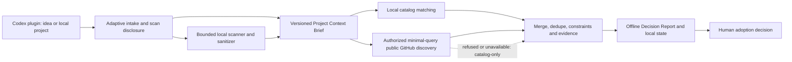

# myAI-StackGuide

> A context-aware guide for choosing open-source repositories, stacks, and adoption paths for a real product—not another “awesome list.”

myAI-StackGuide is a myAI Labs project that helps founders, product teams, engineers, and operators understand which open-source solutions are relevant to their specific project, why they fit, what should be compared, and what should be avoided or deferred.

The selected V1 is a Codex plugin combining a curated repository catalog, a bounded local read-only scanner, adaptive intake and a remote MCP discovery backend. It starts from an idea or local project and ends with a saved Project Context Brief and offline **Decision Report** to discuss before adopting or integrating anything.

**Current status:** the catalog and reproducible pipeline exist; agent/skill definitions and offline team checks are present. CP-01 aligns the plugin-first product documentation. Product schemas, scanner, intake/recommendation runtime and MCP backend remain planned; documentation and static checks do not make them operational.

## Why This Project Exists

Choosing open-source software is rarely a search problem alone.

A user may know that they need “better support automation,” “a RAG layer,” or “an agent workflow,” but still not know:

- which technical category actually matches the problem;
- what capabilities already exist in their project;
- whether they need a library, platform, reference implementation, or complete product;
- which popular repositories are a poor fit for their stage or constraints;
- what must be verified before adoption;
- how several repositories could fit together as a stack.

Most repository lists and search tools return candidates. myAI-StackGuide is intended to turn project context and user intent into a structured decision path.

## What myAI-StackGuide Is

myAI-StackGuide has three product layers.

### 1. Curated Catalog

A structured map of open-source repositories across:

- AI and agentic engineering;
- RAG, retrieval, memory, and knowledge graphs;
- MCP, tools, evals, observability, and sandboxing;
- frontend, backend, data, infrastructure, and security;
- product, design, analytics, support, CRM, finance, legal, and business operations.

The catalog is organized around categories, repository roles, use cases, compatibility relationships, and stack recipes. Stars and freshness are retained as discovery signals, not treated as proof of quality or fit.

### 2. Project Context Layer

The planned scanner will inspect an authorized project in read-only mode and build a sanitized **Project Context Brief** containing:

- product type and target users when inferable;
- detected languages, frameworks, databases, and infrastructure;
- product surfaces, domain entities, and integrations;
- visible capabilities, maturity signals, and possible gaps;
- observed facts, inferences, confidence, and missing context.

The scanner is context acquisition—not a coding agent. It must not edit files, execute project code, install dependencies, create pull requests, or collect secrets.

### 3. Decision Workflow

The guide combines the corrected Project Context Brief with a short interview about the user’s goal, stage, constraints, and preferred adoption mode. It then maps the project to category paths and repository candidates.

The target output is an offline Decision Report with evidence, caveats and a next human decision. The older memo/Integration Blueprint names are retained in historical documents; they do not add an implementation stage.

## Intended User Journey



This is the intended workflow, not runtime evidence. The catalog and authorized discovery lanes can run in parallel after a preliminary Brief; corrections invalidate dependent results. The user remains the decision owner. Code changes, recommended installations, integration, Git operations and deployment require a separate workflow. The plugin's bounded local artifact writes and separately authorized public candidate uploads are described below; neither is a scanner write.

## What The User Receives

A complete recommendation flow is designed to produce:

1. **Project understanding** — what the product appears to be and which facts support that view.
2. **Detected constraints** — stack, stage, deployment, integration, privacy, and team constraints.
3. **Category path** — the sequence of repository categories relevant to the problem.
4. **Role-based shortlist** — candidates labeled as primary, supporting, reference-only, compare-against, or avoid-for-now.
5. **Fit explanation** — why each repository is relevant to this project rather than generally popular.
6. **Compare view** — the trade-offs that matter before choosing.
7. **Avoid/defer guidance** — attractive options that are premature or mismatched, plus conditions for revisiting them.
8. **Reading path** — what to inspect first in documentation, examples, deployment guides, releases, issues, and licenses.
9. **Evidence and caveats** — provenance, snapshot date, freshness, confidence, and unverified assumptions.
10. **Next human decision** — the choice that should be made before implementation begins.

## Who It Is For

| User | Typical question | Useful outcome |
|---|---|---|
| Non-technical founder or product owner | “What open-source solutions could help this product?” | Plain-language shortlist and decision memo for discussion with a technical partner. |
| Product manager | “Which platforms or libraries fit this workflow?” | Category path, comparison frame, and build-versus-buy guidance. |
| Engineer or technical lead | “What should we evaluate before adding another subsystem?” | Faster landscape triage grounded in the existing stack and project stage. |
| Internal operator | “What can improve support, CRM, analytics, finance, or automation?” | Business-workflow interpretation and relevant self-hosted or integration options. |
| Researcher or analyst | “How is this open-source landscape structured?” | Source-aware map, shortlist, caveats, and reading order. |

## Example Scenarios

- A founder opens a local SaaS project in Codex and asks which open-source support and analytics tools are worth evaluating.
- A product team wants to compare RAG platforms, retrieval libraries, memory systems, and evaluation tools for an existing document product.
- An engineer needs a controlled coding-agent delivery stack spanning runtime, MCP tools, sandboxing, evals, and security.
- An operator wants to compare self-hosted CRM, helpdesk, workflow automation, and reporting products.
- A team needs to understand whether a repository should be adopted directly, integrated as a component, forked, studied, or deferred.

## Current Product State

The repository deliberately separates implemented evidence from product intent.

| Surface | Current state |
|---|---|
| Interactive catalog | Available as a self-contained HTML artifact. |
| Catalog snapshot | Source-owned and reproducible from manifest + template. |
| Repository count | 1,142 canonical repository records. |
| Taxonomy | 77 categories and 1,290 category placements in the current HTML snapshot. |
| Catalog status groups | 314 accepted, 813 candidate, and 15 reference/benchmark records. |
| Stack guidance | 10 stack recipes and 10 compatibility edges in the current manifest. |
| Product concept, PRD, and roadmap | Present as source-controlled planning artifacts. |
| Project-scoped skills and agents | Structurally configured and statically tested. |
| Read-only scanner | Planned; no production scanner runtime is committed. |
| Codex plugin and remote MCP backend | Accepted V1 direction; team contracts updated and locally checked, runtime not implemented or activated. |
| Hosted web app and project GitHub OAuth | Earlier entrypoint proposal; superseded for V1 by local plugin-first context acquisition. |
| Recommendation engine and interview runtime | Planned; contracts and eval cases are still being defined. |
| MCP server / Agents SDK | MCP is planned; no runtime is activated. An Agents SDK application is not required by the selected plugin architecture. |

Static configuration, generated artifacts, and local tests do not prove recommendation quality, browser behavior, GitHub integration, private-repository safety, or production readiness.

## Use The Catalog Today

Open [docs/UNIFIED_CATALOG.html](docs/UNIFIED_CATALOG.html) in a browser. It is a self-contained artifact and does not require a server.

The current catalog supports:

- search across repository metadata;
- category and use-case navigation;
- persona and status filters;
- stack recipes and compatibility relationships;
- repository comparison and triage signals;
- visible source, snapshot, and evidence metadata where available.

Useful searches include `RAG`, `MCP`, `agent memory`, `sandbox`, `browser automation`, `CRM`, `support`, `analytics`, and `workflow automation`.

## Catalog Snapshot And Provenance

| Snapshot layer | Date | Scope |
|---|---|---|
| Current HTML v5 | 2026-08-12 | 1,142 repositories, 77 categories, and 1,290 placements. |
| Legacy unified Markdown | 2026-05-23 | 314 repositories, 42 categories, and 351 placements. |
| Original account-fork catalog | 2026-05-23 | 107 repositories generated from `data/source_repos.csv`. |

Canonical current HTML data lives in [data/catalog_manifest.json](data/catalog_manifest.json), with its top-level contract in [data/catalog_manifest.schema.json](data/catalog_manifest.schema.json). The UI shell lives in [templates/unified_catalog.html](templates/unified_catalog.html).

Catalog metadata is a snapshot. Repository stars, activity, license metadata, ownership, and archive status may change. Current claims require a fresh source-backed check; discovery metadata must not be presented as security, legal, procurement, or production-readiness evidence.

## Privacy And Advisory Boundaries

The planned product follows these default rules:

- local project scanning and public GitHub retrieval are read-only and least-privilege;
- the user sees scan scope, exclusions, retention, and transmission rules before scanning;
- allowlisted files and metadata are preferred over broad source ingestion;
- secrets, credentials, keys, dumps, customer exports, raw user messages, logs, dependency folders, and build outputs are excluded by default;
- raw project source stops at the scanner/sanitizer boundary;
- the model receives sanitized structures and evidence references; agents must not bypass the scanner to read raw source;
- MCP receives a minimal DiscoveryQuery and public candidate metadata, never the full Brief, answers, excerpts, absolute paths or private project identifiers; no private-data contribution exception applies;
- warn users not to type secrets into Codex chat; already-entered chat cannot retroactively become untransmitted, and secret-like answers must be sanitized before persistence;
- plugin output writes are limited to `docs/myai-stackguide/`: atomic `state.json`, offline `status.html` and immutable finalized `runs/{run_id}.json`;
- `candidate_batch_upsert` is an own-backend external write requiring auth and explicit consent or bounded standing policy; machine candidates never acquire curator `accepted` automatically;
- refusal of auth/transmission or unavailable discovery produces visible catalog-only fallback; failed candidate upload does not block delivery of the local report;
- recommendations are advisory and do not constitute security, legal, license, compliance, procurement, or production approval.

## Architecture Direction

The product is being designed around clear trust boundaries:

1. **Context access** — authorized local project scanning through the Codex plugin; public GitHub discovery uses a separate sanitized MCP query boundary.
2. **Scanner and sanitizer** — deterministic inventory, exclusions, facts, evidence references, and confidence.
3. **Project Context Brief** — user-readable understanding that can be corrected before matching.
4. **Matching and discovery** — pinned local catalog plus authorized bounded public GitHub evidence, hard constraints, dedupe, separate snapshot/live provenance and explicit fallback.
5. **Advisory response** — Decision Report, comparison, avoid/defer, reading path, evidence and next decision; local persistence and version history.

Detailed documents:

- [Product concept](docs/MYAI_STACKGUIDE_PRODUCT_CONCEPT.md)
- [Context scanner](docs/MYAI_STACKGUIDE_CONTEXT_SCANNER.md)
- [Module architecture](docs/MYAI_STACKGUIDE_MODULE_ARCHITECTURE.md)
- [Product requirements](docs/PRODUCT_REQUIREMENTS.md)
- [V1 roadmap](docs/V1_ROADMAP.md)

## Development Priorities

The active [PRD](docs/PRODUCT_REQUIREMENTS.md#active-plugin-v1-requirements) defines R01-R14; the [roadmap](docs/V1_ROADMAP.md#active-plugin-v1-milestones) and [CP plan](docs/plan/2026-08-30-codex-plugin-v1-implementation-plan.md) define delivery gates. Local agent-team remediation is implemented. CP-01 reconciles the documentation; runtime/auth/storage decisions and measured builder readiness remain open.

The active dependency order is:

1. CP-01: reconcile scope, requirements, historical mappings and acceptance.
2. CP-02: accept runtime, auth, storage, privacy and budget decisions; CP-04 eval preparation can follow CP-01 independently.
3. CP-03/05: accept schemas and complete builder readiness, preserving already-authored roles.
4. CP-06-CP-11: build the local plugin/report vertical slice and prove one useful synthetic case before broader cases.
5. CP-12-CP-14: mock-first backend and mixed retrieval, then separately authorized test-environment verification.
6. CP-15-CP-16: independent quality/privacy/browser review and release package; publication, deployment and scheduling need separate authorization.

See [REQUIREMENTS.md](REQUIREMENTS.md), [PLAN.md](PLAN.md), [TEST.md](TEST.md), and [EVALS.md](EVALS.md) for the current execution state and evidence gates.

## Build And Verify

Run from the repository root:

```powershell
python scripts/build_catalog.py
python scripts/build_unified_catalog.py
python scripts/build_catalog_html.py
python scripts/build_catalog_html.py --check
python -m unittest discover -s tests -v
```

The HTML parity check validates deterministic reconstruction of the checked-in artifact. It does not refresh GitHub metadata or prove browser behavior.

## Repository Structure

```text
.
|-- data/                 # Current manifest plus legacy catalog sources
|-- templates/            # Source HTML shell
|-- scripts/              # Reproducible catalog builders and research utilities
|-- docs/                 # Catalog artifacts, product concept, PRD, architecture, roadmap
|-- categories/           # Generated legacy category pages
|-- tests/                # Pipeline and Codex contract tests
|-- evals/                # Agent/skill cases and future recommendation evals
|-- .agents/skills/       # Project-scoped Codex skills
|-- .codex/agents/        # Project-scoped agent roles
|-- REQUIREMENTS.md       # Compact execution registry
|-- PLAN.md               # Active dependency order and gates
|-- TEST.md               # Verification strategy
|-- EVALS.md              # Recommendation-quality contract
`-- RUNLOG.md             # Decisions, commands, evidence, and residual risks
```

## Contributing

Contributions should preserve source provenance, snapshot boundaries, deterministic generation, and the distinction between discovery signals and adoption evidence.

Read [docs/CONTRIBUTING.md](docs/CONTRIBUTING.md), [docs/METHODOLOGY.md](docs/METHODOLOGY.md), and [docs/RELEASE_PROCESS.md](docs/RELEASE_PROCESS.md) before changing catalog sources or generated artifacts.

## License

This project is available under the [MIT License](LICENSE).
