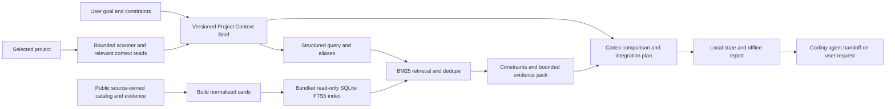

# myAI-StackGuide

> A context-aware guide for choosing open-source repositories, stacks, and adoption paths for a real product—not another “awesome list.”

myAI-StackGuide is a myAI Labs project that helps founders, product teams, engineers, and operators understand which open-source solutions are relevant to their specific project, why they fit, what should be compared, and what should be avoided or deferred.

The selected path is a Codex plugin working locally from the user's project: adaptive intake, bounded relevant context, a curated catalog and **SQLite FTS5/BM25 retrieval**. It helps users build or modernize solutions through OSS integration, ending with a saved Project Context Brief, offline **Decision Report**, actionable integration plan and coding-agent handoff. Remote MCP/discovery and a shared backend are deferred, not installation/runtime/release prerequisites.

**Current status:** the catalog and reproducible pipeline exist; agent/skill definitions and offline team checks are present. CP-01/02 documentation and [local ADRs](specs/decisions/plugin-v1-architecture.md) are amended to the owner's 2026-08-31 decisions. CP-03 includes 22 local schemas, [eight-view/presentation/publication contracts](specs/artifact/session-workspace-contract.md) and [linked examples](tests/fixtures/plugin_contracts.json). CP-03 passes all 46 contract checks. The [C8 captured-result scorer](evals/plugin-v1/runner-contract.md) passes 27 checks and CLI verification of four synthetic captures. Contract acceptance is complete; CP-04 retrieval-quality and human calibration remain open. The validator is isolated in TEMP, not a plugin dependency. FTS5 index, scanner and recommendation runtime remain planned; the plugin is not installed or operational. Relevant authorized project context is allowed; [privacy boundaries](specs/decisions/plugin-v1-permissions.md#context-access-and-product-privacy) retain minimization and sensitive exclusions without a host-wide isolation promise.

The planned session workspace is one offline HTML from the first saved answer, with eight desktop views and RU/EN switching. Codex collects answers and performs operations; HTML displays canonical state, evidence and copyable next actions. CP-07/10 implement persistence/publication and rendering; the approved design is not yet a working plugin.

## Why This Project Exists

Choosing open-source software is rarely a search problem alone.

A user may know that they need “better support automation,” “a RAG layer,” or “an agent workflow,” but still not know:

- which technical category actually matches the problem;
- what capabilities already exist in their project;
- whether they need a library, platform, reference implementation, or complete product;
- which popular repositories are a poor fit for their stage or constraints;
- what must be verified before adoption;
- how several repositories could fit together as a stack.

Most repository lists and search tools return candidates. myAI-StackGuide is intended to turn project context and user intent into a structured decision path.

## What myAI-StackGuide Is

myAI-StackGuide has three product layers.

### 1. Curated Catalog

A structured map of open-source repositories across:

- AI and agentic engineering;
- RAG, retrieval, memory, and knowledge graphs;
- MCP, tools, evals, observability, and sandboxing;
- frontend, backend, data, infrastructure, and security;
- product, design, analytics, support, CRM, finance, legal, and business operations.

The catalog is organized around categories, repository roles, use cases, compatibility relationships, and stack recipes. Stars and freshness are retained as discovery signals, not treated as proof of quality or fit.

### 2. Project Context Layer

The planned scanner will inspect an authorized project in read-only mode and build a sanitized **Project Context Brief** containing:

- product type and target users when inferable;
- detected languages, frameworks, databases, and infrastructure;
- product surfaces, domain entities, and integrations;
- visible capabilities, maturity signals, and possible gaps;
- observed facts, inferences, confidence, and missing context.

Scanner operations do not edit files, execute project code, install dependencies, create pull requests or collect secrets. Targeted relevant source reads under existing permissions can complement the structured overview; they are minimized rather than copied into persistent artifacts.

### 3. Decision Workflow

The guide combines the corrected Project Context Brief with a short interview about the user’s goal, stage, constraints, and preferred adoption mode. It then uses local SQLite FTS5/BM25 to retrieve a bounded set of repository cards, applies constraints and builds an evidence pack for comparison. It never needs the full catalog in model context.

The target output is an offline Decision Report with evidence, alternatives, integration steps, affected components, a first validation slice and rollback. It provides an actionable coding-agent handoff. A recommendation does not execute changes; a user implementation request authorizes its own bounded workflow.

## Intended User Journey



This is planned architecture, not runtime evidence. `source_mode=catalog_only` uses `retrieval_engine=sqlite_fts5`; corrections invalidate dependent packs/recommendations. Relevant source may inform Codex under its own permissions/settings; local does not mean offline inference. The public index contains no user project context. Integration execution follows a user coding request; external/destructive/credential/cost boundaries remain in force.

## What The User Receives

A complete recommendation flow is designed to produce:

1. **Project understanding** — what the product appears to be and which facts support that view.
2. **Detected constraints** — stack, stage, deployment, integration, privacy, and team constraints.
3. **Category path** — the sequence of repository categories relevant to the problem.
4. **Role-based shortlist** — candidates labeled as primary, supporting, reference-only, compare-against, or avoid-for-now.
5. **Fit explanation** — why each repository is relevant to this project rather than generally popular.
6. **Compare view** — the trade-offs that matter before choosing.
7. **Avoid/defer guidance** — attractive options that are premature or mismatched, plus conditions for revisiting them.
8. **Reading path** — what to inspect first in documentation, examples, deployment guides, releases, issues, and licenses.
9. **Evidence and caveats** — provenance, creation/push/verified-commit versus observation dates, gaps and unverified assumptions; no automatic rejection just because a snapshot is old.
10. **Integration plan and handoff** — affected components, steps, version/license prerequisites, first validation slice, unresolved decisions and rollback for a coding agent.

## Who It Is For

| User | Typical question | Useful outcome |
|---|---|---|
| Non-technical founder or product owner | “What open-source solutions could help this product?” | Plain-language shortlist and decision memo for discussion with a technical partner. |
| Product manager | “Which platforms or libraries fit this workflow?” | Category path, comparison frame, and build-versus-buy guidance. |
| Engineer or technical lead | “What should we evaluate before adding another subsystem?” | Faster landscape triage grounded in the existing stack and project stage. |
| Internal operator | “What can improve support, CRM, analytics, finance, or automation?” | Business-workflow interpretation and relevant self-hosted or integration options. |
| Researcher or analyst | “How is this open-source landscape structured?” | Source-aware map, shortlist, caveats, and reading order. |

## Example Scenarios

- A founder opens a local SaaS project in Codex and asks which open-source support and analytics tools are worth evaluating.
- A product team wants to compare RAG platforms, retrieval libraries, memory systems, and evaluation tools for an existing document product.
- An engineer needs a controlled coding-agent delivery stack spanning runtime, MCP tools, sandboxing, evals, and security.
- An operator wants to compare self-hosted CRM, helpdesk, workflow automation, and reporting products.
- A team needs to understand whether a repository should be adopted directly, integrated as a component, forked, studied, or deferred.

## Current Product State

The repository deliberately separates implemented evidence from product intent.

| Surface | Current state |
|---|---|
| Interactive catalog | Available as a self-contained HTML artifact. |
| Catalog snapshot | Source-owned and reproducible from manifest + template. |
| Repository count | 1,800 records in the current canonical intermediate snapshot; CAT-07A separately freezes a non-canonical 2,500-identity candidate for CAT-08/09/10. |
| Taxonomy | 126 nodes: 111 thematic leaves, 14 navigation containers and one review queue; the current canonical snapshot has 1,945 direct placements. |
| Catalog status groups | 526 accepted, 1,244 candidate, and 30 reference/benchmark records in the current canonical intermediate snapshot. |
| Stack guidance | 10 stack recipes and 10 compatibility edges in the current manifest. |
| Product concept, PRD, and roadmap | Present as source-controlled planning artifacts. |
| Project-scoped skills and agents | Structurally configured and statically tested. |
| Read-only scanner | Planned; no production scanner runtime is committed. |
| Local Codex plugin | Selected local direction; CP-02 amended for FTS5, runtime not implemented or activated. |
| SQLite FTS5 retrieval | Selected lexical baseline; CP-03 contracts/examples present, index/retrieval/evals remain CP-04/06/09/11/15. No embeddings or server needed. |
| Remote MCP and shared candidate backend | Deferred future extension; no service, hosting, storage or auth selected for the local path. |
| Hosted web app and project GitHub OAuth | Earlier entrypoint proposal; superseded for V1 by local plugin-first context acquisition. |
| Recommendation engine and interview runtime | Planned; contracts and eval cases are still being defined. |
| MCP server / Agents SDK | MCP is planned; no runtime is activated. An Agents SDK application is not required by the selected plugin architecture. |

Static configuration, generated artifacts, and local tests do not prove recommendation quality, browser behavior, GitHub integration, private-repository safety, or production readiness.

## Use The Catalog Today

Open [docs/UNIFIED_CATALOG.html](docs/UNIFIED_CATALOG.html) in a browser. It is a self-contained artifact and does not require a server.

The current catalog supports:

- search across repository metadata;
- category and use-case navigation;
- persona and status filters;
- stack recipes and compatibility relationships;
- repository comparison and triage signals;
- visible source, snapshot, and evidence metadata where available.

Useful searches include `RAG`, `MCP`, `agent memory`, `sandbox`, `browser automation`, `CRM`, `support`, `analytics`, and `workflow automation`.

## Catalog Snapshot And Provenance

| Snapshot layer | Date | Scope |
|---|---|---|
| Current canonical HTML v5.1 intermediate | 2026-08-31 | 1,800 repositories, 126 taxonomy nodes, and 1,945 direct placements. |
| Frozen CAT-07A candidate | 2026-09-01 | 2,500 distinct identities over the same taxonomy; non-canonical until CAT-08/09/10 complete. |
| Legacy unified Markdown | 2026-05-23 | 314 repositories, 42 categories, and 351 placements. |
| Original account-fork catalog | 2026-05-23 | 107 repositories generated from `data/source_repos.csv`. |

Canonical current HTML data lives in [data/catalog_manifest.json](data/catalog_manifest.json), with its top-level contract in [data/catalog_manifest.schema.json](data/catalog_manifest.schema.json). The UI shell lives in [templates/unified_catalog.html](templates/unified_catalog.html).

Catalog metadata is a snapshot. Repository stars, activity, license metadata, ownership, and archive status may change. Current claims require a fresh source-backed check; discovery metadata must not be presented as security, legal, procurement, or production-readiness evidence.

## Privacy And Integration Boundaries

The owner prioritizes useful integration guidance while retaining actual permission and data safeguards:

- relevant project context may be read under the user's existing host permissions; the scanner remains bounded, read-only and non-executing;
- secrets, credentials, dumps, customer exports and unsafe paths stay excluded; do not bypass exclusions through a different tool;
- save minimized findings, sanitized answers and safe references, not whole source files or raw chat; local artifacts may still contain confidential context;
- the public catalog/SQLite index contains no project files, user answers or queries; no remote service, upload, telemetry or extra provider account is added;
- output writes remain under `docs/myai-stackguide/`: atomic state, offline HTML and immutable finalized runs, with bounded recovery/history and no automatic deletion;
- Codex may process relevant context under its own settings; this plugin does not promise host-wide isolation or offline model inference;
- a report can propose integration steps and commands without executing or claiming to have tested them; explicit implementation requests can continue through the coding workflow without blanket refusal;
- future MCP receives only a minimal public-safe query/evidence; own-backend writes need their own scope/auth/consent, and machine eligibility never grants curator acceptance;
- repository activity and popularity do not constitute security, compatibility, legal, procurement or production approval.

## Architecture Direction

1. Source-owned public metadata and evidence become canonical solution cards and a versioned bundled FTS5 index; browser-only enrichment is not persisted source proof.
2. Intake, bounded scanning and relevant authorized reads produce a corrected Brief with facts/inferences/gaps.
3. Structured queries, weighted BM25 and RU/EN/technology aliases retrieve at most 60 candidates; constraints/dedupe produce at most 12 detailed cards and a 48-KiB evidence pack. These are initial engineering ceilings pending evaluation, not measured performance.
4. Codex compares the bounded evidence and prepares a useful integration plan/handoff; state and offline HTML remain local JSON/artifacts, separate from the read-only public index.
5. Source/index/policy pins prevent mismatch; missing/corrupt index is visible, never a full-catalog prompt fallback. Activity and observation dates stay separate; there is no blanket snapshot TTL.

Detailed documents: [product concept](docs/MYAI_STACKGUIDE_PRODUCT_CONCEPT.md), [scanner](docs/MYAI_STACKGUIDE_CONTEXT_SCANNER.md), [module architecture](docs/MYAI_STACKGUIDE_MODULE_ARCHITECTURE.md), [PRD](docs/PRODUCT_REQUIREMENTS.md), [roadmap](docs/V1_ROADMAP.md) and [selected ADR](specs/decisions/plugin-v1-architecture.md).

## Development Priorities

The [PRD](docs/PRODUCT_REQUIREMENTS.md#active-plugin-v1-requirements) and [CP plan](docs/plan/2026-08-30-codex-plugin-v1-implementation-plan.md) reflect the 2026-08-31 owner decisions:

1. CP-01/02: completed documentation, amended for local FTS5/context/activity/integration.
2. CP-03 contracts and bounded C8/C9 compatibility are accepted. Complete CP-04 quality corpus/baseline/thresholds and human calibration, plus CP-05 agent/skill alignment before their downstream acceptance.
3. CP-06/07: persist catalog metadata, build cards/index, then local intake/state/preflight.
4. CP-08/09/10/11: context, bounded retrieval and integration report; one useful actual FTS5 slice, then negatives/scaling.
5. CP-15/16: independent local acceptance and package/index/fresh-session/rollback evidence. Publication requires separate authorization.

CP-12-CP-14 are an optional remote extension and do not block the local release. No mandatory vectors, embedding model or service setup. See [REQUIREMENTS](REQUIREMENTS.md), [PLAN](PLAN.md), [TEST](TEST.md) and [EVALS](EVALS.md) for scopes and evidence ceilings.

## Build And Verify

Run from the repository root:

```powershell
python scripts/build_catalog.py
python scripts/build_unified_catalog.py
python scripts/build_catalog_html.py
python scripts/build_catalog_html.py --check
python -m unittest discover -s tests -v
```

The HTML parity check validates deterministic reconstruction of the checked-in artifact. It does not refresh GitHub metadata or prove browser behavior.

## Repository Structure

```text
.
|-- data/                 # Current manifest plus legacy catalog sources
|-- templates/            # Source HTML shell
|-- scripts/              # Reproducible catalog builders and research utilities
|-- docs/                 # Catalog artifacts, product concept, PRD, architecture, roadmap
|-- categories/           # Generated legacy category pages
|-- tests/                # Pipeline and Codex contract tests
|-- evals/                # Agent/skill cases and future recommendation evals
|-- .agents/skills/       # Project-scoped Codex skills
|-- .codex/agents/        # Project-scoped agent roles
|-- REQUIREMENTS.md       # Compact execution registry
|-- PLAN.md               # Active dependency order and gates
|-- TEST.md               # Verification strategy
|-- EVALS.md              # Recommendation-quality contract
`-- RUNLOG.md             # Decisions, commands, evidence, and residual risks
```

## Contributing

Contributions should preserve source provenance, snapshot boundaries, deterministic generation, and the distinction between discovery signals and adoption evidence.

Read [docs/CONTRIBUTING.md](docs/CONTRIBUTING.md), [docs/METHODOLOGY.md](docs/METHODOLOGY.md), and [docs/RELEASE_PROCESS.md](docs/RELEASE_PROCESS.md) before changing catalog sources or generated artifacts.

## License

This project is available under the [MIT License](LICENSE).
