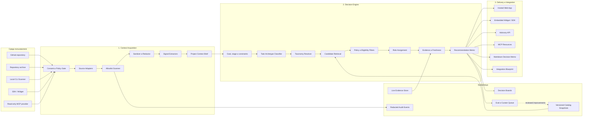
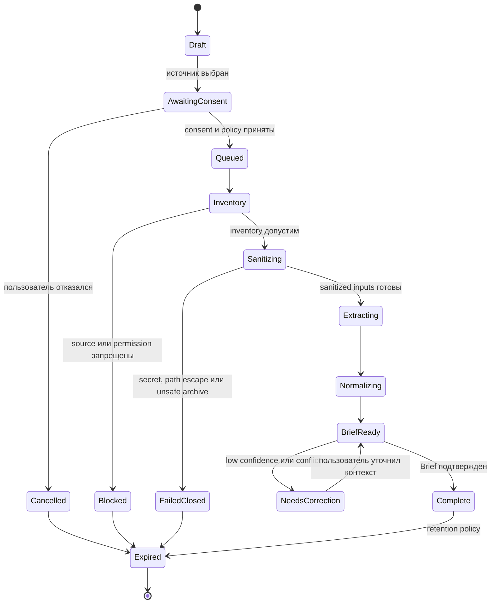
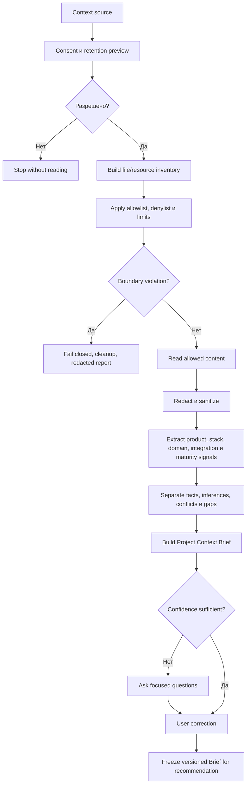
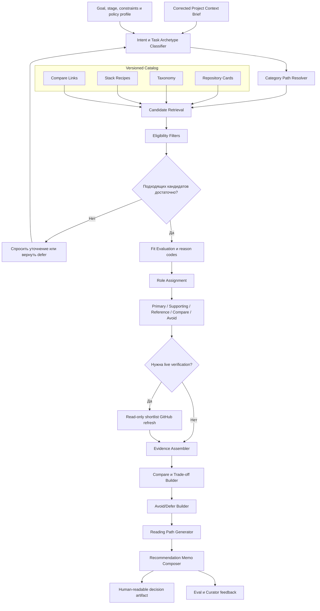
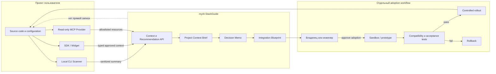
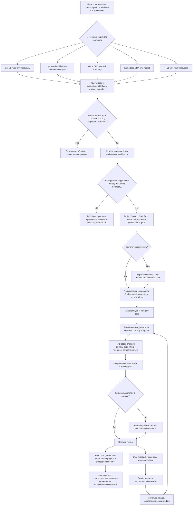

# myAI-StackGuide Module Architecture Direction

The active product boundary is defined by [PRD R01-R14](PRODUCT_REQUIREMENTS.md#active-plugin-v1-requirements) and the [CP plan](plan/2026-08-30-codex-plugin-v1-implementation-plan.md). CP-02 owns architecture decisions; this summary does not select a runtime, database, provider, deployment or auth mechanism.

## Active Plugin V1 Boundary

The intended path is Codex intake + local scanner/sanitizer -> versioned sanitized Brief -> local catalog matching and authorized minimal-query public GitHub discovery -> merged Decision Report -> local state/offline HTML/finalized runs. The two retrieval lanes can operate in parallel after a preliminary Brief. Catalog-only is the intended refusal/failure path and first local verification baseline; it cannot substitute for later proof of mixed retrieval.

Raw source stops inside the local scanner/sanitizer; neither the model nor MCP may bypass that boundary. MCP receives no full Brief, raw answers, excerpts, absolute paths or private project identifiers. The four tools are `catalog_delta_get`, `github_discover`, `candidate_batch_upsert` and `candidate_status_get`. GitHub retrieval is read-only; the upsert writes public metadata to our own backend only with auth and explicit consent or bounded standing policy. Upload failure does not block the local report.

Local plugin writes are limited to `docs/myai-stackguide/`. State is atomic and current, HTML is an offline projection, and finalized run snapshots are immutable. Corrections invalidate dependent recommendations. Snapshot and overlay versions are pinned; machine evidence/eligibility does not assign curator acceptance. No source modification, recommended installation, project execution, Git or deployment is part of recommendation delivery.

## Historical V1X Disposition

| Historical row | Current disposition |
| --- | --- |
| V1X-00 | Keep existing canonical docs/source locations; CP-01 reconciles documentation only, without moving files or changing builders |
| V1X-01 | Superseded by CP-01 plugin-first PRD/roadmap; expanded hosted/adapter V1 is not active |
| V1X-02 | CP-02/03/04 decision ownership; old retention, quota and telemetry choices are not accepted defaults |
| V1X-03 | CP-03 contracts and CP-04 eval design; historical V1-S rows are traceability only |
| V1X-04 | CP-03/06 catalog/advisory contract; current snapshot preserved, no expansion quota |
| V1X-05 | Local scanner boundary in CP-02/03/08 replaces broad source adapters; archive/SDK/resource acquisition deferred |
| V1X-06 | CP-02 runtime/auth/storage/operations decisions; no implicit modular-monolith or service choice |
| V1X-07 | CP-05, preserving the two existing plugin/backend builder definitions; no fixed skill quota or runtime-readiness claim |
| V1X-08 | CP-07/08/09/11 local intake, scan, matching and semantic evidence |
| V1X-09 | Hosted flow superseded by CP-07/10/11 local plugin/artifact path |
| V1X-10 | Archive, standalone CLI, SDK/widget and context-provider MCP modes deferred; remote discovery MCP follows CP-12/14 |
| V1X-11 | CP-12/13/14 mixed retrieval, overlay and provenance; separate curator acceptance |
| V1X-12 | CP-04/15/16 quality and release evidence, with separate external authorization |

## Historical Module Architecture Proposal — Not Runtime Evidence

All multilingual text below is preserved history, including diagrams, V1X task tables, original commands and dated audit results. Phrases describing an implemented version, old test counts and the old parity failure are historical claims, not current evidence. No old diagram or permission statement overrides the active PRD; the current command registry remains in TEST.md and the CP plan.

<details>
<summary>Preserved historical architecture proposal</summary>

В реализованной версии myAI-StackGuide — это не один «умный агент», а три изолированные подсистемы:

1. безопасное получение и нормализация контекста проекта;
2. подбор решений через curated catalog и проверяемые GitHub evidence;
3. доставка рекомендаций обратно пользователю или в его рабочую среду.

Ключевая граница: myAI-StackGuide интегрируется с проектом для чтения контекста и передачи advisory-артефактов, но не устанавливает выбранные репозитории, не меняет код и не создаёт PR. Для внедрения выбранного решения он формирует `Integration Blueprint`, который исполняет человек или отдельно авторизованный engineering workflow.

## Общая архитектура



# 1. Модуль сканирования проекта пользователя

## Что является входом

Все источники реализуют единый `ContextSourceAdapter`:

| Режим | Что читает система | Что передаётся в scanner core |
|---|---|---|
| GitHub | Файлы и metadata через read-only GitHub permission | Versioned file inventory и разрешённое содержимое |
| Archive | Загруженный ZIP/TAR или documentation pack | Временное распакованное дерево после safety checks |
| Local CLI | Локальный workspace | Только локально сформированный sanitized summary |
| SDK/widget | Контекст, явно переданный приложением пользователя | Typed context payload с tenant и consent metadata |
| MCP | Только разрешённые `project://...` resources | Resource snapshots без write tools |

Scanner core не должен знать, пришёл ли файл из GitHub, архива или локального CLI. Adapter преобразует источник в общий `ScanManifest`.

Пример логического контракта:

```text
ScanManifest
├── scan_id
├── tenant_id
├── source_kind
├── source_revision
├── consent_record
├── retention_mode
├── file_inventory[]
│   ├── sanitized_path
│   ├── source_group
│   ├── media_type
│   ├── size
│   └── content_reader
└── policy_version
```

## Внутренние модули scanner pipeline

### 1. Consent and Policy Gate

До чтения содержимого система фиксирует:

- тип источника;
- какие группы файлов будут просмотрены;
- какие группы исключены;
- покидает ли raw content окружение пользователя;
- retention mode;
- кто сможет видеть сохранённый Brief;
- разрешён ли private repository;
- версия scan policy.

Без `consent_record` scan остаётся в `awaiting_consent`.

### 2. Source Adapter

Отвечает только за безопасное получение данных:

- GitHub adapter — чтение tree/blob metadata;
- Archive adapter — проверка формата и безопасная распаковка;
- CLI adapter — локальный inventory и sanitization;
- SDK adapter — валидация typed payload и tenant boundary;
- MCP adapter — чтение allowlisted resources.

Adapter не делает продуктовые выводы.

### 3. Inventory Builder

Строит перечень потенциальных источников, но ещё не читает все значения:

- README и документация;
- manifests и dependency files;
- routes и API contracts;
- database schemas и migrations;
- deployment configuration;
- tests и evals;
- changelogs и roadmap;
- agent/prompts/configuration artifacts.

Inventory необходим для прозрачного scan report: пользователь видит, что было включено, исключено и почему.

### 4. Exclusion and Limit Engine

До extraction применяются:

- deny patterns для `.env`, ключей, tokens и credentials;
- исключение dumps, production logs, exports и raw messages;
- исключение `node_modules`, build outputs и caches;
- file-count, individual-size и total-size limits;
- archive depth и decompression ratio limits;
- защита от `../` path traversal;
- запрет traversal через symlink/junction;
- media-type validation;
- cancellation и timeout policy.

Результат — не просто «файл пропущен», а reason code: `secret_pattern`, `generated_dependency`, `binary_unsupported`, `oversized`, `path_escape`, `user_denied`.

### 5. Sanitizer and Redactor

Этот модуль формирует trust boundary между raw project context и остальной системой.

Он:

- удаляет secret-like values;
- заменяет потенциальные PII и credentials структурными markers;
- нормализует локальные абсолютные пути;
- ограничивает длинные фрагменты;
- сохраняет hashes или sanitized evidence references вместо полного raw content;
- не помещает raw source в prompts, logs, fixtures или decision boards.

После этой границы recommendation engine работает только с sanitized facts и evidence references.

### 6. Signal Extractors

Независимые extractors выделяют сигналы:

- `ProductSurfaceExtractor`: dashboard, API, mobile, CLI, assistant;
- `StackExtractor`: languages, frameworks, databases, infrastructure;
- `DomainExtractor`: tickets, contacts, documents, invoices, workflows;
- `IntegrationExtractor`: GitHub, Stripe, Slack, CRM, storage;
- `CapabilityExtractor`: RAG, agents, analytics, automation;
- `MaturityExtractor`: tests, releases, observability, evals;
- `GapExtractor`: отсутствующие проверки, weak docs, missing eval layer.

Extractor не говорит «это точно SaaS». Он возвращает:

```text
ObservedSignal
├── signal_type
├── value
├── evidence_refs[]
├── confidence
└── extraction_method
```

### 7. Context Normalizer

Сводит повторяющиеся и конфликтующие сигналы:

- факт остаётся фактом только при прямом evidence;
- эвристический вывод становится `inference`;
- конфликтующие версии сохраняются как conflict, а не молча выбираются;
- недостаточный контекст превращается в `missing_context`;
- confidence рассчитывается отдельно для product understanding, stack и recommendation readiness.

### 8. Project Context Brief Builder

На выходе появляется пользовательский артефакт:

```text
ProjectContextBrief
├── observed_facts[]
├── inferences[]
├── detected_stack
├── product_surface[]
├── domain_entities[]
├── integrations[]
├── capabilities[]
├── possible_gaps[]
├── task_archetype_hints[]
├── category_path_hints[]
├── confidence
├── caveats[]
├── user_corrections[]
└── evidence_refs[]
```

Пользователь сначала читает и исправляет Brief, и только потом запускается подбор решений.

## Workflow сканирования





# 2. Механизм и workflow подбора решений на GitHub

Важное различие: система не начинает с произвольного GitHub search. Сначала она ищет внутри versioned curated catalog. Live GitHub используется после построения shortlist — как freshness/evidence layer.

Это предотвращает три проблемы:

- выдачу случайных популярных репозиториев;
- зависимость результата от текущего GitHub ranking;
- смешение snapshot facts и live metadata.

## Вход recommendation engine

```text
RecommendationRequest
├── corrected_project_context_brief
├── user_goal
├── project_stage
├── constraints
├── recommendation_mode
├── policy_profile
├── catalog_snapshot_id
└── model_and_config_version
```

Примеры constraints:

- self-hosted only;
- permissive licenses;
- Python-first;
- prototype complexity;
- no external data processing;
- reference-only;
- production evaluation, а не immediate adoption.

## Подбор по этапам

### 1. Intent and Task Archetype Classification

Система объединяет Brief и пользовательскую цель.

Например:

> «В продукте есть support tickets, documentation и Next.js dashboard; пользователь хочет автоматизировать ответы».

Это может дать несколько archetypes:

- `crm_support_customer_ops`;
- `rag_document_intelligence`;
- `evals_observability_promptops`;
- возможно `business_ops_automation`.

Классификатор не выбирает репозитории — он создаёт routing hints.

### 2. Category Path Resolver

Вместо одной категории строится последовательность:

```text
Customer Support & Success
→ Documents & Parsing
→ RAG & Retrieval
→ Evals & Observability
→ Workflow Automation
```

Category path показывает, какие части решения являются core, а какие — supporting.

### 3. Candidate Retrieval

Retrieval работает по нескольким слоям:

- taxonomy/category membership;
- task archetypes;
- stack recipes;
- advisory fields;
- compatible integration surfaces;
- compare-against links;
- lexical/semantic similarity;
- curated high-confidence pool.

Первичный candidate pool может быть широким, например 50–100 repositories, но пользователю он не показывается.

### 4. Eligibility and Policy Filters

До ranking отбрасываются несовместимые кандидаты:

- неподходящий `adoption_mode`;
- слишком высокая complexity;
- несовместимый project stage;
- запрещённый license profile;
- неподходящий deployment model;
- конфликт data sensitivity;
- отсутствующие обязательные advisory fields;
- слишком низкий trust или verification status;
- явный `avoid_if`.

Это hard gates. Популярность не может вернуть запрещённый кандидат.

### 5. Fit Evaluation

Для оставшихся кандидатов оцениваются независимые dimensions:

- соответствие цели;
- соответствие category path;
- stack compatibility;
- integration surface;
- stage и complexity;
- deployment fit;
- evidence completeness;
- trust и freshness;
- reference value;
- known caveats.

Система сохраняет reason codes, а не только единый opaque score.

### 6. Role Assignment

Каждый кандидат получает функциональную роль:

- `primary_candidate` — прямой fit, смотреть первым;
- `supporting_tool` — закрывает соседний слой;
- `reference_only` — полезен как архитектурный пример;
- `compare_against` — нужен как benchmark или альтернатива;
- `avoid_for_now` — привлекательный, но преждевременный или несовместимый.

Один и тот же репозиторий может иметь разные роли для разных Brief.

### 7. Shortlist-Only Live Verification

Только после получения shortlist система при необходимости проверяет GitHub read-only:

- repository exists/archived;
- latest release;
- recent activity;
- stars/forks как вторичный сигнал;
- license metadata;
- README availability;
- security/advisory signals, если доступны.

При этом создаётся новый `LiveEvidenceRecord`. Snapshot card не перезаписывается.

Если GitHub недоступен или rate-limited:

- рекомендация не исчезает;
- пользователь видит `live_verification_unavailable`;
- используются snapshot data и explicit stale caveat.

### 8. Compare, Avoid/Defer and Reading Path

Для двух–пяти кандидатов строится сравнение:

- direct fit;
- adoption model;
- integration cost;
- complexity;
- maintenance/docs;
- deployment;
- data sensitivity;
- caveats;
- что необходимо проверить вручную.

`avoid/defer` всегда содержит:

- причину;
- условие пересмотра;
- evidence или policy rule.

Reading path говорит, что читать:

1. positioning и README;
2. architecture/docs/examples;
3. integration/deployment guide;
4. releases/issues;
5. license/security notes;
6. alternatives.

### 9. Recommendation Memo

Финальный memo воспроизводим:

```text
RecommendationMemo
├── interpreted_goal
├── project_understanding
├── category_path[]
├── candidates_by_role
├── avoid_and_defer[]
├── compare_view
├── reading_path[]
├── evidence_and_freshness
├── caveats[]
├── missing_context[]
├── next_human_decision
├── catalog_snapshot_id
├── brief_version
└── model_and_config_version
```

## Схема recommendation workflow



## Как система улучшает подбор

Два feedback-контура разделены:

1. Product feedback:

   - пользователь исправил Brief;
   - кандидат оказался нерелевантным;
   - avoid/defer был полезен или бесполезен;
   - decision memo не помог принять решение.

2. Curator/eval feedback:

   - отсутствует advisory metadata;
   - неверная категория;
   - duplicate;
   - stale evidence;
   - regression на эталонном сценарии.

Ни один feedback автоматически не меняет публичный catalog. Он создаёт curator item, проходит review и только затем входит в новый catalog snapshot.

# 3. Интеграция в проект пользователя

Здесь есть два разных понятия интеграции.

## A. Интеграция самого myAI-StackGuide

### Hosted Web App

Подходит для разового анализа:

- пользователь подключает GitHub или загружает archive;
- анализ выполняется в hosted flow;
- Brief и memo доступны в web UI;
- проект пользователя не изменяется.

### Local CLI Scanner

Подходит для private code:

```text
user workspace
→ local inventory
→ local exclusions/redaction
→ sanitized summary
→ hosted recommendation API
```

Raw source остаётся локально. CLI может сохранить Brief локально или отправить только sanitized payload.

### SDK / Widget

SDK позволяет встроить guide в admin panel, developer portal или внутреннюю систему.

Логический интерфейс:

```text
createContextSession()
submitSanitizedProjectContext()
getProjectContextBrief()
applyBriefCorrections()
createRecommendation()
getDecisionMemo()
```

Widget отвечает за UX, SDK — за typed integration и tenant/session handling.

### MCP Context Provider

MCP предоставляет только resources:

```text
project://summary
project://stack
project://dependencies
project://routes
project://schemas
project://docs
project://integrations
```

Нет write tools, shell execution, package installation или repository mutation.

## B. Интеграция выбранного GitHub-решения

По исходному продуктовому контракту myAI-StackGuide не устанавливает выбранный проект автоматически.

Вместо этого он создаёт `Integration Blueprint`:

- выбранный repository и его роль;
- какую проблему он закрывает;
- предполагаемый integration surface;
- совместимость со стеком;
- какие данные будут передаваться;
- dependency и deployment impact;
- конфигурационные параметры без secret values;
- recommended sandbox/prototype;
- acceptance scenarios;
- rollback strategy;
- manual verification checklist;
- причины не внедрять решение сейчас.

Дальнейшее выполнение происходит только после отдельного человеческого решения или через отдельно авторизованный engineering agent.

## Схема интеграции



## Четыре уровня результата

| Уровень | Что получает пользователь | Меняется ли проект |
|---|---|---|
| Discovery | Category path и shortlist | Нет |
| Decision | Compare, avoid/defer, reading path и memo | Нет |
| Integration planning | `Integration Blueprint`, risks, tests и rollback | Нет |
| Adoption execution | Prototype, code changes, dependency install, deployment | Только отдельным авторизованным engineering workflow |

Если под «интеграцией» подразумевается автоматическая установка репозитория, изменение кода или создание PR, это уже новый продуктовый режим, которого в принятом плане нет. Для него понадобились бы отдельные permissions, sandbox, implementation agents, security gates, test evidence и rollback contract.

<proposed_plan>
# Расширенный V1 myAI-StackGuide: функциональная модель и план реализации

## 1. Результат анализа

Целевой подробный артефакт: `docs/V1_IMPLEMENTATION_PLAN.md`. Корневой `PLAN.md` остаётся компактным маршрутизатором: активная стадия, dependency order, текущий gate и ссылка на подробный план.

### Текущие слои системы

| Слой | Источник истины | Текущее назначение | Состояние |
|---|---|---|---|
| Продукт | `docs/PRODUCT_REQUIREMENTS.md`, `docs/V1_ROADMAP.md` | Пользователи, FR1–FR15, V1 journey, milestones и beta gate | Требования существуют, но ещё описывают узкий V1 |
| Концепция | `docs/MYAI_STACKGUIDE_PRODUCT_CONCEPT.md` | Advisory-only позиционирование, карточки, retrieval, shortlist, compare, memo | Шире PRD; часть функций не трассирована в FR |
| Context Scanner | `docs/MYAI_STACKGUIDE_CONTEXT_SCANNER.md` | GitHub, archive, CLI, SDK/widget и MCP context modes | Конфликтует с узким V1; по решению пользователя все режимы входят в расширенный V1 |
| Текущий продукт | `README.md`, catalog builders, `scripts/product_guidance.py` | Статический каталог, поиск, фильтры, decision lenses, recipes и compare views | Реализовано: 42 категории, 351 placement, 314 уникальных репозиториев |
| Данные | `data/source_repos.csv`, два research JSON snapshot | Каталог и research snapshots | До цели не хватает 686 репозиториев, 18+ категорий и advisory metadata |
| Execution control plane | `REQUIREMENTS.md`, `PLAN.md`, `TEST.md`, `EVALS.md`, `RUNLOG.md` | Активная очередь, gates, evidence и ownership | Статические контракты работают; продуктовая реализация не начата |
| Агентная система | `.codex/agents`, `.agents/skills`, `.codex/TEAM.md` | Семь catalog/control-plane ролей | 5 contract tests проходят; behavioral routing ещё не проверен |
| Hosted/runtime | отсутствует | Web app, API, auth, storage, jobs, scanner runtime | `applicable_missing`; runtime stack не выбран |

### Критические разрывы

1. Перенос документов в `docs/` не завершён системно: README, AGENTS, TEST, release process и builders продолжают использовать корневые пути. Старый parity-команд завершается `FileNotFoundError`; сравнение builders с `docs/UNIFIED_CATALOG.*` проходит.
2. PRD исключает archive, CLI, SDK и public MCP из V1, а Context Scanner включает эти режимы. Для расширенного V1 PRD и roadmap должны быть переписаны до архитектуры.
3. Текущие 314 репозиториев и 42 категории не достигают V1-целей 1,000 и 60–90. В `data/repos.csv` отсутствуют advisory-поля.
4. Snapshot датирован 2026-05-23; он не доказывает актуальное состояние GitHub на 2026-08-05.
5. `V1-S1`–`V1-S7` пока не реализованы: нет repository-card, taxonomy, scanner, context, memo и eval schemas.
6. Существующая команда не содержит владельцев frontend/backend runtime. Расширять ownership `catalog_pipeline_builder` нельзя без нового team contract.
7. Не определены retention/deletion SLA, hosted stack, model/retrieval budget, telemetry и точный GitHub permission profile.

## 2. Функциональные сценарии конечного пользователя



Сценарий считается успешным, когда пользователь:

- понимает, как система интерпретировала продукт и какие выводы являются предположениями;
- получает короткий category path и role-based shortlist вместо плоского списка;
- видит, почему кандидат подходит, почему другой отложен и что требуется проверить;
- может сравнить варианты и сохранить воспроизводимый decision memo;
- не воспринимает результат как security, legal, procurement или production approval;
- сохраняет контроль над доступом, retention и удалением контекста.

## 3. Детальная очередь реализации

| ID | Задача и результат | Исполняющие агенты и скиллы | Зависимости | Критерии приёмки |
|---|---|---|---|---|
| `V1X-00` | Завершить переход на `docs/` как canonical location для long-form и generated documentation. Обновить README, AGENTS, builders, TEST и release process; не менять исходные данные каталога. | Последовательно: `product_planner` → `docs_maintainer` → `evidence_reviewer`. Skills: `maintain-control-plane`, `verify-generated-parity`, `review-advisory-evidence`. | Нет | Все локальные ссылки существуют; builders пишут `docs/UNIFIED_CATALOG.*`, `docs/METHODOLOGY.md`, `docs/CONTRIBUTING.md`, `docs/LICENSE`; обновлённый parity проходит; корневые дубликаты отсутствуют; пользовательские dirty changes сохранены. |
| `V1X-01` | Переписать PRD и roadmap под расширенный V1: hosted GitHub, upload, CLI, SDK/widget и read-only MCP. Для каждого режима добавить persona, workflow, privacy boundary, non-goals, acceptance и rollout stage. | `product_planner`; review — `evidence_reviewer`. Skills: `shape-product-slice`, `design-recommendation-evals`, `maintain-control-plane`. | `V1X-00` | Ни один режим не указан одновременно как V1 и Post‑V1; каждый FR связан с journey, scenario, check и evidence owner; hosted GitHub остаётся первым вертикальным сценарием. |
| `V1X-02` | Закрыть продуктовые owner-gates: ephemeral-by-default retention, deletion flow, minimum primary-candidate metadata, 60-category baseline, pool из первых 100 high-confidence cards, permission modes, latency/cost measurement и telemetry plan. | `product_planner` + `catalog_architect`; privacy review — `evidence_reviewer`. Skills: `shape-product-slice`, `design-catalog-contracts`, `audit-readonly-boundaries`. | `V1X-01` | Для каждого решения записаны owner, выбранная политика, alternatives, residual risk и review trigger; unresolved решения блокируют runtime implementation, а не передаются builder-агенту. |
| `V1X-03` | Реализовать `V1-S1`–`V1-S6`: Repository Card, Taxonomy, Scan Policy, Project Context Brief, Recommendation Memo, Eval Case/Result schemas и fixtures. | Последовательно: `catalog_architect` → `quality_evaluator` → `evidence_reviewer`. Skills: `design-catalog-contracts`, `design-context-contracts`, `design-recommendation-evals`, `audit-readonly-boundaries`. | `V1X-02` | Для каждого контракта есть positive, negative и boundary fixtures; identity, provenance, confidence, corrections и evidence совместимы между схемами; unsupported inference не может стать fact; отсутствуют secrets и private source payloads. |
| `V1X-04` | Расширить taxonomy и каталог: 60 стабильных категорий, 1,000 уникальных repositories, минимум 100 high-confidence cards с обязательными advisory fields. | Последовательно: `github_research_curator` → `evidence_reviewer` → `catalog_pipeline_builder`. Skills: `research-github-candidates`, `curate-catalog-taxonomy`, `review-advisory-evidence`, `evolve-catalog-pipeline`, `verify-generated-parity`. | `V1X-03` repository/taxonomy contracts | Все 1,000 entries имеют baseline metadata и provenance; 100 primary-eligible cards имеют `best_for`, `avoid_if`, adoption/stage/complexity/integration/deployment/caveat/verification fields; duplicates и alias collisions отсутствуют; snapshot и live evidence не смешаны. |
| `V1X-05` | Спроектировать общий scanner core и context-source adapter contract для GitHub, archive, CLI, SDK и MCP. Все адаптеры должны выдавать один normalized sanitized input. | `catalog_architect`; tests — `quality_evaluator`; review — `evidence_reviewer`. Skills: `design-context-contracts`, `audit-readonly-boundaries`, `design-recommendation-evals`. | `V1X-03` | Контракт описывает allowlist, denied sources, size/time/count limits, symlink policy, archive path traversal и decompression-bomb protection, redaction, cancellation, audit metadata и fail-closed behavior; MCP остаётся resource-only/read-only. |
| `V1X-06` | Принять runtime architecture ADR: modular-monolith boundary, web/API/worker responsibilities, authentication, storage, queue, tenant isolation, deletion, observability, provider adapter, deployment и rollback. | `catalog_architect` + `product_planner`; independent review — `evidence_reviewer`. Skills: `design-context-contracts`, `design-catalog-contracts`, `audit-readonly-boundaries`. | `V1X-03`, `V1X-05` | ADR сравнивает минимум modular monolith и split services; фиксирует выбранный stack и точные build/test commands; raw source не пересекает scanner boundary; live model, OAuth, MCP publication и deployment остаются `approval_required`. |
| `V1X-07` | Расширить agent team для runtime. Добавить только два новых builder-контракта: `advisory_backend_builder` и `advisory_frontend_builder`; создать repo-specific skills и behavioral routing cases. | `product_planner` + `quality_evaluator`. Skill создания: `skill-creator`; проверка: `design-recommendation-evals`, `maintain-control-plane`. | Принятый `V1X-06` | Новые агенты имеют disjoint ownership, ровно три project skills, fresh-context packets, forbidden files, commands, expected evidence и sequential fallback; static validation проходит; behavioral suitability остаётся отдельным gate до параллельной работы. |
| `V1X-08` | Реализовать scanner и recommendation core: `SanitizedProjectSummary → ProjectContextBrief → corrected brief + interview → RecommendationMemo`. Начать с deterministic filtering/rules; AI и semantic retrieval подключать только через versioned provider port после eval gate. | `advisory_backend_builder`; contract review — `catalog_architect`; tests — `quality_evaluator`. Skills: новые `build-advisory-runtime`, `build-context-connectors`, существующий `audit-readonly-boundaries`. | `V1X-04`–`V1X-07` | Один и тот же synthetic project через разные adapters даёт семантически эквивалентный Brief; recommendation воспроизводима по brief, answers, catalog snapshot и model/config version; low-confidence flow спрашивает или defers; output не содержит implementation commands. |
| `V1X-09` | Реализовать первый end-to-end hosted flow: sign-in, GitHub connection, repository picker, permission screen, scan progress, Brief correction, interview, shortlist, compare, memo, export, disconnect и delete. | Последовательно: `advisory_backend_builder` → `advisory_frontend_builder` → `quality_evaluator`. Frontend skills: новые `build-hosted-advisory-ui`, `verify-user-journeys`, существующий `review-advisory-evidence`. | `V1X-08` | Happy path, denial, revoke, failed scan, low-confidence, stale-evidence и deletion journeys проверены; UI показывает read-only/advisory boundary; пользователь может завершить сценарий без локальной установки. |
| `V1X-10` | Добавить expanded context modes по очереди: archive/doc pack → local CLI sanitized summary → SDK/widget → read-only MCP resources. Не запускать их параллельно на общем scanner contract. | `advisory_backend_builder`, затем `advisory_frontend_builder` для widget; verification — `quality_evaluator` и `evidence_reviewer`. Skills: `build-context-connectors`, `audit-readonly-boundaries`, `verify-user-journeys`. | Успешный hosted vertical `V1X-09` | Каждый режим проходит adapter parity и negative privacy tests; archive временно хранится и удаляется по policy; CLI не передаёт raw code; SDK изолирует tenants; MCP не содержит write tools и не публикуется без отдельного approval. |
| `V1X-11` | Реализовать evidence/freshness panel, shortlist-only GitHub refresh, curator queue и immutable provenance transitions. | `advisory_backend_builder` + `github_research_curator`; review — `evidence_reviewer`. Skills: `review-advisory-evidence`, `research-github-candidates`, `audit-readonly-boundaries`. | `V1X-04`, `V1X-09` | `catalog_snapshot`, `github_live_evidence`, `curator_decision` и `recommendation_output` хранятся раздельно; refresh не перезаписывает snapshot; rate-limit и unavailable states становятся visible caveats. |
| `V1X-12` | Beta eval и release gate: contract, privacy, recommendation, UI, adapter parity, failure, accessibility, responsiveness и human usefulness. | `quality_evaluator` → read-only `evidence_reviewer` → `docs_maintainer`. Skills: `design-recommendation-evals`, `verify-generated-parity`, `audit-readonly-boundaries`, `maintain-control-plane`. | Все предыдущие строки | Нет critical privacy/provenance/advisory failures; core scenario threshold принят владельцем; known gaps записаны; release artifacts, rollback и deletion evidence существуют; только после этого возможен beta verdict. |

### Правила исполнения агентами

- Root control-plane, schemas, canonical data, generators и generated outputs изменяются только последовательно.
- Параллельная работа разрешается лишь после `V1X-07`, при непересекающихся backend/frontend ownership.
- Каждый task row получает заполненный `.codex/artifact-templates/agent-task-packet.md`; raw conversation history не используется.
- `evidence_reviewer` остаётся read-only и может заблокировать promotion.
- Любой live OAuth, private repository access, external model call, MCP publication, deployment, external write или Git operation требует отдельного approval packet.
- Отсутствие evidence означает `present_unverified`, `implemented_not_verified` или `blocked`, но не `done`.

## 4. Контракты и проверки

### Обязательная цепочка данных

```text
ContextSource
→ ScanManifest
→ ScanReport + SanitizedProjectSummary
→ ProjectContextBrief
→ UserCorrections + InterviewAnswers
→ RecommendationRequest
→ RecommendationMemo
→ DecisionBoard / MarkdownExport
```

Обязательные общие типы:

- `EvidenceRef`: source kind, snapshot/live state, timestamp, sanitized location и confidence.
- `RepositoryCard`: baseline identity/provenance плюс optional advisory metadata.
- `ProjectContextBrief`: observed facts, inferences, confidence, corrections, gaps и evidence.
- `RecommendationMemo`: category path, role-based candidates, avoid/defer, comparison, reading path, caveats, evidence и next human decision.
- `ContextSourceAdapter`: GitHub, archive, CLI, SDK и MCP реализации одного sanitized contract.
- `EvalCase`/`EvalResult`: requirement, scenario, deterministic checks, human rubric, threshold, evidence owner и accepted gaps.

### Test plan

1. Documentation topology: link check, no duplicate canonical artifacts, updated generated parity и `git diff --check`.
2. Schema contracts: valid fixtures pass; missing identity/provenance, invalid confidence, unsupported fact и incompatible IDs fail.
3. Scanner safety: secrets, dumps, logs, customer exports, symlinks, path traversal, oversized archives и executable behavior блокируются.
4. Adapter parity: одинаковый synthetic project через пять источников даёт совместимый sanitized summary и Brief.
5. Recommendation quality: founder, PM, engineer, operator, low-context, sensitive, RAG, stale-live-conflict и no-code scenarios.
6. Hosted E2E: connect, approve, scan, correct, compare, export, revoke, delete, failure fallback.
7. Expanded-mode E2E: archive cleanup, CLI no-raw-upload, SDK tenant isolation и MCP resource allowlist.
8. Promotion checks: current command evidence, human usefulness review, no critical failures, documented residual risks и rollback.

Текущие проверочные команды сохраняются как baseline:

- `python -m unittest tests.test_codex_contracts -v`
- `codex --strict-config doctor --summary`
- `git diff --check`
- обновлённая in-memory parity-проверка против `docs/UNIFIED_CATALOG.md` и `docs/UNIFIED_CATALOG.html`

После `V1X-06` выбранный runtime stack обязан добавить точные backend/frontend unit, contract, build и E2E команды в `TEST.md` до начала реализации.

## 5. Допущения, rollout и границы готовности

- `docs/` принимается canonical location для long-form product docs и generated catalog artifacts; root содержит README и Product-Agent OS control plane.
- Расширенный V1 включает hosted GitHub, archive/doc upload, local CLI, SDK/widget и read-only MCP, но выпускается ступенчато: contracts → hosted public-repo alpha → private/upload gate → CLI → SDK/widget → MCP.
- Privacy default: ephemeral processing и отсутствие raw-source persistence; сохранение только sanitized Brief, answers и memo после явного opt-in. Точный deletion SLA закрывается в `V1X-02`.
- Recommendation baseline — deterministic catalog rules и filters. Semantic retrieval и model-backed generation не активируются до принятого ADR, cost/latency budget и eval evidence.
- До `V1X-06` hosted/runtime implementation имеет статус `blocked_by_architecture_decision`; это контролируемый gate, а не решение, оставленное builder-агенту.
- Текущий результат аудита — `inspection-only`: 5 agent/skill contract tests прошли, Codex Doctor сообщил 0 failures, но root parity сломан после незавершённого переноса документов; runtime и V1 product flows отсутствуют.
- Git staging, commit, branch, push, deployment и внешняя публикация в этот план не входят.
</proposed_plan>

</details>
