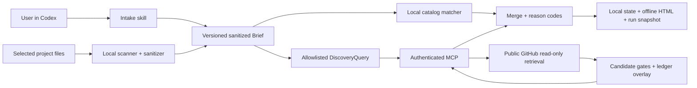

# myAI-StackGuide — Codex Plugin V1 Implementation Plan

Planning date: 2026-08-30. Timezone: `Europe/Moscow`.

Document status: `proposal_staged` for remaining product work. The owner authorized CP-01 documentation implementation with agents and skills; its current result is recorded in that task block and RUNLOG. CP-02 through CP-16 remain `planned`; this document does not activate the plugin, MCP or publication.

Team-audit remediation was subsequently authorized in [Agent Team Audit Remediation](2026-08-30-agent-team-remediation-plan.md). That bounded slice updates source routing, instructions, builder definitions, and offline team checks. It does not close the CP tasks or authorize product runtime. Active shared execution contracts are in [Plugin V1 Team Execution Contracts](plugin-v1-team-contracts.md).

## 1. Goal, Sources, And Boundaries

V1 goal: help users choose a suitable open-source solution based on their goal, project, constraints, and available evidence. The entry point is a Codex plugin; the output is a persisted Project Context Brief and Decision Report in local HTML.

Source: the user-provided “Codex Plugin V1 for myAI-StackGuide” text (title translated into English), SHA-256 `A456F4C4CD7A22709D844ADC52276F40874F0D93232D58F3198E005BE12C9DB5`. This document translates its requirements into tasks, ownership, and gates; new engineering proposals are explicitly identified below.

Local baseline verified when the plan was prepared:

- `README.md`, `docs/METHODOLOGY.md`, `docs/RELEASE_PROCESS.md`, `PLAN.md`, `EVALS.md`, `.codex/TEAM.md`, `.codex/config.toml`, and the seven existing `.codex/agents/*.toml` files.
- The catalog source of truth is `data/catalog_manifest.json`; its contract is `data/catalog_manifest.schema.json`; the HTML shell is `templates/unified_catalog.html`. `docs/UNIFIED_CATALOG.html` is generated output.
- Manifest: `schemaVersion=5.0-full-refresh`, snapshot `2026-08-12`, 1,142 repository records, 77 categories. This is a local snapshot, not evidence of current GitHub metadata as of the planning date.
- The existing `PLAN.md` contains V1-S1–V1-S7; the `specs/` directory does not yet exist. The previous `team_ready` status applies to the earlier static slice and does not establish readiness of the new plugin team.
- `EVALS.md` already defines ten rubric dimensions, but the executable recommendation evaluator is marked `applicable_missing`.

Direction reconciliation: CP-01 replaces the active hosted journey with the plugin direction in the PRD, roadmap and root control plane while retaining historical requirements and mappings. The active [PRD](../PRODUCT_REQUIREMENTS.md#active-plugin-v1-requirements) owns product acceptance; this plan owns execution contracts. Scope alignment does not close CP-02 architecture choices.

Future implementation scope: intake, scanner, sanitized context, catalog matching, bounded GitHub discovery, a shared candidate ledger, local artifacts, evals, and plugin packaging.

Outside the recommendation workflow: installing recommended products, modifying the analyzed project's source code, running its scripts/tests/build, Git mutations, and deployment. Implementing the selected solution requires a separate, explicitly approved workflow.

Future plugin local writes are limited to `docs/myai-stackguide/` in the selected project. The scanner itself remains read-only. Local scanner access to source files does not authorize sending them to Codex/the model or MCP.

## 2. Required V1 Behavior

| ID | Requirement | Tasks |
| --- | --- | --- |
| R01 | Public Codex plugin instead of a hosted app; skill + local scripts + remote MCP; no custom MCP UI | CP-01, CP-02, CP-07, CP-16 |
| R02 | 1–10 adaptive questions, resume, corrections, persistence after every answer, truthful progress | CP-03, CP-07, CP-11 |
| R03 | Empty project, compact, standard, large/monorepo; bounded progressive scanning | CP-02, CP-03, CP-08 |
| R04 | Raw source stays with the scanner; the model receives sanitized structures; MCP receives only a minimal DiscoveryQuery | CP-03, CP-08, CP-12, CP-15 |
| R05 | Facts, inferences, assumptions, corrections, gaps, and evidence references are separate and versioned | CP-03, CP-07, CP-08, CP-10 |
| R06 | Catalog and GitHub lanes run in parallel after the preliminary Brief; correct catalog-only fallback | CP-09, CP-12, CP-13, CP-14 |
| R07 | Dedupe, hard filters, reason codes, recommendation roles, and visible source/freshness badges | CP-03, CP-06, CP-09, CP-13 |
| R08 | Automatic public candidate overlay; machine eligibility separate from curator acceptance | CP-03, CP-12, CP-15 |
| R09 | Auth, idempotency, per-user limits, audit, bounded retries; no anonymous mutation | CP-02, CP-12, CP-14, CP-15 |
| R10 | Atomic state, offline HTML, immutable finalized runs, safe version history | CP-03, CP-07, CP-10, CP-11 |
| R11 | Snapshot compaction: 100 new candidates or 24 hours; pinned snapshot + overlay | CP-03, CP-12, CP-13, CP-16 |
| R12 | Recommendation evals, privacy/provenance gates, browser QA, runtime evidence, rollback | CP-04, CP-11, CP-14, CP-15, CP-16 |
| R13 | The workflow ends with a Decision Report; implementation, publication, and external writes require separate boundaries | CP-01, CP-07, CP-14, CP-16 |
| R14 | Do not present legacy scoring, popularity, or incomplete metadata as evidence of fit | CP-06, CP-09, CP-15 |

### Intake And Additional Context

The question bank covers: decision `build/replace/compare/learn/evaluate`; state `idea/empty/prototype/product`; outcome and success criterion; current and target stage; `quick/standard/deep`; stack/platform; privacy/data residency/deployment; license/self-hosting/procurement; team capacity/integration complexity/time horizon; adoption mode `product/library/platform/reference/comparison`.

Ask a question only if the answer changes scope, eligibility, or the decision. Do not fill unknowns with guesses. After the tenth question, proceed with explicit assumptions or return `clarification_required`. Correcting an answer creates a new Brief version and invalidates dependent recommendations. Redact secret-like answers before persistence; state records `redaction_applied`, not the original value.

Privacy clarification: text the user has already entered in Codex chat cannot retroactively become “never transmitted to the model.” The plugin must therefore warn users not to enter secrets; the sanitizer protects subsequent persistence and MCP payloads. The strict raw-source boundary applies to scanner file access and prohibits agents from bypassing it by reading source files directly.

Additional useful fields: existing solutions and reasons for replacement, required integrations and versions, decision owner, team operational skills, acceptable costs, and migration risks. These are optional: do not turn them into a mandatory lengthy questionnaire or request personal data.

Progress: `Intake → Scan → Context Review → Matching → Report`, question number, last saved, and next action. `product_understanding`, `technical_stack`, and `recommendation_readiness` must use defined criteria; progress is not confidence and must not imply unsupported precision.

### Scanner

Provided design defaults, not yet calibrated against runtime evidence:

| Mode | Condition |
| --- | --- |
| `idea_or_empty` | No scan-eligible files; this is a valid outcome, not a scanner failure |
| `compact` | At most 500 eligible files and five manifests |
| `standard` | At most 5,000 eligible files and twenty manifests/service roots |
| `large_or_monorepo` | A standard threshold is exceeded, a monorepo is detected, or a budget is reached |

Sequence: topology → high-signal → goal-targeted → normalization → user correction. Standard budget: 200 files read and 10 MiB of text; deep expansion: up to an additional 300 files and 20 MiB. At the limit, report `coverage_partial`, uninspected areas, and the corresponding confidence reduction.

CP-02 must define monorepo detection precedence over compact, the manifests/service-roots counting rule, quick budget, topology enumeration/time/depth limits, and maximum individual file size. Without these decisions, the modes are not fully specified. Allowlist-first access, sensitive exclusions, canonical path containment, and symlink/junction escape protection are mandatory; no project subprocesses, dependency installation, or network access.

### Matching And Candidate Lifecycle

Catalog retrieval uses category paths/task archetypes; hard constraints include stage, complexity, deployment, license, sensitivity, and adoption. `unknown` for a mandatory constraint is not a match. Output roles: `primary_candidate`, `supporting_tool`, `reference_only`, `compare_against`, `avoid_for_now`; an evidence-backed “no suitable solution” outcome is valid.

GitHub discovery: 3–5 sanitized queries, at most 20 normalized candidates/run. Identity, redirects, archive state, README, license, releases, and activity are stored as separate, dated live evidence. Failure/rate limiting produces `live_discovery_unavailable`; the catalog lane continues. Publishing a candidate is not a prerequisite for delivering the user's report.

Dedupe: GitHub repository ID, canonical owner/name, redirects, and aliases. Preserve the catalog identity on a match; live evidence must not overwrite prior facts without provenance. Stars are a triage signal, not fit. Badges show `catalog_snapshot`, `github_live`, `machine_inference`, eligibility, and freshness.

Do not collapse three independent concepts into one enum:

- `catalog_status`: includes `candidate` and `accepted`; `accepted` requires a separate curator decision.
- Evidence stage: `discovered_live → identity_validated → machine_evidence_complete`, with possible rejection.
- `recommendation_eligibility`: `primary_eligible`, `reference_only`, `blocked`; the `primary_candidate` role is assigned in relation to a specific request.

Minimum candidate gates: canonical identity/URL, provenance/timestamp, dedupe/redirects, availability/archive state, baseline metadata with explicit unknowns, category proposal/reason, and rejection of unsafe/malformed content. `primary_eligible` additionally requires a complete advisory contract, traceable fit, best_for/avoid_if, adoption/stage/complexity/integration/deployment/caveats, freshness, no policy contradiction, and deterministic checks. No machine gate assigns `accepted` or proves security/production readiness.

The append-only ledger creates a versioned overlay over an immutable snapshot. Compaction occurs after 100 new candidates or 24 hours; the scheduler requires separate activation. Report pin: `catalog_snapshot_id` + `candidate_overlay_version`. CP-02/CP-03 define pinned-version replay, retention, concurrent writes, and invalidation/retraction through new events rather than hidden history changes.

### Local User Artifact

`docs/myai-stackguide/state.json` is the sole current source of truth; `status.html` is a deterministic offline projection without a CDN; `runs/{run_id}.json` is an immutable snapshot of a completed run or an explicitly finalized incomplete run. Writes are atomic after each answer and completed phase; no raw source, secrets, or MCP credentials. A concurrent run must not overwrite another run's state.

HTML sections: overview/goal/stage/progress; answers/assumptions; scan scope/coverage/exclusions/complexity; facts/inferences/corrections/gaps; stack/architecture; mixed recommendations; comparison/avoid/defer/reading path; ingestion status; evidence hierarchy/risks/forbidden claims; run history/version IDs. Details use progressive disclosure; the first screen supports a decision.

References from the original planning: `2026-05-20-mypartners-architecture-db-stack-flow-status.html` and `2026-08-24-mypartners-independent-architecture-audit.html`. Their historical evidence state is source-only inspection, not visual acceptance. This plan neither uses their private content as fixtures nor authorizes transferring data from another project. Rendered QA of the new artifact remains mandatory; bypassing browser restrictions is prohibited.

## 3. Architecture And Contracts

MCP boundary: raw files, excerpts, absolute local paths, the full Brief, and user answers are not accepted. Credentials remain outside project artifacts. `github_discover` is public read-only retrieval; `candidate_batch_upsert` is an external write to our backend, not a read-only operation. Automatic upload is allowed only within an explicitly agreed public-metadata transmission mode; consent/managed policy must support refusal and catalog-only fallback.

Planned packaging: `plugins/myai-stackguide/.codex-plugin/plugin.json`, `skills/myai-stackguide/SKILL.md`, `scripts/`, `myai-stackguide.app.json`, `assets/`. CP-02 verifies the exact manifest/connection contract against current official documentation; this document does not establish that verification. Links supplied in the user specification: [Plugin architecture](https://developers.openai.com/plugins/concepts/plugins), [Package your plugin](https://developers.openai.com/plugins/build/plugins). They were not rechecked while saving the plan.

Future schema-file registry; these are currently proposed artifacts:

- C1 intake: `specs/intake/intake-state.schema.json`, `specs/intake/interview-answer.schema.json`.
- C2 scanner: `specs/scanner/scan-policy.schema.json`, `specs/scanner/scan-policy.yaml`, `specs/scanner/scan-manifest.schema.json`, `specs/scanner/scan-report.schema.json`, `specs/scanner/exclusion-cases.json`.
- C3 context: `specs/context/sanitized-project-summary.schema.json`, `specs/context/project-context-brief.schema.json`, `specs/context/user-corrections.schema.json`.
- C4 catalog: `specs/catalog/repository-card.schema.json`, `specs/catalog/live-evidence-record.schema.json`, `specs/catalog/discovery-candidate.schema.json`, `specs/catalog/candidate-ledger-event.schema.json`, `specs/catalog/candidate-eligibility.schema.json`, `specs/catalog/taxonomy.yaml`, `specs/catalog/taxonomy-rules.md`.
- C5 recommendation: `specs/recommendation/recommendation-request.schema.json`, `specs/recommendation/recommendation-memo.schema.json`.
- C6 artifact: `specs/artifact/project-artifact-state.schema.json`.
- C7 MCP: `specs/mcp/discovery-query.schema.json`, `specs/mcp/tool-contracts.json` with input/output/error/auth/side-effect contracts for all four tools.
- C8 evals: `evals/scenario.schema.json`, `evals/result.schema.json`, `evals/plugin-v1/cases.json`, `evals/plugin-v1/rubric.json`.

MCP tools: `catalog_delta_get(snapshot_id, overlay_version)`, `github_discover(discovery_query)`, `candidate_batch_upsert(discovery_batch, idempotency_key)`, `candidate_status_get(candidate_ids)`. CP-03 defines bounded pagination/delta size, expiry/conflict, error enums, and version compatibility. Upsert revalidates public provenance on the backend; client-supplied fields are not trusted.

## 4. Team, Skills, And Execution Order

Existing agents were verified against `.codex/agents/`. This table assigns responsibility but does not dispatch anyone.

| Agent | Status / baseline | Responsibility | Primary skills |
| --- | --- | --- | --- |
| `product_planner` | Existing; `gpt-5.6-sol/high` | Scope, requirement mapping, gates | `shape-product-slice`, `design-recommendation-evals`, `maintain-control-plane` |
| `catalog_architect` | Existing; `gpt-5.6-sol/high` | Contracts, ADRs, trust boundaries | `design-catalog-contracts`, `design-context-contracts`, `audit-readonly-boundaries` |
| `github_research_curator` | Existing; `gpt-5.6-terra/medium` | Public evidence and category proposals; no canonical promotion | `research-github-candidates`, `curate-catalog-taxonomy`, `review-advisory-evidence` |
| `catalog_pipeline_builder` | Existing; `gpt-5.6-sol/high` | Source-owned adapter/bundle, reproducible pipeline | `evolve-catalog-pipeline`, `verify-generated-parity`, `design-catalog-contracts` |
| `quality_evaluator` | Existing; `gpt-5.6-sol/high` | Tests/evals and evidence; no implementation fixes | `design-recommendation-evals`, `verify-generated-parity`, `audit-readonly-boundaries` |
| `evidence_reviewer` | Existing, read-only; `gpt-5.6-sol/high` | Independent provenance/privacy/claims review; findings only | `review-advisory-evidence`, `audit-readonly-boundaries`, `verify-generated-parity` |
| `docs_maintainer` | Existing; `gpt-5.6-terra/medium` | Curated docs/RUNLOG after approved facts are handed off | `maintain-control-plane`, `review-advisory-evidence` |
| `plugin_runtime_builder` | Proposed, absent | Plugin local runtime/HTML only | Proposed `build-stackguide-plugin`; existing `design-context-contracts` |
| `mcp_backend_builder` | Proposed, absent | MCP backend/ledger only | Proposed `build-stackguide-mcp`; existing `design-catalog-contracts`, `audit-readonly-boundaries` |
| Primary orchestrator | Lead of the current workflow, not a new TOML agent | Handoff acceptance, approvals, sequential transfers, release coordination | Product-Agent OS `implementation-planner`, `agent-team-designer` |

The two builder definitions and project skills are now authored under the separately approved team-audit remediation. They remain execution-gated by CP-02/03, full task packets, fresh-session loading, and behavioral evidence; role existence does not close CP-05. The baseline for new roles must be evaluated on representative cases; no model/effort or permission defaults change without the required review. Static validation does not prove routing quality or model suitability.

The current configured limit is three concurrent threads/session. This plan does not increase it. Default to one writer; use minimal fan-out only for independent read-only review or disjoint tests. Shared schemas, source data, generated catalog, and root control docs require sequential handoffs.

| Stage | Tasks | Exit gate |
| --- | --- | --- |
| P1 — Contract reset | CP-01–CP-05 | Scope agreed, ADRs closed, schema/eval contracts accepted, roles ready for dispatch |
| P2 — Local vertical | CP-06–CP-11 | One useful synthetic end-to-end case, then targeted edge cases; no MCP |
| P3 — Mixed retrieval | CP-12–CP-14 | Mock-first integration, then separately authorized test-environment runtime |
| P4 — Private verification | CP-15 | Privacy/auth/abuse/eval/browser evidence and owner acceptance |
| P5 — Public alpha | CP-16 | Package/release/rollback gates; publication requires separate authorization |

Prove a `1/1` semantic slice on a local fixture first. Do not compensate for its failure by expanding the team, fixtures, or repeated full-suite runs. Start backend implementation after P2; research/contract review may happen earlier without runtime/network mutations.

### Fresh-Context Handoff

Before each future dispatch, prepare a packet using `.codex/artifact-templates/agent-task-packet.md`: task/lifecycle/goal, sources, facts/assumptions, requirement IDs, owned and forbidden files, exact input versions, acceptance, commands, expected evidence, approval scope, rollback, stop condition, and next owner. Raw conversation is not a handoff.

The agent returns distilled findings, touched/proposed files, commands/exit codes, evidence references, supported/unsupported claims, gaps, actual model/skills, and the next step. On overlap, a failed mandatory gate, an unknown permission boundary, or expanded private-data scope, stop and hand off to the primary orchestrator. The Evidence Reviewer does not edit the code under review; after fixes, rerun only the affected check, followed by one final gate.

## 5. Open Decisions And Plan Readiness

| Decision / gate | Status | Repair task / closure criterion |
| --- | --- | --- |
| Product reset and old-ID migration | `implemented` | CP-01: active PRD/roadmap, preserved history, old-to-new mapping, documentation checks and independent review; RUNLOG records evidence |
| Runtime/local packaging | `applicable_missing` | CP-02: supported OS/runtime, installation prerequisites, commands; Python local scripts below are a proposal, not an accepted platform requirement |
| Backend/storage/hosting, schema migration | `applicable_missing` | CP-02: one selected option, costs, rollback, test runner, and exact backend-owned paths |
| MCP auth/provider/session expiry, credentials | `applicable_missing` | CP-02: auth ADR without OAuth activation or secret use |
| Rate/retry/time budgets, quick scan, topology cap | `applicable_missing` | CP-02: numeric limits and observable stop conditions |
| Retention/deletion/audit/data residency, public upload consent | `applicable_missing` | CP-02: minimization, retention period, access control, and consent UI/text; no project identifier in the public ledger |
| Schema/domain/API/compatibility gates | `proposal_staged` | CP-03: positive/negative fixtures, field ownership, version migrations |
| Eval runner/critical dimensions | `applicable_missing` | CP-04: executable runner contract, rubric and held-out baseline |
| New agent/skill contracts | `present_unverified` | CP-05: definitions authored through team remediation; fresh-session loading and bounded routing evidence still required |
| HTML frontend gate | `proposal_staged` | CP-10/CP-15: offline behavior, escaping, accessibility, rendered QA |
| Hosted frontend / repository picker | `not_applicable` | Excluded from plugin-first V1 |
| Live GitHub credentials, shared writes, deployments | `approval_required` | CP-14: specific destination/data/cost/time/side-effect limits |
| Public release / scheduler | `approval_required` | CP-16: separate authorization for the selected external actions |

Plan-quality verdict: `proposal_staged`, not `plan_ready`. Structural matrix validation may pass with these gaps, but it does not close them. Runtime tasks await upstream gates; time estimates below are preliminary ranges of active engineering effort, not delivery commitments or model-cost estimates. They exclude waiting for decisions, auth/deployment approvals, and external services.

## 6. Verification Registry

Commands in this section are planned unless explicitly stated otherwise. Listing them does not mean they have run or that future files already exist.

- V-DOC: Product-Agent OS validator `scripts/validate_task_matrix.py` with this file's path; additionally check unique task IDs, dependency DAG, requirements coverage, references, UTF-8, and whitespace. Validates the plan only.
- V-CONTRACT: proposed `python -m unittest discover -s tests -p "test_plugin_contracts.py"`; CP-03 creates the tests and records runtime prerequisites in CP-02.
- V-CATALOG: existing `python scripts/build_catalog_html.py --check` and `python -m unittest discover -s tests -p "test_catalog_v5_pipeline.py"`; CP-06 creates adapter-specific checks. Do not regenerate the catalog without source changes.
- V-LOCAL: proposed `python -m unittest discover -s tests -p "test_plugin_*.py"`; start with one case using the exact command registered by CP-11, then run a targeted subset.
- V-EVAL: `command_gap` until CP-04; that task must define the runner command, case version, input/output schema, raw-data policy, and thresholds before the first model run. Synthetic contract tests are not recommendation evals.
- V-MCP: `command_gap` until CP-02/CP-12; exact lint/type/unit/integration/migration commands for the chosen backend stack are required, not an invented npm/Python workflow.
- V-LIVE: CP-14 records the exact approved invocation, request limits, environment/endpoint, IDs/timestamps, and sanitized trace in advance. Do not substitute a mock/fallback for the live path.
- V-UI: offline rendered review, escaping/unsafe URL cases, keyboard/accessibility, responsiveness/overflow, browser console, and no third-party requests. Source-only HTML inspection is insufficient.
- V-RELEASE: package install/run in an isolated authorized test workspace, auth expiry, upgrade/downgrade, service disable, and previous-snapshot fallback. Publication is separate.

Recommendation promotion: at least 16/20 across the ten dimensions in the current `EVALS.md`; no critical dimension below 1; zero privacy, permission, provenance, or unsupported-readiness failures; 100% of primary recommendations have visible source/evidence/freshness/caveats; zero machine→accepted transitions. CP-04 explicitly marks critical dimensions and aggregation rules; a total score does not replace human usefulness review.

Shared rollback/stop rules: preserve the last working local artifact and previous catalog snapshot; do not delete ledger history; an external write failure must not block the local report. No `git reset`, automatic deletion of user files, or hidden retry loops. On backend problems, disable discovery/upload through the intended selector and show the fallback and its reason. Owner consent is not runtime proof.

## 7. Detailed Task Matrix

### Task `CP-01`

- Task: CP-01 — reconcile plugin-first requirements with the existing control plane
- Status: implemented
- Schema version: task_matrix_plan_v1
- Timezone: Europe/Moscow
- Plan trigger: The user-provided Codex Plugin V1 replaces the hosted V1 journey.
- Validator target: detailed task blocks
- Date and time of task implementation: 30-08-2026 21:27
- Depends on: none
- Blocks: CP-02, CP-03, CP-04, CP-05, CP-16
- Source: User-provided plan; R01–R14; current REQUIREMENTS.md and PLAN.md.
- Short description: Record scope, non-goals, acceptance, and old-to-new mapping.
- Technical value: One aligned contract instead of competing hosted/plugin paths.
- Product value: A clear Codex entry point and a report without unauthorized implementation.
- Scope: product_planner owns REQUIREMENTS.md and PLAN.md; docs_maintainer then sequentially updates README.md, docs/PRODUCT_REQUIREMENTS.md, docs/V1_ROADMAP.md, docs/MYAI_STACKGUIDE_PRODUCT_CONCEPT.md, docs/MYAI_STACKGUIDE_CONTEXT_SCANNER.md, docs/MYAI_STACKGUIDE_MODULE_ARCHITECTURE.md, and RUNLOG.md using approved decisions. The primary also updates this file's CP-01 record and status references; other task contracts remain unchanged.
- Non-goals: Code, agent configs, generated catalog, external actions.
- Expected result: Requirement IDs and milestones are aligned; previous records are preserved as historical/superseded.
- Acceptance criteria: All R01–R14 map to tasks; advisory-only behavior and upload consent are consistent with a read-only scanner; the owner accepts the scope.
- Verification gates: V-DOC; focused cross-document contradiction review.
- Risks / approval gates: Do not carry the previous team_ready status over to the new runtime; return semantic scope expansion to the owner.
- Complexity: M
- Estimated execution time: 2–4 active hours; preliminary.
- Agents: Owner product_planner; sequential docs_maintainer; reviewer evidence_reviewer.
- Skills: shape-product-slice; maintain-control-plane; review-advisory-evidence.
- Output artifacts: The listed curated docs; requirement mapping and decisions in PLAN.md.
- Evidence owner: product_planner; evidence_reviewer returns findings without editing documents.
- Docs update path: RUNLOG.md after approved facts are handed off to docs_maintainer.
- Rollback: Preserve the original baseline and undo only this slice's changes after review; no Git history mutations.
- Stop conditions: Unresolved product conflict or ownership overlap.
- Next step: CP-02; then independent contract/eval work with sequential writes to shared files.

#### Completion report

- status: implemented
- what was done: Reconciled active plugin-first requirements, journey, boundaries and milestones; mapped R01-R14, FR1-FR15, cross-cutting legacy sections and historical milestones/V1X rows. Historical source bodies remain preserved, explicitly inactive.
- files touched / work locations: The ten documentation files listed in Scope; no product code, schemas, catalog, agent/skill definitions or configuration changes.
- technical value delivered: A single active requirements path with distinct scanner, model, MCP and local-output boundaries; independent review found no actionable gaps.
- product value delivered: A consistent idea/local-project to Decision Report journey; no runtime or measured user outcome claimed.
- actual implementation date and time: 30-08-2026 21:27
- verification evidence: Eleven existing control-plane contract tests pass. Local audit confirms all fourteen R/task mappings, fifteen FR mappings, sixteen-task dependency DAG, five preserved historical bodies, forty-four active local links/anchors and unchanged CP-02-CP-16 blocks. Independent evidence_reviewer found no actionable findings. Final V-DOC/status validation and exact command outcomes are recorded in RUNLOG.
- residual risks: CP-02 decisions, CP-03 schemas, CP-04 quality runner and full CP-05 readiness remain open. No implicit model/skill routing promotion or runtime acceptance.
- follow-up: CP-02 architecture/runtime/permission decisions under a separate assignment; this documentation authorization does not execute downstream tasks.

### Task `CP-02`

- Task: CP-02 — accept architecture, runtime, and permission ADRs
- Status: planned
- Schema version: task_matrix_plan_v1
- Timezone: Europe/Moscow
- Plan trigger: Runtime/backend/privacy decisions must be closed before executable implementation.
- Validator target: detailed task blocks
- Date and time of task implementation: pending_execution_timestamp
- Depends on: CP-01
- Blocks: CP-03, CP-05, CP-07, CP-08, CP-12, CP-14
- Source: Sections 2–5; R01, R03, R04, R09, R11, R13.
- Short description: Close every applicable_missing item in the decision registry with owners and checks.
- Technical value: Unambiguous runtime, auth, storage, budgets, and trust boundaries.
- Product value: Predictable availability, costs, and privacy commitments.
- Scope: specs/decisions/plugin-v1-architecture.md; specs/decisions/plugin-v1-permissions.md; specs/decisions/plugin-v1-verification.md; update the proposed file/command registry through product_planner.
- Non-goals: Deployment, credentials, OAuth activation, runtime installation.
- Expected result: Accepted ADRs; local Python or another explicit runtime; selected backend stack and storage; exact commands/paths; retention and consent policy.
- Acceptance criteria: No unknown auth/rate/quick/topology budgets; archive/stale eligibility policy, pinned replay, crash/concurrency handling, supported OS, and credential storage are defined; the official plugin contract is rechecked as of implementation.
- Verification gates: Architecture self-review + independent audit-readonly-boundaries; current official documentation evidence; V-MCP command gap closed.
- Risks / approval gates: Hosting/cost/data residency/auth choices require an owner decision; documentation retrieval does not authorize deployment.
- Complexity: L
- Estimated execution time: 4–8 active hours; excludes waiting for decisions.
- Agents: Owner catalog_architect; reviewer evidence_reviewer; decisions accepted by product owner.
- Skills: design-context-contracts; design-catalog-contracts; audit-readonly-boundaries; openai-docs for future verification of Codex API/package claims.
- Output artifacts: Three ADRs and an agreed verification/file registry.
- Evidence owner: catalog_architect; independent findings from evidence_reviewer.
- Docs update path: PLAN.md through product_planner; RUNLOG.md through docs_maintainer.
- Rollback: Preserve the bundled-catalog-only design until ADR acceptance; do not change runtime.
- Stop conditions: Selecting a backend or disclosure mode requires a material unsupported assumption.
- Next step: CP-03 and CP-05 after ADR acceptance.

#### Completion report

- status: planned
- what was done: ADRs have not yet been prepared.
- files touched / work locations: This plan file only.
- technical value delivered: Not claimed.
- product value delivered: Not claimed.
- actual implementation date and time: pending_execution_timestamp
- verification evidence: Runtime and the official package contract were not verified in this slice.
- residual risks: Backend, auth, and some scan budgets remain open.
- follow-up: Agree on ADRs without activating integrations.

### Task `CP-03`

- Task: CP-03 — define schemas and public contracts
- Status: planned
- Schema version: task_matrix_plan_v1
- Timezone: Europe/Moscow
- Plan trigger: Runtime must use source-owned versioned contracts.
- Validator target: detailed task blocks
- Date and time of task implementation: pending_execution_timestamp
- Depends on: CP-01, CP-02
- Blocks: CP-06, CP-07, CP-08, CP-09, CP-10, CP-11, CP-12, CP-13
- Source: R02–R11; registry C1–C7; previous V1-S1–V1-S5.
- Short description: Define intake/context/catalog/MCP/artifact contracts and strict state transitions.
- Technical value: Testable boundaries between scanner, model, matcher, and backend.
- Product value: Explainable recommendations and safe result recovery.
- Scope: catalog_architect owns every exact file in C1–C7; quality_evaluator subsequently owns tests/test_plugin_contracts.py and tests/fixtures/plugin_contracts.json.
- Non-goals: Runtime handlers, source catalog changes, real user fixtures.
- Expected result: Versioned JSON Schema, positive/negative fixtures, field provenance, and migration policy; minimal DiscoveryQuery; catalog status separate from eligibility.
- Acceptance criteria: Unknown/additional sensitive fields are rejected; correction invalidation, artifact concurrency, run finalization, and pinned versions are defined; all four MCP tools have errors/auth/limits/side effects; examples pass schema validation.
- Verification gates: V-CONTRACT; adversarial payload review; schema change review before builder handoff.
- Risks / approval gates: Do not expand MCP input to the full Brief; shared schemas have one writer.
- Complexity: L
- Estimated execution time: 8–16 active hours; preliminary.
- Agents: Owner catalog_architect; sequential test owner quality_evaluator; reviewer evidence_reviewer.
- Skills: design-context-contracts; design-catalog-contracts; audit-readonly-boundaries; design-recommendation-evals.
- Output artifacts: C1–C7; tests/test_plugin_contracts.py; tests/fixtures/plugin_contracts.json.
- Evidence owner: quality_evaluator retains test evidence; the architect owns contract acceptance.
- Docs update path: TEST.md, PLAN.md, and RUNLOG.md through their respective owners.
- Rollback: Versioned schema baseline; incompatible changes are not promoted to consumers.
- Stop conditions: Undefined ownership/provenance/status semantics or a failed negative fixture.
- Next step: CP-06–CP-10 after schema acceptance; no concurrent editing of shared contracts.

#### Completion report

- status: planned
- what was done: Contracts are listed but have not been created.
- files touched / work locations: This plan file only.
- technical value delivered: Not claimed.
- product value delivered: Not claimed.
- actual implementation date and time: pending_execution_timestamp
- verification evidence: Future schema tests have not run.
- residual risks: The schemas directory is absent from the current baseline.
- follow-up: Close CP-02 first.

### Task `CP-04`

- Task: CP-04 — prepare the eval baseline and acceptance corpus
- Status: planned
- Schema version: task_matrix_plan_v1
- Timezone: Europe/Moscow
- Plan trigger: Schema/unit checks do not prove product quality.
- Validator target: detailed task blocks
- Date and time of task implementation: pending_execution_timestamp
- Depends on: CP-01
- Blocks: CP-11, CP-15
- Source: EVALS.md; R02–R14; user-provided thresholds.
- Short description: Create versioned cases/rubric and an executable eval runner specification.
- Technical value: Repeatable baseline/candidate evaluation with negative scenarios.
- Product value: Evaluate decision usefulness rather than the number of repositories found.
- Scope: EVALS.md, TEST.md, C8, evals/plugin-v1/runner-contract.md; record the actual runner path/command here before execution and align them with CP-02.
- Non-goals: Paid model runs, private corpus collection, changing the promotion threshold to obtain a pass.
- Expected result: Existing persona cases plus greenfield, compact, monorepo, contradictory-intake, noise, duplicate, archived, malicious-metadata, and auto-promotion; typical, edge, adversarial, and regression groups.
- Acceptance criteria: Formalize 16/20 and critical minimum 1; name critical dimensions; privacy/provenance/permission/readiness failures override the score; check 100% primary evidence; calibrate the human rubric; separate baseline/held-out cases.
- Verification gates: C8 schema checks after CP-03 compatibility review; deterministic rubric fixtures; close the V-EVAL command gap before model execution.
- Risks / approval gates: Model/API cost and private data require separate boundaries; do not hide missing runtime cases behind synthetic scores.
- Complexity: M
- Estimated execution time: 4–8 active hours; excludes model execution.
- Agents: Owner quality_evaluator; product usefulness reviewer product_planner; independent claims reviewer evidence_reviewer.
- Skills: design-recommendation-evals; review-advisory-evidence; audit-readonly-boundaries.
- Output artifacts: C8, evals/plugin-v1/runner-contract.md, TEST.md, EVALS.md.
- Evidence owner: quality_evaluator; product_planner accepts usefulness criteria.
- Docs update path: EVALS.md and TEST.md; RUNLOG.md through docs_maintainer.
- Rollback: Preserve the original rubric and case versions; new results do not replace the baseline without a trace.
- Stop conditions: Unclear critical failures, runner command, or source of expected answers.
- Next step: CP-11 local gate; then CP-15 paired evals.

#### Completion report

- status: planned
- what was done: Eval work has not started.
- files touched / work locations: This plan file only.
- technical value delivered: Not claimed.
- product value delivered: Not claimed.
- actual implementation date and time: pending_execution_timestamp
- verification evidence: Neither baseline nor candidate model runs have been performed.
- residual risks: The current evaluator is applicable_missing.
- follow-up: Freeze the runner and corpus before scoring.

### Task `CP-05`

- Task: CP-05 — prepare the missing builder roles and skills
- Status: planned
- Schema version: task_matrix_plan_v1
- Timezone: Europe/Moscow
- Plan trigger: The original seven-agent team did not own plugin runtime or MCP backend implementation. Two builder definitions were authored during team remediation, but execution and behavioral gates remain open.
- Validator target: detailed task blocks
- Date and time of task implementation: pending_execution_timestamp
- Depends on: CP-01, CP-02
- Blocks: CP-07, CP-08, CP-09, CP-10, CP-12, CP-13, CP-16
- Source: .codex/TEAM.md; existing agent TOMLs; Product-Agent OS team contract.
- Short description: Add scoped contracts only after explicit authorization for durable configuration changes.
- Technical value: Builders declare narrow task ownership; actual inherited runtime permissions must be inspected separately and are not constrained by ownership prose alone.
- Product value: Predictable ownership, coordination cost, and stop behavior.
- Scope: The primary orchestrator owns .codex/agents/plugin-runtime-builder.toml, .codex/agents/mcp-backend-builder.toml, .agents/skills/build-stackguide-plugin/SKILL.md, .agents/skills/build-stackguide-mcp/SKILL.md, and .codex/TEAM.md; quality_evaluator separately owns tests/test_codex_contracts.py, evals/agents/agent-routing-cases.json, evals/skills/skill-activation-cases.json, and evals/agents/team-behavior-cases.json. Preserve the already-authored remediation changes; do not recreate them.
- Non-goals: Changing sandbox/approvals, automatic dispatch, increasing concurrency, creating an MCP service.
- Expected result: Two roles that exist after task execution, with ownership/inputs/outputs/stops/model policy; two narrow skill contracts; routing evidence separate from static validity.
- Acceptance criteria: No ownership overlap across schemas/source catalog/root docs; fresh-context packets mandatory; model baseline accepted; configuration validation and bounded routing cases have no critical failures.
- Verification gates: Product-Agent OS validate_agents.py; tests/test_codex_contracts.py targeted checks; versioned agent-routing/skill-activation cases with an explicit evidence ceiling.
- Risks / approval gates: Durable definitions now exist, but runtime tasks still require accepted CP-02/03 inputs and fresh-context evidence. Do not infer dispatch or model suitability from static checks.
- Complexity: M
- Estimated execution time: 3–6 active hours; routing runs separate.
- Agents: Owner primary orchestrator; reviewer evidence_reviewer; eval owner quality_evaluator.
- Skills: product-agent-os:agent-team-designer; skill-creator; design-recommendation-evals.
- Output artifacts: Two TOMLs, two SKILL.md files, updated TEAM.md; evals/agents/agent-routing-cases.json and evals/skills/skill-activation-cases.json owned by quality_evaluator.
- Evidence owner: quality_evaluator for static/routing evidence; primary orchestrator for the accepted team packet.
- Docs update path: PLAN.md and RUNLOG.md through sequential handoff.
- Rollback: Do not activate new roles on failure; retain existing configs as the working baseline.
- Stop conditions: Unclear model policy, file ownership, or permissions; a new skill expands scope.
- Next step: Hand off fresh bounded packets for CP-07 and CP-12 only after their upstream gates.

#### Completion report

- status: planned
- what was done: Stack-neutral role/skill definitions and offline checks were authored in the approved team-remediation slice; full CP-05 acceptance remains pending.
- files touched / work locations: Team definitions and skills are recorded in the linked remediation plan; project model/permission defaults remain unchanged.
- technical value delivered: Not claimed.
- product value delivered: Not claimed.
- actual implementation date and time: pending_execution_timestamp
- verification evidence: No new agent/skill routing runs.
- residual risks: No accepted builder runtime contract.
- follow-up: Await CP-02 and implementation authorization.

### Task `CP-06`

- Task: CP-06 — adapt the catalog to the advisory contract
- Status: planned
- Schema version: task_matrix_plan_v1
- Timezone: Europe/Moscow
- Plan trigger: Legacy metadata and scoring are not equivalent to context-aware recommendation data.
- Validator target: detailed task blocks
- Date and time of task implementation: pending_execution_timestamp
- Depends on: CP-03
- Blocks: CP-09, CP-11, CP-16
- Source: R07, R14; data/catalog_manifest.json; C4; docs/METHODOLOGY.md.
- Short description: Create a source-first compatibility adapter and a minimal evidence-backed seed for the local vertical.
- Technical value: Avoids a destructive v5 migration and invented advisory fields.
- Product value: Users see the current catalog's limitations and the basis for fit.
- Scope: catalog_pipeline_builder owns scripts/build_plugin_catalog.py, data/plugin_advisory_seed.json, and plugins/myai-stackguide/assets/catalog.snapshot.json; the curator writes only research/plugin-v1-advisory-evidence.json; quality_evaluator owns tests/test_plugin_catalog.py.
- Non-goals: Reassessing all 1,142 records, changing the canonical v5 manifest or generated HTML.
- Expected result: Deterministic bundle with snapshot/provenance/unknown; best_for/avoid_if/adoption/stage/complexity/integration fields derive only from scoped evidence, traceable inference, or explicit unknown.
- Acceptance criteria: No automatic accepted or legacyScore→fit mapping; preserve known IDs/status; insufficient evidence does not grant primary eligibility; one relevant seed is enough for the first semantic slice.
- Verification gates: V-CATALOG and tests/test_plugin_catalog.py; byte-stable v5 source/output hashes when no changes are intended.
- Risks / approval gates: Curator research is public read-only; candidates do not receive canonical acceptance; current metadata claims require dated verification.
- Complexity: M
- Estimated execution time: 4–8 active hours; excludes whole-catalog enrichment.
- Agents: Owner catalog_pipeline_builder; upstream github_research_curator; tests quality_evaluator; reviewer evidence_reviewer.
- Skills: evolve-catalog-pipeline; design-catalog-contracts; research-github-candidates; review-advisory-evidence; verify-generated-parity.
- Output artifacts: Adapter, separate seed evidence, bundled snapshot, and targeted tests.
- Evidence owner: catalog_pipeline_builder for parity; curator for public evidence; quality_evaluator for checks.
- Docs update path: docs/METHODOLOGY.md and RUNLOG.md through docs_maintainer.
- Rollback: Restore the previous plugin bundle version; leave canonical v5 unchanged.
- Stop conditions: Unsupported advisory facts are needed, or legacy source mutation exceeds scope.
- Next step: CP-09 catalog matcher.

#### Completion report

- status: planned
- what was done: No adapter implementation or enrichment has been performed.
- files touched / work locations: This plan file only.
- technical value delivered: Not claimed.
- product value delivered: Not claimed.
- actual implementation date and time: pending_execution_timestamp
- verification evidence: Parity and targeted tests will run after implementation.
- residual risks: Advisory-field coverage may be insufficient.
- follow-up: Start with a minimal seed, not a bulk refresh.

### Task `CP-07`

- Task: CP-07 — implement the plugin shell, intake, and state lifecycle
- Status: planned
- Schema version: task_matrix_plan_v1
- Timezone: Europe/Moscow
- Plan trigger: R01, R02, R05, R10, R13 require a resumable user workflow.
- Validator target: detailed task blocks
- Date and time of task implementation: pending_execution_timestamp
- Depends on: CP-02, CP-03, CP-05
- Blocks: CP-08, CP-09, CP-10, CP-11, CP-13
- Source: C1, C3, C6; architecture ADR; intake requirements.
- Short description: Create a local entry point and atomic sanitized state without MCP activation.
- Technical value: Stage machine, versioning, and recovery before external service integration.
- Product value: Users can resume work, correct answers, and understand the next step.
- Scope: plugins/myai-stackguide/.codex-plugin/plugin.json; skills/myai-stackguide/SKILL.md inside the plugin; scripts/intake.py, scripts/state_store.py, scripts/sanitize.py, and assets/question-bank.json inside the plugin; tests/test_plugin_intake.py and tests/test_plugin_state.py owned by quality_evaluator.
- Non-goals: MCP connection activation, direct raw project reads by the agent, installation of recommendations.
- Expected result: Adaptive 1–10 questions; resume/update goal/new run; redaction; atomic save; versioned corrections; safe finalization and concurrent-run protection.
- Acceptance criteria: Persist after every answer; a crash preserves the last valid state; secret-like content is not saved; user refusal and clarification_required are shown; progress does not present confidence as a completion percentage.
- Verification gates: Targeted V-LOCAL intake/state tests; schema validation; adversarial skill-boundary check.
- Risks / approval gates: Python paths remain conditional until CP-02; running the plugin in another project requires a selected root/output scope.
- Complexity: L
- Estimated execution time: 8–16 active hours; preliminary.
- Agents: Owner proposed plugin_runtime_builder after CP-05; tests quality_evaluator; reviewer evidence_reviewer.
- Skills: build-stackguide-plugin after CP-05; design-context-contracts; audit-readonly-boundaries.
- Output artifacts: Plugin shell, intake/state/sanitizer modules, question bank, and tests.
- Evidence owner: quality_evaluator; sanitized failure traces without raw answers.
- Docs update path: TEST.md and RUNLOG.md through sequential handoff.
- Rollback: Disable the new entry point; preserve user state and do not delete runs.
- Stop conditions: Non-atomic writes, secret persistence, raw-source bypass, or unauthorized schema mutation.
- Next step: CP-08 scanner and CP-10 renderer on frozen contracts.

#### Completion report

- status: planned
- what was done: The plugin shell has not been created.
- files touched / work locations: This plan file only.
- technical value delivered: Not claimed.
- product value delivered: Not claimed.
- actual implementation date and time: pending_execution_timestamp
- verification evidence: Intake/state runtime checks have not run.
- residual risks: Runtime ADRs and new role contracts are required.
- follow-up: Complete upstream CP-02, CP-03, CP-05.

### Task `CP-08`

- Task: CP-08 — implement the bounded local scanner and Context Brief
- Status: planned
- Schema version: task_matrix_plan_v1
- Timezone: Europe/Moscow
- Plan trigger: R03–R05 require safe analysis from an empty workspace to a monorepo.
- Validator target: detailed task blocks
- Date and time of task implementation: pending_execution_timestamp
- Depends on: CP-02, CP-03, CP-05, CP-07
- Blocks: CP-11
- Source: Scanner defaults; C2/C3; accepted scan policy.
- Short description: Progressive read-only scanning with bounded topology and evidence-aware normalization.
- Technical value: Controlled I/O, memory, scope, and leakage surface.
- Product value: Users can see what was found, what was not inspected, and how this affects recommendations.
- Scope: plugins/myai-stackguide/scripts/scanner.py and scripts/context.py; quality_evaluator owns tests/test_plugin_scanner.py and tests/fixtures/plugin_scanner/ with synthetic data only.
- Non-goals: Running project code, installs, network, reading secret values, full-codebase AST analysis.
- Expected result: Four modes; budgets; ScanManifest/ScanReport/SanitizedProjectSummary/Brief; stable sanitized evidence references; corrections separate from observed facts.
- Acceptance criteria: Empty is not a failure; monorepo precedence is deterministic; caps yield coverage_partial; symlink/junction escapes and sensitive paths are not read; cancellation returns a truthful incomplete state; stdout/errors do not expose raw files.
- Verification gates: Targeted V-LOCAL scanner cases: empty/compact/monorepo/weak docs/sensitive/oversize/budget/cancel/encoding/path traversal.
- Risks / approval gates: Expanding scan roots or deep scope requires a confirmed boundary; do not bypass denied files.
- Complexity: L
- Estimated execution time: 8–16 active hours; preliminary.
- Agents: Owner proposed plugin_runtime_builder; test owner quality_evaluator; reviewer evidence_reviewer.
- Skills: build-stackguide-plugin after CP-05; design-context-contracts; audit-readonly-boundaries.
- Output artifacts: Scanner/context modules; synthetic fixtures; bounded execution traces.
- Evidence owner: quality_evaluator; traces contain counts/reason codes, not source text.
- Docs update path: TEST.md and docs/MYAI_STACKGUIDE_CONTEXT_SCANNER.md through their owners.
- Rollback: Fall back to intake-only context with explicit missing scan evidence; preserve state.
- Stop conditions: Root escape, sensitive data in output, unbounded inventory, or project code execution.
- Next step: CP-11 after CP-09/CP-10.

#### Completion report

- status: planned
- what was done: The scanner has not been implemented and no projects have been scanned.
- files touched / work locations: This plan file only.
- technical value delivered: Not claimed.
- product value delivered: Not claimed.
- actual implementation date and time: pending_execution_timestamp
- verification evidence: No runtime privacy/coverage claims.
- residual risks: Future OS-specific symlink/junction cases are mandatory.
- follow-up: Accept the scan policy before reading fixtures.

### Task `CP-09`

- Task: CP-09 — implement local catalog matching
- Status: planned
- Schema version: task_matrix_plan_v1
- Timezone: Europe/Moscow
- Plan trigger: R06, R07, R14 require a useful catalog-only baseline.
- Validator target: detailed task blocks
- Date and time of task implementation: pending_execution_timestamp
- Depends on: CP-03, CP-05, CP-06, CP-07
- Blocks: CP-11, CP-13
- Source: C4/C5; bundled catalog; hard-filter and role contracts.
- Short description: Match categories/archetypes/constraints with reason codes and an explicit no-match outcome.
- Technical value: Deterministic fallback and verifiable ranking rationale.
- Product value: The shortlist shows fit, caveats, avoid/defer guidance, and the next choice.
- Scope: plugins/myai-stackguide/scripts/matcher.py; tests/test_plugin_matching.py owned by quality_evaluator.
- Non-goals: GitHub calls, a single opaque popularity score, automatic primary status for unknown constraints.
- Expected result: Role-based RecommendationMemo, constraint exclusions, evidence/freshness, and a reading path; explain insufficient fit.
- Acceptance criteria: Hard conflicts exclude primary eligibility; unknowns do not become facts; identical input versions reproduce the result; catalog-only mode is explicit; primary references are traceable.
- Verification gates: Targeted V-LOCAL matching; V-CATALOG input parity; representative human usefulness check.
- Risks / approval gates: Do not compensate for insufficient coverage with more results; the matcher must not modify the catalog.
- Complexity: M
- Estimated execution time: 4–8 active hours; preliminary.
- Agents: Owner proposed plugin_runtime_builder; tests quality_evaluator; fit review catalog_architect.
- Skills: build-stackguide-plugin after CP-05; design-catalog-contracts; design-recommendation-evals.
- Output artifacts: Matcher, targeted tests, and a sanitized baseline memo.
- Evidence owner: quality_evaluator; product_planner for usefulness.
- Docs update path: EVALS.md, TEST.md, and RUNLOG.md through their owners.
- Rollback: Keep the result reference-only when advisory evidence is insufficient; do not raise eligibility.
- Stop conditions: Fit relies only on stars/legacyScore, or a primary recommendation lacks evidence.
- Next step: CP-11 local end-to-end gate.

#### Completion report

- status: planned
- what was done: The matching runtime has not been created.
- files touched / work locations: This plan file only.
- technical value delivered: Not claimed.
- product value delivered: Not claimed.
- actual implementation date and time: pending_execution_timestamp
- verification evidence: Recommendation quality has not been evaluated.
- residual risks: Coverage and usefulness depend on CP-06.
- follow-up: Use one frozen seed for the first case.

### Task `CP-10`

- Task: CP-10 — implement offline Project Status HTML
- Status: planned
- Schema version: task_matrix_plan_v1
- Timezone: Europe/Moscow
- Plan trigger: R05, R07, R10 require a human-readable Decision Report.
- Validator target: detailed task blocks
- Date and time of task implementation: pending_execution_timestamp
- Depends on: CP-03, CP-05, CP-07
- Blocks: CP-11, CP-15
- Source: Project artifact requirements; C6; source-only reference status.
- Short description: Deterministic state projection with progressive disclosure and truthful evidence badges.
- Technical value: One state source, offline rendering, escaping, and safe links.
- Product value: The first screen answers goal/result/risks/next action; details are available without overload.
- Scope: plugins/myai-stackguide/scripts/render_report.py and assets/status-template.html; tests/test_plugin_artifact.py owned by quality_evaluator.
- Non-goals: Custom MCP UI, hosted frontend, CDN, transferring private data from visual references.
- Expected result: Every artifact-contract section; accessible navigation, offline styles/scripts, relative sanitized references, and immutable run links.
- Acceptance criteria: The same state produces the same HTML; unsafe markup/URLs do not execute; no external requests; partial/fallback/unknown states are visible; tables do not overlap the interface; history does not present mutable state as an immutable run.
- Verification gates: Targeted V-LOCAL artifact tests and V-UI on synthetic state; separate owner visual acceptance.
- Risks / approval gates: Do not bypass browser restrictions; an approved local preview runs only in an authorized environment without exposing private data.
- Complexity: M
- Estimated execution time: 6–12 active hours; preliminary UI effort.
- Agents: Owner proposed plugin_runtime_builder; tests/rendered QA quality_evaluator; evidence_reviewer for claims.
- Skills: build-stackguide-plugin after CP-05; review-advisory-evidence; browser:control-in-app-browser only for authorized rendered QA.
- Output artifacts: Renderer/template, tests, sanitized screenshots, and UI findings.
- Evidence owner: quality_evaluator; product owner accepts visual usefulness.
- Docs update path: TEST.md and RUNLOG.md through their owners.
- Rollback: Preserve valid state.json and the previous valid HTML; renderer failure must not corrupt state.
- Stop conditions: XSS/unsafe links, leakage, CDN dependency, or unsupported visual acceptance.
- Next step: CP-11, followed by expanded CP-15 verification.

#### Completion report

- status: planned
- what was done: No HTML artifact has been created.
- files touched / work locations: This plan file only.
- technical value delivered: Not claimed.
- product value delivered: Not claimed.
- actual implementation date and time: pending_execution_timestamp
- verification evidence: Browser QA has not been performed.
- residual risks: References do not replace review of the new rendered artifact.
- follow-up: Create synthetic state and verify the projection.

### Task `CP-11`

- Task: CP-11 — prove the local semantic vertical slice
- Status: planned
- Schema version: task_matrix_plan_v1
- Timezone: Europe/Moscow
- Plan trigger: P2 gate before backend work and expansion of test infrastructure.
- Validator target: detailed task blocks
- Date and time of task implementation: pending_execution_timestamp
- Depends on: CP-03, CP-04, CP-06, CP-07, CP-08, CP-09, CP-10
- Blocks: CP-12, CP-13, CP-15
- Source: R02–R07, R10, R12–R14; acceptance corpus.
- Short description: Start with one end-to-end case, then a minimal edge/regression set.
- Technical value: Verify the actual local path and absence of side effects end to end.
- Product value: The user receives a useful decision, can correct input, and can resume the run.
- Scope: tests/test_plugin_vertical.py, tests/fixtures/plugin_vertical.json, TEST.md, EVALS.md; return fixes to the respective module owners.
- Non-goals: MCP/network, model/API cost without authorization, full private-project scanning.
- Expected result: 1/1 case intake→scan→Brief→catalog→state/HTML; then empty/compact/monorepo/correction/resume/cancel/sensitive/fallback checks.
- Acceptance criteria: Exact commands and versions are recorded; no raw data in model-facing outputs/artifacts; useful primary recommendation or justified no-match; truthful stage/progress; unchanged v5 catalog.
- Verification gates: V-CONTRACT, V-CATALOG, targeted V-LOCAL, V-UI; one final broad local gate after focused checks.
- Risks / approval gates: A synthetic pass is not real Codex routing, live GitHub, a private-data privacy audit, or public readiness.
- Complexity: M
- Estimated execution time: 4–8 active hours; fixes assigned separately to their owners.
- Agents: Owner quality_evaluator; independent evidence_reviewer; usefulness product_planner.
- Skills: design-recommendation-evals; audit-readonly-boundaries; verify-generated-parity; review-advisory-evidence.
- Output artifacts: Vertical tests, frozen synthetic inputs, sanitized command/trace evidence, and a P2 verdict.
- Evidence owner: quality_evaluator; evidence_reviewer returns independent findings.
- Docs update path: TEST.md, EVALS.md, RUNLOG.md, and milestone status in PLAN.md through their owners.
- Rollback: Do not close P2; preserve the baseline and repair the smallest failed slice.
- Stop conditions: The first case is not useful, leakage, hidden fallback, or repeated unchanged tests without a new hypothesis.
- Next step: CP-12 only after P2 acceptance.

#### Completion report

- status: planned
- what was done: The vertical slice has not run.
- files touched / work locations: This plan file only.
- technical value delivered: Not claimed.
- product value delivered: Not claimed.
- actual implementation date and time: pending_execution_timestamp
- verification evidence: No 1/1 runtime evidence.
- residual risks: Local and behavioral evidence must still be obtained separately.
- follow-up: Verify the smallest useful case before expanding the pipeline.

### Task `CP-12`

- Task: CP-12 — implement the MCP backend and CandidateLedger in local test mode
- Status: planned
- Schema version: task_matrix_plan_v1
- Timezone: Europe/Moscow
- Plan trigger: R06, R08, R09, R11 require a shared candidate overlay with safe writes.
- Validator target: detailed task blocks
- Date and time of task implementation: pending_execution_timestamp
- Depends on: CP-02, CP-03, CP-05, CP-11
- Blocks: CP-13, CP-14
- Source: C4/C7; accepted backend/auth/retention ADRs; lifecycle requirements.
- Short description: Four tools, a mock GitHub adapter, auth checks, append-only ledger, eligibility, and compaction.
- Technical value: Deterministic identity/idempotency/state machine before external activation.
- Product value: New public candidates are available through the overlay without appearing as curated accepted entries.
- Scope: services/catalog_mcp/; CP-02 must record exact files, migrations, and commands before dispatch; quality_evaluator owns the backend test directory established by the same ADR; do not edit the plugin bundle or v5 source.
- Non-goals: Deployment, credentials, real GitHub calls, shared production writes, scheduler activation.
- Expected result: Backend validation, scoped auth/rate limits, dedupe, bounded retries, audit minimization, machine gates, append-only events, pinned deltas, and mock-clock compaction at 100/24h.
- Acceptance criteria: Unauthorized mutation denied; repeating an idempotency key does not duplicate an event; payload conflict detected; malformed/private/unsafe fields rejected; unknowns preserved; curator accepted unavailable to machine paths; pinned replay reproducible; concurrent updates consistent.
- Verification gates: V-MCP commands after ADR acceptance; unit/contract/auth/migration/replay/compaction tests; malicious metadata, timeout, stale/archive/redirect cases.
- Risks / approval gates: The client is not a trusted source of public facts; credential use and remote mutation only through CP-14; a missing backend command registry blocks dispatch.
- Complexity: XL
- Estimated execution time: 16–32 active hours; refine after stack/storage selection.
- Agents: Owner proposed mcp_backend_builder; tests quality_evaluator; architecture catalog_architect; reviewer evidence_reviewer.
- Skills: build-stackguide-mcp after CP-05; design-catalog-contracts; audit-readonly-boundaries; design-recommendation-evals.
- Output artifacts: Scoped backend source/tests, migration and rollback routines, local mock trace; no deployed endpoints.
- Evidence owner: quality_evaluator; catalog_architect accepts state/API compatibility.
- Docs update path: TEST.md, EVALS.md, and RUNLOG.md through their owners; permissions ADR when clarified.
- Rollback: Previous schema-compatible store snapshot; append-only correction events rather than deleted history; network remains disabled.
- Stop conditions: Anonymous write, automatic accepted, lost history, secret logging, or unauthorized provider access.
- Next step: CP-13 mocked mixed integration, then CP-14 approved runtime.

#### Completion report

- status: planned
- what was done: The backend has not been created or started.
- files touched / work locations: This plan file only.
- technical value delivered: Not claimed.
- product value delivered: Not claimed.
- actual implementation date and time: pending_execution_timestamp
- verification evidence: MCP/auth/ledger tests do not exist before implementation.
- residual risks: Exact backend files/commands depend on CP-02; the task is not dispatch-ready.
- follow-up: Do not proceed to remote activation on the basis of a mock pass.

### Task `CP-13`

- Task: CP-13 — integrate mixed retrieval, dedupe, and catalog sync
- Status: planned
- Schema version: task_matrix_plan_v1
- Timezone: Europe/Moscow
- Plan trigger: R06–R11 require one result combining catalog entries and live candidates.
- Validator target: detailed task blocks
- Date and time of task implementation: pending_execution_timestamp
- Depends on: CP-03, CP-05, CP-07, CP-09, CP-11, CP-12
- Blocks: CP-14, CP-15
- Source: C5/C7; matching contracts; mock MCP backend.
- Short description: Wire parallel lanes with a bounded query builder, merge, and fallback.
- Technical value: Independent failures do not corrupt local state or pinned catalog versions.
- Product value: Users see new alternatives, their source, and current ingestion status.
- Scope: plugins/myai-stackguide/scripts/discovery_client.py, scripts/merge.py, scripts/catalog_sync.py, and myai-stackguide.app.json; tests/test_plugin_mixed.py owned by quality_evaluator; the CP-06 builder retains bundle-generation ownership.
- Non-goals: Remote MCP registration, full Brief transmission, implicit shared writes, eligibility-semantics changes.
- Expected result: 3–5 sanitized queries/max20 candidates; validated delta; stable identity; mixed shortlist; catalog-only selector; candidate upload queued/statused without blocking the report.
- Acceptance criteria: Preserve catalog identity on duplicates; separate live evidence; auth refusal and network/rate limits produce truthful fallback; candidate upsert failure is visible; snapshot/overlay pin is atomic; credentials never enter state/HTML.
- Verification gates: Targeted V-LOCAL mixed tests + V-MCP contract fixtures; partial failure/cancel/retry/dedupe/expired version/unsafe response cases.
- Risks / approval gates: app.json does not activate an external connection before CP-14; validate model-generated queries against the allowlist schema.
- Complexity: L
- Estimated execution time: 8–16 active hours; preliminary.
- Agents: Owner proposed plugin_runtime_builder; tests quality_evaluator; contract review catalog_architect.
- Skills: build-stackguide-plugin after CP-05; design-context-contracts; design-catalog-contracts; audit-readonly-boundaries.
- Output artifacts: MCP client/merge/sync, inactive connection manifest, mocked integration tests.
- Evidence owner: quality_evaluator; sanitized outgoing-payload inspection.
- Docs update path: TEST.md, EVALS.md, and RUNLOG.md through their owners.
- Rollback: Catalog-only selector; previous compatible snapshot; do not retry pending uploads without a bounded policy.
- Stop conditions: Private query fields, hidden fallback, a stale overlay replacing pinned data, or downstream contract drift.
- Next step: CP-14 approval packet and bounded live test.

#### Completion report

- status: planned
- what was done: Mixed integration has not been implemented.
- files touched / work locations: This plan file only.
- technical value delivered: Not claimed.
- product value delivered: Not claimed.
- actual implementation date and time: pending_execution_timestamp
- verification evidence: Mock and live integration checks have not run.
- residual risks: Auth/partial-failure behavior has not been proven.
- follow-up: Mock contract gate first, then a separate live gate.

### Task `CP-14`

- Task: CP-14 — authorize and verify bounded test-environment integration
- Status: planned
- Schema version: task_matrix_plan_v1
- Timezone: Europe/Moscow
- Plan trigger: P3 requires the actual MCP/GitHub path, not only mock evidence.
- Validator target: detailed task blocks
- Date and time of task implementation: pending_execution_timestamp
- Depends on: CP-02, CP-12, CP-13
- Blocks: CP-15, CP-16
- Source: R04, R06, R08, R09, R12, R13; permissions ADR.
- Short description: Prepare an approval packet; verify the exact external path after separate authorization.
- Technical value: Verify auth, transport, upsert, replay, and fallback in a real integration.
- Product value: Establish what actually works and which data leave the workspace.
- Scope: catalog_architect owns .codex/reviews/github-mcp-permission-review.md; quality_evaluator owns evals/plugin-v1/live-verification.md; the primary orchestrator coordinates only the approved test environment.
- Non-goals: Production rollout, anonymous upload, unlimited research, private repository access, plugin publication.
- Expected result: Approval packet with destination, public fields, credential use, cost/request/time caps, retention, and disable path; then sanitized runtime evidence if authorized.
- Acceptance criteria: The approved endpoint/auth path is actually invoked; catalog/live/upsert/status paths are distinguishable by trace IDs; inputs are minimal; an actual write is read back and idempotent; live-lane refusal is explicitly tested; fallback does not mask the success scenario.
- Verification gates: V-LIVE; V-MCP integration; payload/audit review; separate go/no-go evidence verdict.
- Risks / approval gates: List deployment, OAuth/auth activation, credential use, shared writes, and provider cost separately; without authorization, the packet may be ready but live execution has not started.
- Complexity: L
- Estimated execution time: 4–8 active hours; approvals and provisioning excluded.
- Agents: Owner primary orchestrator; boundary owner catalog_architect; execution builders only within approved scope; quality_evaluator and read-only evidence_reviewer.
- Skills: audit-readonly-boundaries; review-advisory-evidence; design-recommendation-evals; build-stackguide-mcp after CP-05.
- Output artifacts: Permission review, approval reference, sanitized runtime IDs/results, and P3 verdict; no persisted credentials/raw payloads.
- Evidence owner: quality_evaluator; evidence_reviewer independently checks claims/limits.
- Docs update path: PLAN.md, TEST.md, RUNLOG.md through their owners.
- Rollback: Disable remote connection/upload; catalog-only remains available; deleting remote data requires separate scoped consent.
- Stop conditions: Missing approval, exceeded limit, unknown destination, sensitive disclosure, or production route.
- Next step: CP-15 after P3 is proven; leave the live gate open if approval is absent.

#### Completion report

- status: planned
- what was done: Neither approval-packet preparation nor live execution has been performed.
- files touched / work locations: This plan file only.
- technical value delivered: Not claimed.
- product value delivered: Not claimed.
- actual implementation date and time: pending_execution_timestamp
- verification evidence: No network/provider/MCP runtime evidence.
- residual risks: approval_required; the current planning request does not authorize external actions.
- follow-up: Prepare and agree on the exact live boundary before execution.

### Task `CP-15`

- Task: CP-15 — perform private verification and independent review
- Status: planned
- Schema version: task_matrix_plan_v1
- Timezone: Europe/Moscow
- Plan trigger: P4 requires quality, privacy, and artifact UX evidence before public alpha.
- Validator target: detailed task blocks
- Date and time of task implementation: pending_execution_timestamp
- Depends on: CP-04, CP-10, CP-11, CP-13, CP-14
- Blocks: CP-16
- Source: R02–R14; frozen eval cases; current runtime candidate.
- Short description: Run representative/edge/adversarial/regression checks with independent evaluation.
- Technical value: Prove the intended path, isolation, recovery, and side-effect boundaries.
- Product value: The report is useful, truthful, and understandable across project types.
- Scope: quality_evaluator owns evals/plugin-v1/private-verification.md, TEST.md, EVALS.md; evidence_reviewer returns findings only; private fixtures remain outside tracked artifacts and require separate consent from their owner.
- Non-goals: Calling a synthetic corpus a private pilot, hiding failed cases, security certification, or production-readiness claims.
- Expected result: Baseline/candidate traces, privacy/auth/abuse checks, browser QA, owner usefulness acceptance, residual risks, and a P4 verdict.
- Acceptance criteria: Section 6 thresholds met; zero critical failures; 100% primary evidence; no machine accepted; empty/large/contradictory/noise/stale/malicious/cancel cases; browser accessibility/offline/overflow; auth expiry and per-user isolation.
- Verification gates: V-EVAL, V-UI, targeted V-LOCAL/V-MCP/V-LIVE for affected surfaces; current independent review after fixes.
- Risks / approval gates: Model cost and private source require explicit bounded authorization; retain sanitized results only; missing permission means an unmet gate, not a pass.
- Complexity: L
- Estimated execution time: 8–16 active hours; fixes and external waiting separate.
- Agents: Owner quality_evaluator; independent evidence_reviewer; product acceptance product_planner and product owner; fixes only by the original builders.
- Skills: design-recommendation-evals; audit-readonly-boundaries; review-advisory-evidence; verify-generated-parity; browser:control-in-app-browser for authorized QA.
- Output artifacts: Versioned eval results, sanitized traces/screenshots, review findings, owner verdict, and gap list.
- Evidence owner: quality_evaluator; evidence_reviewer is independent of implementation owners.
- Docs update path: TEST.md, EVALS.md, PLAN.md, and RUNLOG.md through their owners.
- Rollback: No-go on a critical failure; return to the last verified candidate or catalog-only mode; do not delete user runs.
- Stop conditions: Privacy failure, unsupported readiness, unapproved cost/data scope, or a false live/visual pass.
- Next step: CP-16 only after every mandatory P4 gate and owner acceptance.

#### Completion report

- status: planned
- what was done: Private verification and independent review have not started.
- files touched / work locations: This plan file only.
- technical value delivered: Not claimed.
- product value delivered: Not claimed.
- actual implementation date and time: pending_execution_timestamp
- verification evidence: No eval score, private pilot, or rendered acceptance.
- residual risks: Public readiness has not been established.
- follow-up: Freeze the candidate/cases and approvals before verification.

### Task `CP-16`

- Task: CP-16 — prepare the release package and separately authorized public alpha
- Status: planned
- Schema version: task_matrix_plan_v1
- Timezone: Europe/Moscow
- Plan trigger: P5 proceeds only after contract/privacy/eval/browser/runtime gates.
- Validator target: detailed task blocks
- Date and time of task implementation: pending_execution_timestamp
- Depends on: CP-01, CP-05, CP-06, CP-14, CP-15
- Blocks: none
- Source: R01, R09–R13; docs/RELEASE_PROCESS.md; P4 evidence.
- Short description: Freeze the release manifest, instructions, compatibility, support, and rollback; publication is a separate substep.
- Technical value: Reproducible package and controlled disabling of remote capabilities.
- Product value: Users understand prerequisites, data transmission, limitations, and support.
- Scope: docs_maintainer owns README.md, docs/RELEASE_PROCESS.md, docs/PLUGIN_V1_USER_GUIDE.md, docs/PLUGIN_V1_PRIVACY.md, docs/PLUGIN_V1_RELEASE_CHECKLIST.md, RUNLOG.md; builders make only approved version/packaging changes in their owned files; the orchestrator owns release coordination.
- Non-goals: Automatic Git commits/tags/push, public rollout, or scheduler activation without separate authorization.
- Expected result: Frozen artifact hashes/versions, installation/resume/revoke/disable guide, evidence ceiling, known gaps, release go/no-go; list 24h compaction activation separately.
- Acceptance criteria: V-RELEASE passed in supported environments; previous-version and snapshot fallback verified; no secrets/private artifacts; owner accepts the release; exact publish/deploy destination and cost scope confirmed before external actions.
- Verification gates: V-CATALOG final parity; package validation against the current official contract; V-RELEASE; final independent evidence review; approved post-release smoke without scope expansion.
- Risks / approval gates: Package readiness is not publication; deployment, public listing, credential activation, shared writes, and the recurring scheduler have separate approval boundaries.
- Complexity: M
- Estimated execution time: 4–8 active hours; publication/platform review and approval waiting excluded.
- Agents: Owner primary orchestrator; documentation docs_maintainer; package plugin_runtime_builder; service mcp_backend_builder; gates quality_evaluator; reviewer evidence_reviewer.
- Skills: maintain-control-plane; review-advisory-evidence; verify-generated-parity; build-stackguide-plugin and build-stackguide-mcp after CP-05; openai-docs for current packaging requirements.
- Output artifacts: Release/user/privacy/checklist docs, immutable package manifest, explicit release state, and rollback evidence.
- Evidence owner: quality_evaluator for gates; orchestrator for approval/publication receipt; docs_maintainer only records evidence.
- Docs update path: README.md, release docs, PLAN.md, TEST.md, EVALS.md, RUNLOG.md strictly according to ownership.
- Rollback: Disable remote capabilities/scheduler; use the previous compatible plugin/snapshot; preserve user artifacts and ledger history; irreversible cleanup requires separate authorization.
- Stop conditions: Any mandatory gate remains open, approval is absent, the package changed after freeze, or rollback is unverified.
- Next step: Close P5 only with actual approved release evidence; otherwise retain package-ready/publication-pending with an owner and reason.

#### Completion report

- status: planned
- what was done: No release has been prepared or published.
- files touched / work locations: This plan file only.
- technical value delivered: Not claimed.
- product value delivered: Not claimed.
- actual implementation date and time: pending_execution_timestamp
- verification evidence: No package/install/deploy/publication evidence.
- residual risks: All public-alpha gates remain future work.
- follow-up: Do not treat the saved plan as release authorization.
