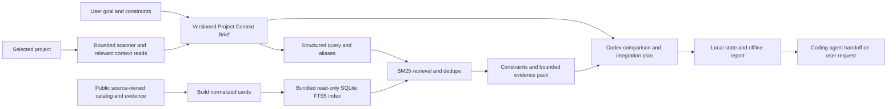

# myAI-StackGuide — Codex Plugin V1 Implementation Plan

Planning date: 2026-08-30; owner revision: 2026-08-31. Timezone: `Europe/Moscow`.

Document status: the detailed eight-view desktop/laptop design and RU-EN implementation scope are `owner_accepted`; runtime dispatch still requires CP-03 contracts, CP-04 evaluation design and CP-05 behavior alignment. CP-01/02 are implemented documentation; CP-03 contracts/examples are present with partial verification, and CP-04-CP-16 remain planned. No product runtime, index, remote integration or publication is activated by this revision.

## 1. Goal, Sources, And Boundaries

Owner revision: 2026-08-31. SQLite FTS5/BM25 is selected for local catalog retrieval. The product optimizes time to a useful open-source integration or modernization plan. Relevant project reads are allowed within existing permissions; the former host-wide source-isolation requirement is superseded, not technically proven. Repository activity and evidence observation are separate; the former 30-day snapshot rejection is withdrawn. CP-01/02 remain completed documentation records. CP-03 local schemas, policies and fixtures now exist; acceptance is partially verified pending standards validation and the CP-04 compatibility join. CP-04-CP-16 remain planned, with CP-12-CP-14 deferred. Runtime and permissions are unchanged.

Goal: help users build or modernize their solutions faster by selecting suitable OSS components and handing off a concrete integration plan grounded in their project. The saved output is a Project Context Brief plus an offline Decision Report with comparison, integration steps, a first useful validation slice and rollback. Measured speed/quality improvements are hypotheses until evaluated.

The [active PRD](../PRODUCT_REQUIREMENTS.md#active-plugin-v1-requirements) owns product meaning; this plan owns task scope and dependencies. [Root PLAN](../../PLAN.md), [team contracts](plugin-v1-team-contracts.md), and the [architecture](../../specs/decisions/plugin-v1-architecture.md), [permissions](../../specs/decisions/plugin-v1-permissions.md), [verification](../../specs/decisions/plugin-v1-verification.md) ADRs are synchronized to the owner revision. The earlier source plan SHA-256 `A456F4C4CD7A22709D844ADC52276F40874F0D93232D58F3198E005BE12C9DB5` is historical input, not an override of later owner decisions.

Current catalog source is `data/catalog_manifest.json`, schema `data/catalog_manifest.schema.json`, shell `templates/unified_catalog.html`; `docs/UNIFIED_CATALOG.html` is generated. The inspected snapshot is 2026-08-12 with 1,142 repositories and 77 categories. A 2,000+ future catalog is a scaling requirement, not a claim that the current source contains that many. Existing browser enrichment is not reliably persisted source evidence; CP-06 must close that input gap before indexing claims about activity. Unknown facts must not be invented.

No hosted app, Cloudflare, remote database/auth/MCP, embedding API/model, vector extension, Docker, daemon or scheduler is needed for the local route. Public read-only research remains possible when requested; it does not create a plugin network dependency. CP-12-CP-14 are a future extension requiring a new scope/architecture decision. Local CP-15/16 do not depend on them, directly or transitively.

The scanner remains read-only and does not execute project scripts/builds/installations. Relevant targeted project reads under actual user/host permissions are allowed, with exclusions and minimization. The recommendation flow writes only minimized artifacts under `docs/myai-stackguide/`; no recommendation automatically changes code. An explicit implementation request can authorize a bounded coding workflow using the handoff; existing authorization persists, and external/destructive/credential/cost boundaries still apply.

## 2. Required V1 Behavior

| ID | Requirement | Tasks |
| --- | --- | --- |
| R01 | Codex plugin with local Python scripts, bundled catalog and SQLite FTS5 index; no hosted app, service, custom MCP UI or remote prerequisite. | CP-01, CP-02, CP-07, CP-16 |
| R02 | 1-10 adaptive questions, early useful result, resume/corrections, persistence after each answer and truthful progress. | CP-03, CP-07, CP-11 |
| R03 | Idea/empty, compact, standard and large/monorepo contexts; bounded progressive scanning with explicit coverage gaps. | CP-02, CP-03, CP-08 |
| R04 | Relevant project context may be read under user/host permissions; minimize persisted context, exclude secrets, and do not promise host-wide source isolation. No private context in public catalog/index or future MCP. | CP-02, CP-03, CP-05, CP-08, CP-15 |
| R05 | Versioned facts, inferences, assumptions, corrections, gaps and evidence references; corrections invalidate dependent retrieval and recommendations. | CP-03, CP-07, CP-08, CP-10 |
| R06 | Local lexical RAG: structured query -> SQLite FTS5/BM25 -> bounded evidence pack -> Codex comparison. Never load the entire catalog into model context; remote discovery is deferred. | CP-03, CP-04, CP-06, CP-09, CP-11 |
| R07 | Canonical dedupe, task-specific constraints/reasons/roles; distinguish creation, last push, verified last commit/release and observation dates. No blanket snapshot-age rejection. | CP-03, CP-06, CP-09, CP-10 |
| R08 | Separate catalog status, machine evidence and recommendation eligibility; curator-only acceptance. Automatic public candidate overlay is a deferred extension. | CP-03, CP-06, CP-09, CP-12, CP-13 |
| R09 | No service credentials/auth or shared writes in local V1. Future remote auth, consent, idempotency, quotas and audit require an explicit extension decision. | CP-02, CP-12, CP-14 |
| R10 | Atomic minimized state, offline HTML, immutable finalized runs, safe concurrency, recovery and version history. | CP-03, CP-07, CP-10, CP-11 |
| R11 | Pin catalog, index, schema and retrieval-policy versions/hashes; reproduce candidate selection and reject mismatches. Remote overlay/compaction remains deferred. | CP-03, CP-06, CP-09, CP-11, CP-13, CP-16 |
| R12 | Retrieval relevance, bounded context/scale, recommendation usefulness, privacy/provenance, rendered UI, local runtime and rollback evidence before local release. | CP-04, CP-11, CP-15, CP-16 |
| R13 | Help build or modernize through an actionable integration plan and coding-agent handoff. Recommendations do not execute changes; an explicit implementation request authorizes its own bounded workflow. | CP-01, CP-03, CP-05, CP-07, CP-10, CP-11, CP-15, CP-16 |
| R14 | Activity/popularity are signals, not proof of operability or fit; missing mandatory facts remain unknown. Prefer useful caveated guidance over unnecessary refusal. | CP-03, CP-04, CP-06, CP-09, CP-15 |
| R15 | One session HTML supports RU-EN interface and localized narrative, preserving canonical facts, evidence, decisions and technical literals; offline switching performs no retrieval/model call or domain-state write. | CP-03, CP-04, CP-05, CP-07, CP-09, CP-10, CP-11, CP-15, CP-16 |

### Intake And Context

Ask 1-10 adaptive questions only when the answer changes a decision: build/replace/compare/learn/evaluate, current/target project stage, outcome, stack/platform, existing solutions, deployment/license/data constraints, integration surface, team capacity and time horizon. Stop early when enough context exists; after ten, proceed with explicit assumptions or a material clarification. Sanitize before persistence. Save after each answer/phase; corrections increment the Brief version and invalidate retrieval/recommendations. Progress is `Intake -> Scan -> Context Review -> Matching -> Report`, saved revision and next action; progress is not confidence.

Use topology -> high-signal scan -> selected relevant context -> normalization -> correction. Empty projects are valid; partial enumeration is not an empty project. The architecture ADR retains exact quick/standard/deep, topology, time, file/byte and response caps. Scanner output is structured; permitted targeted source excerpts may inform the host transiently, but raw project files/conversations do not become persisted state or public search data. Context selection is purpose-bound and source-referenced, with gaps rather than unrestricted retries.

### Local Retrieval, Evidence And Integration

`source_mode=catalog_only` and `retrieval_engine=sqlite_fts5` are distinct selectors. Source-owned normalized repository cards become an immutable bundled FTS5 index. `unicode61`, weighted BM25, versioned RU/EN/technology aliases and a compiled bounded query are the first baseline. Parameterize SQL and separately escape/limit FTS query syntax. No raw SQL from model text, arbitrary JSON chunking, full-catalog prompt, embeddings or implicit model/API call for retrieval.

Selected initial ceilings: 60 retrieved candidates across query variants, 12 detailed cards, 48 KiB UTF-8 for the entire evidence pack. These are uncalibrated engineering limits, not measured token/performance targets. CP-03 defines the total Brief/retrieval model-input budget and field limits; CP-04 calibrates without hidden cap increases. Dedupe and mandatory constraints conserve card budget; bounded query broadening cannot reset caps. Pack includes evidence references, missing facts, matched fields, exclusions, activity observations, scores/ranks and truncation reasons. Relevance score is not fit probability.

Keep `createdAt`, `pushedAt`, verified `lastCommitAt` plus SHA/branch, optional `lastReleaseAt`, `observedAt`, snapshot date and index build date semantically separate. No 30-day or other blanket snapshot-age rejection. Old observations trigger uncertainty or targeted verification of volatile facts, not a claim that a repository is dead. Recent commits do not prove working code, security or compatibility. Unknown mandatory facts bar an unconditional primary adoption claim, while useful references and conditional next checks remain possible.

Identity uses stable repository ID and canonical aliases/redirects. Preserve `catalog_status`, evidence stage, eligibility and request-specific role separately. Roles: `primary_candidate`, `supporting_tool`, `reference_only`, `compare_against`, `avoid_for_now`. No machine process assigns curator `accepted`. Archived/unavailable candidates may remain references with explicit caveats. Index failure is not no-match: emit typed unavailable/incompatible reasons without silent fallback.

The report explains what to integrate, why it fits, affected components, supported version/license evidence, adapters/configuration/migration needs, a small validation experiment, risks, rollback and unresolved facts. Commands/examples may be proposed with their prerequisites; they are not executed or declared tested merely because they appear in the report. The coding-agent handoff carries the user's goal, approved scope, source references, first implementation slice, acceptance and stop conditions. It is an actionable artifact, not automatic installation authority.

### Local Artifact And Deferred Extension

`state.json` is sole current state; `status.html` is a deterministic escaped offline projection; finalized `runs/{run_id}.json` is immutable. Preserve the CP-02 lock/revision/atomicity/recovery and retention caps. Record catalog/index/policy/schema pins, source mode/engine and evidence-pack counts/bytes. A correction invalidates stale packs and reports. A frozen retrieval result can be replayed; identical LLM wording is not guaranteed.

HTML contains outcome, context/coverage/gaps, shortlist/roles/evidence/activity, comparison, integration plan/handoff, risks, versions and history. No CDN, telemetry or automatic fetch. It must remain useful offline and pass rendered QA. No user context is stored in the public SQLite index or shared globally.

### Detailed Session Workspace And RU-EN Localization

The owner approved the detailed eight-view single-session HTML design and RU-EN direction, then requested this implementation-plan update. The [workspace design](plugin-v1-session-workspace-design.md) specifies all eight views and is the detailed design addendum to this plan. The owner explicitly excludes mobile: target desktop PCs and laptops, with readable window resizing and text zoom. Each view exposes a decision summary, useful product/technical subsections and on-demand evidence; the sample images are not a three-card result limit or runtime proof.

R15 requires an always-available RU-EN control, complete static UI dictionaries, revision-bound localized narrative, canonical literals/source attribution, visible partial translations and local switching without new retrieval/model calls or state writes. CP-03 specifies the missing presentation/schema mapping; CP-07 owns saved locale and question text; CP-10 owns dictionaries/renderer; CP-04/05/09/11/15/16 add the semantic, host, stable-result, browser and package checks listed in the design. No extra CP task, service, translation provider or vector dependency is introduced. Existing retrieval/state/HTML byte ceilings remain in force for bilingual output.

The detailed composition is the approved baseline; do not request concept approval again. This amendment is implementation planning, not runtime completion evidence. Existing CP-03 schemas are not silently extended; no previous completion report or later task status is promoted. CP-10/15 must still verify the working artifact for usefulness, correctness and accessibility.

#### Approved Build Checkpoints

Use the [approved implementation sequence](plugin-v1-session-workspace-design.md#approved-implementation-sequence) and [commit/publication lifecycle](plugin-v1-session-workspace-design.md#commit-and-html-publication-lifecycle) as the detailed execution contract. Keep the existing CP dependency graph and file ownership.

| Checkpoint | Outcome | Evidence / next join |
| --- | --- | --- |
| CP-03/04/05 preparation | Eight-view source mapping, paired presentation/revision/publication contracts, C8/C9 compatibility and aligned host behavior | Resolve existing CP-03 standards-validation gap; future consumers cannot infer fields from images |
| CP-06/07 foundations | Public card/index bundle; one local intake/state writer with commit/publication interface | Renderer fixture can verify the interface before CP-10; this is not full plugin UI proof |
| CP-10-A | Eight-view shell, RU/EN dictionaries, partial-state rendering from session start | One saved-start fixture and focused offline browser check; no memo required |
| CP-10-B | Goal, Questions, Scan, Context with all mapped subsections | Source/unknown/correction coverage; CP-08 supplies actual scan/Brief data |
| CP-10-C | Options, Compare, Integration with detailed evidence and first useful change | All available roles/cards, decision matrix, prerequisites, proposed diagram, validation, rollback, handoff; CP-09 supplies actual retrieval |
| CP-10-D | History, recovery and full state/accessibility coverage | Focused failures first, then one eight-view RU/EN desktop/keyboard/zoom/print review |
| CP-11/15/16 acceptance | Actual lifecycle, independent quality/usefulness and reproducible local package | Real FTS5 1/1 first, affected negatives/scaling, held-out review, then authorized install/upgrade/rollback |

Publish the same `docs/myai-stackguide/status.html` after the first session commit and each successful answer/phase/correction/finalization, through the CP-07 writer and CP-10 renderer. State remains canonical. Report saved and published revisions separately, preserve saved answers on render failure, reject late obsolete renders and retry publication without rescanning or recomposing the result. Codex owns input and saved decisions and links the updated artifact; an already-open file must be reopened/reloaded, not presented as a live monitor. Browser view/language changes do not trigger state writes. Wire the normal entry workflow so the user does not run a separate report command after every answer.

CP-10-A-D are sequential checkpoints within one task, not new CP IDs. Runtime Builder owns template/dictionaries/rendering; Quality Evaluator owns `tests/test_plugin_artifact.py` and browser evidence. Any shared intake/state/skill wiring remains under CP-07 ownership with sequential handoff, not parallel overlapping edits. Existing 60-candidate/12-card/48 KiB retrieval and 2 MiB state/5 MiB HTML limits remain unchanged. No mobile layout, server, browser filesystem bridge, automatic integration or new translation provider is added.

The deferred extension may add bounded GitHub discovery (original design: 3-5 public-safe queries and up to 20 normalized candidates/run), authenticated candidate ledger, overlay sync and compaction (original proposal: 100 candidates or 24 hours). These are retained proposals to revalidate in CP-12-14, not local requirements or accepted service choices. Remote C4/C7, consent/auth/retries/retention/commands and index-update compatibility must be accepted before activation. Candidate publication is never needed to deliver the local report.

## 3. Architecture And Contracts

The diagram shows planned plugin data flow, not host-wide isolation. SQLite contains public derived catalog data, while user state remains project-local JSON/HTML. The index is read-only at runtime, packaged at build time, and hash/version checked. Missing FTS5/corrupt/mismatched index returns a visible error, without index build, dependency download or a whole-catalog fallback. The actual Python/SQLite build and tested package bytes must be recorded.

Package layout: `plugins/myai-stackguide/.codex-plugin/plugin.json`, `skills/myai-stackguide/SKILL.md`, `scripts/`, `assets/`. Omit `.app.json`, `.mcp.json`, connection entries and hooks in local V1. CP-07/16 recheck current official packaging and verify installed/cache identity; files existing do not prove activation. Runtime remains the selected trusted Windows CPython standard-library path from the ADR, with an explicit FTS5 capability preflight.

Future schema/artifact registry; these paths are owned outputs, not files claimed to exist:

- C1 intake / CP-03: `specs/intake/intake-state.schema.json`, `specs/intake/interview-answer.schema.json`.
- C2 scanner / CP-03: `specs/scanner/scan-policy.schema.json`, `scan-policy.yaml`, `scan-manifest.schema.json`, `scan-report.schema.json`, `exclusion-cases.json` under `specs/scanner/`.
- C3 context / CP-03: `specs/context/sanitized-project-summary.schema.json`, `project-context-brief.schema.json`, `user-corrections.schema.json`, `context-selection.schema.json` under `specs/context/`.
- C4 local catalog / CP-03: `specs/catalog/repository-card.schema.json`, `activity-evidence.schema.json`, `candidate-eligibility.schema.json`, `taxonomy.yaml`, `taxonomy-rules.md` under `specs/catalog/`. Include per-field provenance/observation, activity-date semantics and aliases; baseline unknowns remain representable.
- C5 recommendation / CP-03: `specs/recommendation/recommendation-request.schema.json`, `recommendation-memo.schema.json`, `integration-plan.schema.json` under `specs/recommendation/`.
- C6 artifact / CP-03: `specs/artifact/project-artifact-state.schema.json` including context/catalog/index/policy pins and correction invalidation.
- R15 C6 presentation addendum / planned CP-03 follow-up: `specs/artifact/localized-presentation.schema.json`, joined to affected C1/C3/C5/C6 schemas and linked examples. Default/source language, revision, coverage and translated field/evidence identity are not yet implemented; the existing twenty-schema count is unchanged.
- C7 remote MCP / deferred CP-12: `specs/mcp/discovery-query.schema.json`, `specs/mcp/tool-contracts.json`; deferred remote C4: `specs/catalog/live-evidence-record.schema.json`, `discovery-candidate.schema.json`, `candidate-ledger-event.schema.json` under `specs/catalog/`. Architect defines these before backend implementation; CP-13 consumes them. Not part of local CP-03 acceptance.
- C8 evaluation / CP-04: `evals/scenario.schema.json`, `evals/result.schema.json`, `evals/plugin-v1/cases.json`, `evals/plugin-v1/rubric.json`, `evals/plugin-v1/runner-contract.md`; offline scoring harness `evals/plugin-v1/evaluate_retrieval.py`, `tests/test_plugin_retrieval_eval.py`, `tests/fixtures/plugin_retrieval_eval.json`.
- C9 retrieval / CP-03: `specs/retrieval/catalog-query.schema.json`, `retrieval-result.schema.json`, `evidence-pack.schema.json`, `index-manifest.schema.json`, `retrieval-policy.json` under `specs/retrieval/`. Policy owns query grammar, field weights/aliases, multi-query rank fusion, caps, rejection reasons and version compatibility; CP-06 packages it, CP-09 consumes it.

Local CP-03 is complete when C1-C6/C9 and their fixtures are accepted. C8 belongs to CP-04; the C7/remote-C4 extension is explicitly transferred to CP-12, not left as an unclosable CP-03 remainder.

## 4. Team, Skills, And Execution Order

The existing nine roles are retained, including already-authored `plugin_runtime_builder` and `mcp_backend_builder`; no need to recreate them. Ownership: Product Planner owns requirements/plan; Catalog Architect owns schemas/ADRs; Curator owns public research evidence; Pipeline Builder owns normalized cards/index/builders; Plugin Runtime Builder owns local runtime/report; Quality Evaluator owns tests/eval acceptance; Docs Maintainer records approved facts; Evidence Reviewer is read-only; MCP Backend Builder stays dormant locally. Configured model/effort defaults are unchanged and not promoted by static checks.

Use the smallest relevant skill set: `shape-product-slice`, `design-context-contracts`, `design-catalog-contracts`, `evolve-catalog-pipeline`, `build-stackguide-plugin`, `design-recommendation-evals`, `review-advisory-evidence`, `verify-generated-parity`, `maintain-control-plane` according to the task. `build-stackguide-mcp` applies only to the deferred extension. Before any delegation, read `.codex/TEAM.md` and send a completed fresh-context `.codex/artifact-templates/agent-task-packet.md`; no raw-history-only handoff. One owner writes each mutable source; tests/evidence/index assets pass sequentially.

CP-05 must realign the existing agent/skill/eval contracts that still encode scanner-only source access or blanket coding refusal. This documentation revision does not edit protected `.codex/` or `.agents/` files, nor behavioral JSON fixtures. Their static pass is not evidence of revised behavior. Verify loaded instructions in a fresh session before runtime dispatch; do not alter host permissions or model policy just to remove a mismatch.

Execution order: CP-03 local schemas and CP-04 eval contract can proceed independently with a final compatibility join; CP-05 readiness is another bounded preparation. CP-06 builds source/card/index assets; CP-07 establishes local intake/state; CP-08 scanner, CP-09 retrieval and CP-10 renderer use disjoint implementation files after their dependencies. CP-11 joins one useful local scenario first; CP-15 independently verifies local acceptance; CP-16 packages the local product. CP-12-14 never lie on this local critical path.

## 5. Decision And Readiness Registry

| Decision / gate | Status | Owner / next evidence |
| --- | --- | --- |
| Local plugin; SQLite FTS5/BM25; no vector/provider/server dependency | `design_selected` | CP-03/06/09 implement and validate contracts/index/retrieval |
| Relevant project context; no strict host-isolation promise | `owner_revised` | CP-03/05/08/15 verify minimization, exclusions, authorized scope and useful reads |
| Activity/observation dates; no blanket snapshot TTL | `owner_revised` | CP-03 semantics, CP-06 source persistence/coverage, CP-09/15 activity cases |
| Actionable integration plan and coding handoff | `design_selected` | CP-03/10/11/15 contract, implementation and human usefulness |
| Contracts and retrieval budgets | `partially_verified` | CP-03 local C1-C6/C9 and fixtures present; standards validation and CP-04 join pending; ceilings uncalibrated |
| Quality corpus, runner and calibration | `applicable_missing` | CP-04 freezes relevance judgments, runner, thresholds and human rubric |
| Loaded agent/skill behavior | `present_unverified` | CP-05 alignment plus fresh-session evidence; no implicit promotion |
| Detailed eight-view desktop design and RU-EN | `owner_accepted` | CP-10 A-D implements the approved composition; CP-11/15 verify the working artifact, without another concept gate |
| Runtime/index/UI/install | `not_implemented` | CP-06-11, CP-15/16; planning is not product acceptance |
| Remote tools/auth/backend/scheduler | `deferred` | New extension decision and CP-12-14; no local-release block |
| Publication / external actions | `approval_required` | Exact destination/action only after a reviewable package exists |

## 6. Verification Registry

All future commands require their named test/runner files to exist; a zero-test discovery is not a pass. Current documentation checks and actual results are recorded in RUNLOG.

- V-DOC: Product-Agent OS task/control-plane validators, focused existing `test_codex_contracts.py`, R01-R15/FR1-FR15 mapping, unique 16-task DAG and reciprocal Blocks, links/UTF-8/history/protected-file audit, whitespace and semantic self-review.
- V-CONTRACT / CP-03: `python -B -m unittest discover -s tests -p test_plugin_contracts.py -v`; local C1-C6/C9 fixtures, bounded query/context, activity/unknown semantics and handoff. No remote-contract prerequisite.
- V-CATALOG / CP-06: future `test_plugin_catalog.py` and `test_plugin_search_index.py`; normalized source/card/index/policy parity and hashes, dedupe/coverage/integrity. Run existing catalog HTML parity only if its source/output changes.
- V-RETRIEVAL / CP-09: future `test_plugin_retrieval.py` and `test_plugin_matching.py`; actual FTS5, query grammar, RU/EN/aliases, stable ordering/constraints/caps, no-hit versus unavailable, read-only and mismatch cases.
- V-LOCAL / CP-11: register one exact useful semantic-case command, then affected edges, then final `python -B -m unittest discover -s tests -p "test_plugin_*.py" -v`. Record intended `sqlite_fts5` route and prevent fallback/mock masking.
- V-EVAL / CP-04/15: future offline scorer `evals/plugin-v1/evaluate_retrieval.py` consumes validated captured C9 results and frozen C8 judgments; CP-04 creates it and accepts its exact CLI/input/output contract. `command_gap` remains until then. Register the held-out cases, lexical baseline, Recall@k/nDCG@k, exclusion errors and human integration-usefulness rubric. Same-case comparisons; no quality gain inferred from FTS5 availability. Synthetic 2,000/10,000-row scaling is separate from actual catalog relevance and real size.
- V-UI / CP-10/15: all eight views in RU/EN, localized narrative/evidence parity and unchanged captured retrieval, rendered offline report, links/escaping, injection, keyboard/lang/focus, desktop-window/200%-zoom overflow, print, missing translation, no-JS/storage/clipboard fallback, console and zero third-party requests. Raster concepts do not pass this gate.
- V-RELEASE / CP-16: authorized clean install/fresh-session identity, actual Python/FTS5 preflight, package/index/policy hashes, read-only query, upgrade/downgrade/disable, previous compatible package and preserved history. Local gate excludes auth expiry/scheduler/live service tests.
- V-MCP / V-LIVE: deferred CP-12/14 only; future exact endpoint, auth/data/cost/action scope, commands and observed traces. They are not marked passed and do not block local release.

Recommendation threshold remains at least 16/20 with no critical dimension below 1, no critical privacy/permission/provenance/unsupported-readiness failure, and full visible evidence/uncertainty for primary recommendations. CP-04 updates critical behavior to authorized context and actionable integration handoff, calibrates examples and aggregation, and freezes retrieval thresholds before quality runs. A score is not a substitute for human usefulness or technical runtime evidence.

Rollback preserves the previous compatible package/index and valid user state/history. No Git reset, automatic data deletion, silent fallback or external activation. Future remote failure must leave the local route usable, with visible provenance and failure reasons.

## 7. Detailed Task Matrix

The task contracts below are amended to the 2026-08-31 local scope. CP-01/02 completion reports are preserved historical evidence for their original documentation runs; the amendment does not retroactively claim new tests or implementation. CP-03 below records current implementation and open acceptance gates; CP-04-CP-16 completion reports still record planning only.

### Task `CP-01`

- Task: CP-01 — reconcile product requirements and integration-oriented scope
- Status: implemented
- Schema version: task_matrix_plan_v1
- Timezone: Europe/Moscow
- Plan trigger: Owner revision 2026-08-31: local SQLite FTS5, relevant context, activity-aware evidence and actionable OSS integration. This task remains within the local product path.
- Validator target: detailed task blocks
- Date and time of task implementation: 30-08-2026 21:27
- Depends on: none
- Blocks: CP-02, CP-03, CP-04, CP-05, CP-16
- Source: Owner decisions 2026-08-31; active PRD R01, R13; accepted CP-02 ADRs and Section 3 registries.
- Short description: Keep plugin-first requirements, owner revisions and historical mappings aligned.
- Technical value: One active local architecture and requirement-to-task mapping.
- Product value: A direct path from project goal to useful OSS integration guidance.
- Scope: Product Planner owns REQUIREMENTS.md and PLAN.md; sequential Docs Maintainer owns README.md, active PRD/roadmap/product/scanner/architecture summaries and RUNLOG.md; primary owns the detailed task-plan amendment. Preserve historical sources.
- Non-goals: Unassigned files, model/permission changes, Git history, automatic installs, private-data disclosure or external activation. No remote architecture/runtime or vector/embedding dependency.
- Expected result: R01-R14 and legacy mappings reflect local FTS5, relevant context, activity evidence and integration handoff.
- Acceptance criteria: All active documents agree on owner decisions, source ownership, permission boundaries and the local dependency path; historical requirements remain explicitly inactive.
- Verification gates: V-DOC and cross-document semantic review; current amendment evidence is separate from the original completion report.
- Risks / approval gates: Preserve pre-existing dirty work and source-owned boundaries. Public research is read-only; sensitive scope, credentials, material cost, external writes, publication and destructive operations follow actual authorization. Selected caps and ranking quality are not yet measured.
- Complexity: M
- Estimated execution time: 2–4 active hours; preliminary.
- Agents: Owner product_planner; sequential docs_maintainer; reviewer evidence_reviewer.
- Skills: shape-product-slice; maintain-control-plane; review-advisory-evidence.
- Output artifacts: Product Planner owns REQUIREMENTS.md and PLAN.md; sequential Docs Maintainer owns README.md, active PRD/roadmap/product/scanner/architecture summaries and RUNLOG.md; primary owns the detailed task-plan amendment. Preserve historical sources.
- Evidence owner: product_planner; evidence_reviewer returns findings without editing documents.
- Docs update path: RUNLOG.md after approved facts are handed off to docs_maintainer.
- Rollback: Undo only owned changes; preserve prior valid state, finalized history and compatible package/index. No automatic deletion, Git reset, permission weakening or silent retrieval fallback.
- Stop conditions: Unexpected sensitive data or side effects, ownership overlap, incompatible accepted contract, unsafe containment, failed mandatory evidence or missing required external authorization. Routine relevant reads are not failures; report useful partial results when safe.
- Next step: CP-03, CP-04 and CP-05 preparation under explicit assignments; do not execute downstream runtime from this plan edit.

#### Completion report

Historical report for the original 2026-08-30 documentation run, preserved verbatim below. Its old R04/staleness/scope wording and verification claims do not govern the amended contract above or validate this revision.

- status: implemented
- what was done: Reconciled active plugin-first requirements, journey, boundaries and milestones; mapped R01-R14, FR1-FR15, cross-cutting legacy sections and historical milestones/V1X rows. Historical source bodies remain preserved, explicitly inactive.
- files touched / work locations: The ten documentation files listed in Scope; no product code, schemas, catalog, agent/skill definitions or configuration changes.
- technical value delivered: A single active requirements path with distinct scanner, model, MCP and local-output boundaries; independent review found no actionable gaps.
- product value delivered: A consistent idea/local-project to Decision Report journey; no runtime or measured user outcome claimed.
- actual implementation date and time: 30-08-2026 21:27
- verification evidence: Eleven existing control-plane contract tests pass. Local audit confirms all fourteen R/task mappings, fifteen FR mappings, sixteen-task dependency DAG, five preserved historical bodies, forty-four active local links/anchors and unchanged CP-02-CP-16 blocks. Independent evidence_reviewer found no actionable findings. Final V-DOC/status validation and exact command outcomes are recorded in RUNLOG.
- residual risks: CP-02 decisions, CP-03 schemas, CP-04 quality runner and full CP-05 readiness remain open. No implicit model/skill routing promotion or runtime acceptance.
- follow-up: CP-02 architecture/runtime/permission decisions under a separate assignment; this documentation authorization does not execute downstream tasks.

### Task `CP-02`

- Task: CP-02 — define local plugin and SQLite FTS5 architecture ADRs
- Status: implemented
- Schema version: task_matrix_plan_v1
- Timezone: Europe/Moscow
- Plan trigger: Owner revision 2026-08-31: local SQLite FTS5, relevant context, activity-aware evidence and actionable OSS integration. This task remains within the local product path.
- Validator target: detailed task blocks
- Date and time of task implementation: 30-08-2026 21:57
- Depends on: CP-01
- Blocks: CP-03, CP-05, CP-07, CP-08, CP-12, CP-14
- Source: Owner decisions 2026-08-31; active PRD R01, R03, R04, R09; accepted CP-02 ADRs and Section 3 registries.
- Short description: Amend local architecture, context/privacy, repository activity and verification decisions.
- Technical value: A bounded read-only public search index, exact version pins and local failure/recovery design.
- Product value: Scalable local guidance without a service dependency or an unnecessary source-isolation blocker.
- Scope: Catalog Architect owns specs/decisions/plugin-v1-architecture.md, plugin-v1-permissions.md and plugin-v1-verification.md; Product Planner/Docs Maintainer sequentially align active control/product docs and RUNLOG.md.
- Non-goals: Unassigned files, model/permission changes, Git history, automatic installs, private-data disclosure or external activation. No remote architecture/runtime or vector/embedding dependency.
- Expected result: Selected FTS5/BM25, package/index ownership, runtime preflight, caps, activity semantics and R04/R13 revision; remote architecture deferred.
- Acceptance criteria: No blanket snapshot-age rejection, no host-wide isolation claim; source mode versus retrieval engine separated; state/recovery caps preserved; local CP-03 and CP-15/16 can complete without remote tasks.
- Verification gates: V-DOC, architecture/permission self-review and focused existing contracts; runtime remains unverified.
- Risks / approval gates: Preserve pre-existing dirty work and source-owned boundaries. Public research is read-only; sensitive scope, credentials, material cost, external writes, publication and destructive operations follow actual authorization. Selected caps and ranking quality are not yet measured.
- Complexity: L
- Estimated execution time: 4–8 active hours; excludes waiting for decisions.
- Agents: Primary Catalog Architect then Product Planner/Docs Maintainer; explicit self-review for this amendment. Original independent reviews remain dated CP-02 evidence.
- Skills: design-context-contracts; design-catalog-contracts; audit-readonly-boundaries; openai-docs; maintain-control-plane; independent review-advisory-evidence.
- Output artifacts: Catalog Architect owns specs/decisions/plugin-v1-architecture.md, plugin-v1-permissions.md and plugin-v1-verification.md; Product Planner/Docs Maintainer sequentially align active control/product docs and RUNLOG.md.
- Evidence owner: catalog_architect; independent findings from evidence_reviewer.
- Docs update path: PLAN.md through product_planner; RUNLOG.md through docs_maintainer.
- Rollback: Undo only owned changes; preserve prior valid state, finalized history and compatible package/index. No automatic deletion, Git reset, permission weakening or silent retrieval fallback.
- Stop conditions: Unexpected sensitive data or side effects, ownership overlap, incompatible accepted contract, unsafe containment, failed mandatory evidence or missing required external authorization. Routine relevant reads are not failures; report useful partial results when safe.
- Next step: CP-03 local C1-C6/C9, CP-04 evals and CP-05 alignment. No server or embeddings decision needed.

#### Completion report

Historical report for the original 2026-08-30 documentation run, preserved verbatim below. Its old R04/staleness/scope wording and verification claims do not govern the amended contract above or validate this revision.

- status: implemented
- what was done: Three local ADRs and active-scope reconciliation completed; official package/permission sources checked; document gates passed; two P2 reviewer findings fixed and independently rechecked.
- files touched / work locations: Three ADRs, active control/product docs and this plan; exact scope in PLAN.md.
- technical value delivered: Local package/runtime, caps, state and verification decisions documented; no runtime claim.
- product value delivered: No server prerequisite for the local path; disclosure and R04 gap explicit.
- actual implementation date and time: 30-08-2026 21:57
- verification evidence: Official sources, task/control validators, 11 existing control-plane tests, links/UTF-8/mapping/DAG/history/protected-diff audit and independent boundary/final review; exact commands/results in RUNLOG. Runtime not run.
- residual risks: R04 host isolation unresolved; runtime, schemas, compatibility, privacy enforcement, evals and install remain unverified; remote choices deferred.
- follow-up: Local CP-03 contracts and CP-05 readiness under separate assignments; R04 sensitive-use gate and remote scope/command gaps remain explicit. No integration activation.

### Task `CP-03`

- Task: CP-03 — define complete local context, catalog, retrieval and integration contracts
- Status: in_progress
- Schema version: task_matrix_plan_v1
- Timezone: Europe/Moscow
- Plan trigger: Owner revision 2026-08-31: local SQLite FTS5, relevant context, activity-aware evidence and actionable OSS integration. This task remains within the local product path.
- Validator target: detailed task blocks
- Date and time of task implementation: 2026-08-31 (Europe/Moscow; acceptance pending)
- Depends on: CP-01, CP-02
- Blocks: CP-06, CP-07, CP-08, CP-09, CP-10, CP-11, CP-12, CP-13
- Source: Owner decisions 2026-08-31; active PRD R02, R03, R04, R05, R06, R07, R08, R10, R11, R13, R14; accepted CP-02 ADRs and Section 3 registries. R15 session workspace/localization amendment and linked design addendum.
- Short description: Accept local C1-C6 plus C9 with bounded interfaces, versions and representative fixtures.
- Technical value: Stable query/card/index/pack/state contracts prevent context growth and source/version confusion.
- Product value: Candidates can become actionable integration plans with visible gaps rather than blanket refusal.
- Scope: Catalog Architect owns exact local C1-C6 and C9 paths in Section 3. Quality Evaluator owns tests/test_plugin_contracts.py and tests/fixtures/plugin_contracts.json. Include field provenance, activity semantics, context-selection budgets, integration-plan fields, index manifest, query grammar/aliases and total Brief/evidence input allocation.
- Non-goals: Unassigned files, model/permission changes, Git history, automatic installs, private-data disclosure or external activation. No remote architecture/runtime or vector/embedding dependency.
- Expected result: Versioned accepted schemas/policy and positive/negative/edge fixtures; local CP-03 fully closable. Remote C4/C7 ownership transferred to deferred CP-12 before its backend implementation.
- Acceptance criteria: Represent unknown dates/license/compatibility without fabricated values; distinguish push from commit and observation; reject private fields in public index, unsafe query grammar/unbounded context and silent pin mismatch. Permit bounded relevant reads and non-executed integration steps. Specify invalidation, errors and compatibility; keep source/card identity stable.
- Session workspace / R15 (planned): Map all eight views to typed fields or explicit unknowns; define specs/artifact/localized-presentation.schema.json and affected C1/C3/C5/C6 joins for default/source locale, paired prose, content versus saved-state revision, coverage and byte limits. Define the shared commit/publication outcome (saved versus published run/revision, first-render failure, stale result and retry semantics) without another domain store. Preserve existing schema evidence; validate the addendum and C8/C9 join before downstream acceptance.
- Verification gates: V-CONTRACT and V-DOC; CP-04 compatibility review before either contract set is accepted; no index implementation or model-quality claim.
- Risks / approval gates: Preserve pre-existing dirty work and source-owned boundaries. Public research is read-only; sensitive scope, credentials, material cost, external writes, publication and destructive operations follow actual authorization. Selected caps and ranking quality are not yet measured.
- Complexity: L
- Estimated execution time: Re-estimate at dispatch from accepted inputs and the first bounded slice; earlier ranges are superseded by the changed FTS5/context/integration scope. No delivery commitment or provider-cost estimate.
- Agents: Owner catalog_architect; sequential test owner quality_evaluator; reviewer evidence_reviewer.
- Skills: design-context-contracts; design-catalog-contracts; audit-readonly-boundaries; design-recommendation-evals.
- Output artifacts: Catalog Architect owns exact local C1-C6 and C9 paths in Section 3. Quality Evaluator owns tests/test_plugin_contracts.py and tests/fixtures/plugin_contracts.json. Include field provenance, activity semantics, context-selection budgets, integration-plan fields, index manifest, query grammar/aliases and total Brief/evidence input allocation.
- Evidence owner: quality_evaluator retains test evidence; the architect owns contract acceptance.
- Docs update path: Product Planner updates PLAN.md/task status; Quality Evaluator records TEST.md/EVALS.md evidence; Docs Maintainer appends RUNLOG.md after handoff. No unsupported completion claim.
- Rollback: Undo only owned changes; preserve prior valid state, finalized history and compatible package/index. No automatic deletion, Git reset, permission weakening or silent retrieval fallback.
- Stop conditions: Unexpected sensitive data or side effects, ownership overlap, incompatible accepted contract, unsafe containment, failed mandatory evidence or missing required external authorization. Routine relevant reads are not failures; report useful partial results when safe.
- Next step: Complete the presentation/view/publication addendum and existing standards validation, join CP-04 compatibility and CP-05 readiness; then CP-06/07 consumers. CP-04 may prepare independently.

#### Completion report

- status: in_progress
- what was done: Implemented all 20 local C1-C6/C9 schemas, source-aligned taxonomy/rules, scan and retrieval policies, 20 linked positive examples, 17 negative mutations, exclusion cases and semantic/structural tests. Added explicit no-manifest failures without fabricated hashes.
- files touched / work locations: Exact CP-03 specs registry; tests/test_plugin_contracts.py; tests/fixtures/plugin_contracts.json; active control/ADR documentation and append-only RUNLOG. No source catalog, generated artifacts, plugin runtime or protected configuration changed.
- technical value delivered: Bounded context/query/card/pack interfaces, exact artifact pins, activity observations, unknown-fact eligibility, corrected-context invalidation and non-executed integration handoff are explicit and testable.
- product value delivered: A concrete synthetic example reaches a useful integration plan; incomplete evidence permits conditional guidance. Real recommendation usefulness is not measured.
- actual implementation date and time: 2026-08-31 (Europe/Moscow; exact verification command outcomes in RUNLOG)
- verification evidence: 19 semantic contract tests and 11 existing control-plane tests pass. Full V-CONTRACT fails explicitly because jsonschema is unavailable; temporary development-only installation awaits user permission. This is a dependency blocker, not expected RED or a skipped pass.
- residual risks: Draft 2020-12 standards validation and C8/C9 compatibility review remain open, so contracts are not yet accepted for downstream runtime. CP-04 owns C8/scorer creation; schemas alone do not prove privacy enforcement, search quality, actual Windows containment, atomic state or plugin installation.
- follow-up: Finish standards validation; implement CP-04 and join its input/result schemas to these C9 examples, then CP-05 alignment. CP-06/07 follow accepted prerequisites. Remote C4/C7 stays deferred to CP-12.

### Task `CP-04`

- Task: CP-04 — define retrieval and integration-usefulness evaluation contracts
- Status: planned
- Schema version: task_matrix_plan_v1
- Timezone: Europe/Moscow
- Plan trigger: Owner revision 2026-08-31: local SQLite FTS5, relevant context, activity-aware evidence and actionable OSS integration. This task remains within the local product path.
- Validator target: detailed task blocks
- Date and time of task implementation: pending_execution_timestamp
- Depends on: CP-01
- Blocks: CP-11, CP-15
- Source: Owner decisions 2026-08-31; active PRD R06, R12, R14; accepted CP-02 ADRs and Section 3 registries. R15 session workspace/localization amendment and linked design addendum.
- Short description: Freeze representative cases, lexical baseline, relevance judgments, metrics and executable runner contract.
- Technical value: Separate search recall/ranking, deterministic safety, scaling and generated recommendation quality.
- Product value: Evaluate time to a useful next integration step, not only a plausible shortlist.
- Scope: Quality Evaluator owns TEST.md, EVALS.md, C8 exact files, evals/plugin-v1/runner-contract.md; Product Planner calibrates usefulness. Quality Evaluator also owns evals/plugin-v1/evaluate_retrieval.py, tests/test_plugin_retrieval_eval.py and tests/fixtures/plugin_retrieval_eval.json: an offline scorer for captured C9 retrieval results against frozen judgments, independent of the unfinished plugin and without model/provider calls. Runner contract defines validated input/output files, replay pins and command before a quality run. Align with accepted CP-03 C3-C6/C9 at the compatibility join.
- Non-goals: Unassigned files, model/permission changes, Git history, automatic installs, private-data disclosure or external activation. No remote architecture/runtime or vector/embedding dependency.
- Expected result: Versioned typical/edge/adversarial/regression and held-out corpus with RU/EN, technology aliases, replacement/integration intent, incomplete metadata, old stable versus newly active repositories, zero-hit/index failures and context limits.
- Acceptance criteria: Predeclare Recall@k/nDCG@k, wrong-exclusion and hard-constraint checks, total context bytes/token measurement method, latency/memory methodology and thresholds before running. Keep initial 60/12/48-KiB caps explicit. Preserve 16/20 rubric and zero critical failures; calibrate authorized reads/handoff instead of blanket coding refusal. Label 2,000/10,000 synthetic scaling separately; no vectors/model provider dependency for lexical eval.
- Session workspace / R15 (planned): Freeze paired RU/EN presentation cases separately from lexical-query cases: one canonical result, identical evidence/constraints/roles/negation/authority, explicit missing translations, and measured generation/byte overhead within existing limits.
- Verification gates: V-DOC, C8 fixtures, runner-contract review and python -B -m unittest discover -s tests -p test_plugin_retrieval_eval.py -v. Tiny known-result fixtures verify metric computation/error handling; human calibration and actual CP-11 captures are required before a product quality verdict.
- Risks / approval gates: Preserve pre-existing dirty work and source-owned boundaries. Public research is read-only; sensitive scope, credentials, material cost, external writes, publication and destructive operations follow actual authorization. Selected caps and ranking quality are not yet measured.
- Complexity: M
- Estimated execution time: Re-estimate at dispatch from accepted inputs and the first bounded slice; earlier ranges are superseded by the changed FTS5/context/integration scope. No delivery commitment or provider-cost estimate.
- Agents: Owner quality_evaluator; product usefulness reviewer product_planner; independent claims reviewer evidence_reviewer.
- Skills: design-recommendation-evals; review-advisory-evidence; audit-readonly-boundaries.
- Output artifacts: Quality Evaluator owns TEST.md, EVALS.md, C8 exact files, evals/plugin-v1/runner-contract.md; Product Planner calibrates usefulness. Quality Evaluator also owns evals/plugin-v1/evaluate_retrieval.py, tests/test_plugin_retrieval_eval.py and tests/fixtures/plugin_retrieval_eval.json: an offline scorer for captured C9 retrieval results against frozen judgments, independent of the unfinished plugin and without model/provider calls. Runner contract defines validated input/output files, replay pins and command before a quality run. Align with accepted CP-03 C3-C6/C9 at the compatibility join.
- Evidence owner: quality_evaluator; product_planner accepts usefulness criteria.
- Docs update path: Product Planner updates PLAN.md/task status; Quality Evaluator records TEST.md/EVALS.md evidence; Docs Maintainer appends RUNLOG.md after handoff. No unsupported completion claim.
- Rollback: Undo only owned changes; preserve prior valid state, finalized history and compatible package/index. No automatic deletion, Git reset, permission weakening or silent retrieval fallback.
- Stop conditions: Unexpected sensitive data or side effects, ownership overlap, incompatible accepted contract, unsafe containment, failed mandatory evidence or missing required external authorization. Routine relevant reads are not failures; report useful partial results when safe.
- Next step: CP-11 local semantic join, then CP-15 held-out acceptance; CP-05 aligns team behavior cases separately.

#### Completion report

- status: planned
- what was done: Task contract and dependencies revised on 2026-08-31; no task implementation executed by this plan revision.
- files touched / work locations: Planning/control/ADR documentation only; future owned outputs are listed above.
- technical value delivered: Implementation benefit not claimed; planned result is Separate search recall/ranking, deterministic safety, scaling and generated recommendation quality.
- product value delivered: User outcome not measured; planned result is Evaluate time to a useful next integration step, not only a plausible shortlist.
- actual implementation date and time: pending_execution_timestamp
- verification evidence: Current documentation checks belong in RUNLOG.md; no task-specific runtime, schema, index, model or release pass claimed.
- residual risks: Upstream acceptance and task-specific evidence remain open. Remote extension and vectors are not prerequisites.
- follow-up: CP-11 local semantic join, then CP-15 held-out acceptance; CP-05 aligns team behavior cases separately.

### Task `CP-05`

- Task: CP-05 — align existing agents, skills and behavior cases with local FTS5 scope
- Status: planned
- Schema version: task_matrix_plan_v1
- Timezone: Europe/Moscow
- Plan trigger: Owner revision 2026-08-31: local SQLite FTS5, relevant context, activity-aware evidence and actionable OSS integration. This task remains within the local product path.
- Validator target: detailed task blocks
- Date and time of task implementation: pending_execution_timestamp
- Depends on: CP-01, CP-02
- Blocks: CP-07, CP-08, CP-09, CP-10, CP-12, CP-13, CP-16
- Source: Owner decisions 2026-08-31; active PRD R04, R13; accepted CP-02 ADRs and Section 3 registries. R15 session workspace/localization amendment and linked design addendum.
- Short description: Update existing readiness contracts rather than recreate already-authored builder roles.
- Technical value: Loaded instructions no longer conflict with authorized context access, retrieval or integration handoff.
- Product value: Avoid needless refusals, repeated approvals and remote setup detours.
- Scope: Product Planner owns scoped existing .codex/agents/plugin-runtime-builder.toml, .codex/TEAM.md and other role references identified in the accepted task packet; local skills .agents/skills/build-stackguide-plugin/SKILL.md, design-context-contracts/SKILL.md, design-recommendation-evals/SKILL.md, audit-readonly-boundaries/SKILL.md and review-advisory-evidence/SKILL.md as needed. Quality Evaluator owns tests/test_codex_contracts.py, evals/agents/agent-routing-cases.json, evals/agents/team-behavior-cases.json and evals/skills/skill-activation-cases.json. Resolve exact further files before edits; protected-directory writes require applicable permission, not policy weakening.
- Non-goals: Unassigned files, model/permission changes, Git history, automatic installs, private-data disclosure or external activation. No remote architecture/runtime or vector/embedding dependency.
- Expected result: Local builder/architect/reviewer routes apply revised R04/R13, FTS5/index boundaries and unknown/activity policy; backend role dormant. Explicit fresh-session evidence for changed contracts.
- Acceptance criteria: Remove scanner-only host-source prohibitions and automatic refusal of requested coding handoff while preserving exclusions, no automatic installs, public/private separation and actual approval boundaries. FTS5 is default and no provider/server is introduced. Targeted static checks plus representative direct/indirect/incomplete/adversarial behavior traces; no model/effort promotion without existing comparison requirements.
- Session workspace / R15 (planned): Align assigned host question/composition/handoff behavior with one canonical result and paired RU/EN presentation. No separate translation provider, automatic language-triggered retrieval or protected-definition edit is authorized by this plan.
- Verification gates: V-DOC, relevant agent/skill validators and focused control-plane checks; fresh-session loading/routing before runtime dispatch. Old static passes are not revised-behavior proof.
- Risks / approval gates: Preserve pre-existing dirty work and source-owned boundaries. Public research is read-only; sensitive scope, credentials, material cost, external writes, publication and destructive operations follow actual authorization. Selected caps and ranking quality are not yet measured.
- Complexity: M
- Estimated execution time: Re-estimate at dispatch from accepted inputs and the first bounded slice; earlier ranges are superseded by the changed FTS5/context/integration scope. No delivery commitment or provider-cost estimate.
- Agents: Owner primary orchestrator; reviewer evidence_reviewer; eval owner quality_evaluator.
- Skills: shape-product-slice; maintain-control-plane; design-recommendation-evals; applicable skill-creator for assigned durable skill changes; openai-docs for fresh loading evidence.
- Output artifacts: Product Planner owns scoped existing .codex/agents/plugin-runtime-builder.toml, .codex/TEAM.md and other role references identified in the accepted task packet; local skills .agents/skills/build-stackguide-plugin/SKILL.md, design-context-contracts/SKILL.md, design-recommendation-evals/SKILL.md, audit-readonly-boundaries/SKILL.md and review-advisory-evidence/SKILL.md as needed. Quality Evaluator owns tests/test_codex_contracts.py, evals/agents/agent-routing-cases.json, evals/agents/team-behavior-cases.json and evals/skills/skill-activation-cases.json. Resolve exact further files before edits; protected-directory writes require applicable permission, not policy weakening.
- Evidence owner: quality_evaluator for static/routing evidence; primary orchestrator for the accepted team packet.
- Docs update path: Product Planner updates PLAN.md/task status; Quality Evaluator records TEST.md/EVALS.md evidence; Docs Maintainer appends RUNLOG.md after handoff. No unsupported completion claim.
- Rollback: Undo only owned changes; preserve prior valid state, finalized history and compatible package/index. No automatic deletion, Git reset, permission weakening or silent retrieval fallback.
- Stop conditions: Unexpected sensitive data or side effects, ownership overlap, incompatible accepted contract, unsafe containment, failed mandatory evidence or missing required external authorization. Routine relevant reads are not failures; report useful partial results when safe.
- Next step: Dispatch local CP-07/08/09/10 only after applicable CP-03 contracts and readiness checks; keep CP-12 dormant.

#### Completion report

- status: planned
- what was done: Task contract and dependencies revised on 2026-08-31; no task implementation executed by this plan revision.
- files touched / work locations: Planning/control/ADR documentation only; future owned outputs are listed above.
- technical value delivered: Implementation benefit not claimed; planned result is Loaded instructions no longer conflict with authorized context access, retrieval or integration handoff.
- product value delivered: User outcome not measured; planned result is Avoid needless refusals, repeated approvals and remote setup detours.
- actual implementation date and time: pending_execution_timestamp
- verification evidence: Current documentation checks belong in RUNLOG.md; no task-specific runtime, schema, index, model or release pass claimed.
- residual risks: Upstream acceptance and task-specific evidence remain open. Remote extension and vectors are not prerequisites.
- follow-up: Dispatch local CP-07/08/09/10 only after applicable CP-03 contracts and readiness checks; keep CP-12 dormant.

### Task `CP-06`

- Task: CP-06 — persist catalog metadata and build normalized cards plus FTS5 bundle
- Status: planned
- Schema version: task_matrix_plan_v1
- Timezone: Europe/Moscow
- Plan trigger: Owner revision 2026-08-31: local SQLite FTS5, relevant context, activity-aware evidence and actionable OSS integration. This task remains within the local product path.
- Validator target: detailed task blocks
- Date and time of task implementation: pending_execution_timestamp
- Depends on: CP-03
- Blocks: CP-09, CP-11, CP-16
- Source: Owner decisions 2026-08-31; active PRD R06, R07, R08, R11, R14; accepted CP-02 ADRs and Section 3 registries.
- Short description: Create the reproducible public-data adapter and immutable search assets without changing canonical v5 by side effect.
- Technical value: Source-owned activity/provenance and canonical dedupe feed a verifiable read-only index.
- Product value: Useful search scales beyond 2,000 entries without requiring all cards to be exhaustively curated first.
- Scope: Pipeline Builder owns scripts/build_plugin_catalog.py, scripts/build_plugin_search_index.py, data/plugin_advisory_seed.json, data/plugin_catalog_metadata.json, plugins/myai-stackguide/assets/catalog.snapshot.json, catalog.search.sqlite, catalog.search-manifest.json and retrieval-policy.json under that assets directory. Curator owns research/plugin-v1-advisory-evidence.json. Quality Evaluator owns tests/test_plugin_catalog.py and tests/test_plugin_search_index.py; sequential handoffs for shared sources/assets.
- Non-goals: Unassigned files, model/permission changes, Git history, automatic installs, private-data disclosure or external activation. No remote architecture/runtime or vector/embedding dependency.
- Expected result: Normalized public cards with actual field-coverage report, sourced activity facts/unknowns and aliases; reproducible logical FTS5 index, version manifest and frozen actual bytes/hash. Query policy derives from CP-03 C9, never a separate duplicate source.
- Acceptance criteria: Do not rely on browser localStorage/fetched objects as persisted metadata. Keep created/push/verified commit/release/observed dates separate with per-field sources; no stamp-all-current after partial refresh. Map all baseline-valid cards to retrieval or explicit rejection, but require mandatory evidence only for primary adoption claims. Test dedupe, sparse cards, index integrity/source parity/pins and one useful search. No user context in bundle; no API/embedding/model download. Real catalog size and synthetic capacity remain distinct.
- Verification gates: V-CATALOG; logical build reproducibility, index hash/integrity and coverage checks; current HTML parity only if existing source/generator/output changes.
- Risks / approval gates: Preserve pre-existing dirty work and source-owned boundaries. Public research is read-only; sensitive scope, credentials, material cost, external writes, publication and destructive operations follow actual authorization. Selected caps and ranking quality are not yet measured.
- Complexity: M
- Estimated execution time: Re-estimate at dispatch from accepted inputs and the first bounded slice; earlier ranges are superseded by the changed FTS5/context/integration scope. No delivery commitment or provider-cost estimate.
- Agents: Owner catalog_pipeline_builder; upstream github_research_curator; tests quality_evaluator; reviewer evidence_reviewer.
- Skills: evolve-catalog-pipeline; design-catalog-contracts; research-github-candidates; review-advisory-evidence; verify-generated-parity.
- Output artifacts: Pipeline Builder owns scripts/build_plugin_catalog.py, scripts/build_plugin_search_index.py, data/plugin_advisory_seed.json, data/plugin_catalog_metadata.json, plugins/myai-stackguide/assets/catalog.snapshot.json, catalog.search.sqlite, catalog.search-manifest.json and retrieval-policy.json under that assets directory. Curator owns research/plugin-v1-advisory-evidence.json. Quality Evaluator owns tests/test_plugin_catalog.py and tests/test_plugin_search_index.py; sequential handoffs for shared sources/assets.
- Evidence owner: catalog_pipeline_builder for parity; curator for public evidence; quality_evaluator for checks.
- Docs update path: Product Planner updates PLAN.md/task status; Quality Evaluator records TEST.md/EVALS.md evidence; Docs Maintainer appends RUNLOG.md after handoff. No unsupported completion claim.
- Rollback: Undo only owned changes; preserve prior valid state, finalized history and compatible package/index. No automatic deletion, Git reset, permission weakening or silent retrieval fallback.
- Stop conditions: Unexpected sensitive data or side effects, ownership overlap, incompatible accepted contract, unsafe containment, failed mandatory evidence or missing required external authorization. Routine relevant reads are not failures; report useful partial results when safe.
- Next step: CP-09 consumes the frozen cards/index/policy after CP-07. Public evidence collection must stay within its assigned read-only scope; incomplete coverage is reported, not fabricated.

#### Completion report

- status: planned
- what was done: Task contract and dependencies revised on 2026-08-31; no task implementation executed by this plan revision.
- files touched / work locations: Planning/control/ADR documentation only; future owned outputs are listed above.
- technical value delivered: Implementation benefit not claimed; planned result is Source-owned activity/provenance and canonical dedupe feed a verifiable read-only index.
- product value delivered: User outcome not measured; planned result is Useful search scales beyond 2,000 entries without requiring all cards to be exhaustively curated first.
- actual implementation date and time: pending_execution_timestamp
- verification evidence: Current documentation checks belong in RUNLOG.md; no task-specific runtime, schema, index, model or release pass claimed.
- residual risks: Upstream acceptance and task-specific evidence remain open. Remote extension and vectors are not prerequisites.
- follow-up: CP-09 consumes the frozen cards/index/policy after CP-07. Public evidence collection must stay within its assigned read-only scope; incomplete coverage is reported, not fabricated.

### Task `CP-07`

- Task: CP-07 — implement local plugin intake, state and runtime preflight
- Status: planned
- Schema version: task_matrix_plan_v1
- Timezone: Europe/Moscow
- Plan trigger: Owner revision 2026-08-31: local SQLite FTS5, relevant context, activity-aware evidence and actionable OSS integration. This task remains within the local product path.
- Validator target: detailed task blocks
- Date and time of task implementation: pending_execution_timestamp
- Depends on: CP-02, CP-03, CP-05
- Blocks: CP-08, CP-09, CP-10, CP-11, CP-13
- Source: Owner decisions 2026-08-31; active PRD R01, R02, R05, R10, R13; accepted CP-02 ADRs and Section 3 registries. R15 session workspace/localization amendment and linked design addendum.
- Short description: Create the local plugin skeleton, adaptive intake and one authoritative state writer.
- Technical value: Trusted interpreter and FTS5 capability checks plus revision-safe minimized state.
- Product value: Start quickly, resume and correct answers without losing progress or requiring login.
- Scope: Plugin Runtime Builder owns plugins/myai-stackguide/.codex-plugin/plugin.json, skills/myai-stackguide/SKILL.md, scripts/intake.py, state_store.py, sanitize.py and assets/question-bank.json under the plugin root. Quality Evaluator owns tests/test_plugin_intake.py and tests/test_plugin_state.py. No .app.json/.mcp.json/connections/hooks.
- Non-goals: Unassigned files, model/permission changes, Git history, automatic installs, private-data disclosure or external activation. No remote architecture/runtime or vector/embedding dependency.
- Expected result: Working local start/answer/resume/correct/finalize transitions and capability preflight; typed prerequisite errors instead of installations. State fields support later retrieval pins and integration handoff without importing unfinished retrieval code.
- Acceptance criteria: 1-10 adaptive questions and early completion; sanitized save after each answer, correction invalidation, safe version checks; output-root containment, expected-revision locking, atomic save/recovery/immutable history, disk/sharing failure and bounded storage/retry slots from CP-02. No hidden network/project execution, raw chat persistence or public context cache. A recommendation request does not execute integration.
- Session workspace / R15 (planned): Persist default locale/presentation revision through shared state_store.py; localize question-bank text and save/resume/error behavior. Own the normal commit-then-publish interface consumed by all phases, with separate saved/published revision outcomes, bounded render-only retry and obsolete-render rejection. A renderer fixture can test this boundary before CP-10 binds the actual renderer; coordinate shared intake/state/skill wiring sequentially. Browser preferences are not state writes; verify older-state compatibility.
- Verification gates: Targeted test_plugin_intake.py and test_plugin_state.py; actual runtime capability and no-write-outside-root evidence; V-CONTRACT compatibility.
- Risks / approval gates: Preserve pre-existing dirty work and source-owned boundaries. Public research is read-only; sensitive scope, credentials, material cost, external writes, publication and destructive operations follow actual authorization. Selected caps and ranking quality are not yet measured.
- Complexity: L
- Estimated execution time: Re-estimate at dispatch from accepted inputs and the first bounded slice; earlier ranges are superseded by the changed FTS5/context/integration scope. No delivery commitment or provider-cost estimate.
- Agents: Owner proposed plugin_runtime_builder after CP-05; tests quality_evaluator; reviewer evidence_reviewer.
- Skills: build-stackguide-plugin after CP-05; design-context-contracts; audit-readonly-boundaries.
- Output artifacts: Plugin Runtime Builder owns plugins/myai-stackguide/.codex-plugin/plugin.json, skills/myai-stackguide/SKILL.md, scripts/intake.py, state_store.py, sanitize.py and assets/question-bank.json under the plugin root. Quality Evaluator owns tests/test_plugin_intake.py and tests/test_plugin_state.py. No .app.json/.mcp.json/connections/hooks.
- Evidence owner: quality_evaluator; sanitized failure traces without raw answers.
- Docs update path: Product Planner updates PLAN.md/task status; Quality Evaluator records TEST.md/EVALS.md evidence; Docs Maintainer appends RUNLOG.md after handoff. No unsupported completion claim.
- Rollback: Undo only owned changes; preserve prior valid state, finalized history and compatible package/index. No automatic deletion, Git reset, permission weakening or silent retrieval fallback.
- Stop conditions: Unexpected sensitive data or side effects, ownership overlap, incompatible accepted contract, unsafe containment, failed mandatory evidence or missing required external authorization. Routine relevant reads are not failures; report useful partial results when safe.
- Next step: CP-10-A starts the shell after its prerequisites; CP-08/09 supply scan/context/retrieval through the same writer. CP-11 must prove actual commit/publication wiring, not only the fixture interface.

#### Completion report

- status: planned
- what was done: Task contract and dependencies revised on 2026-08-31; no task implementation executed by this plan revision.
- files touched / work locations: Planning/control/ADR documentation only; future owned outputs are listed above.
- technical value delivered: Implementation benefit not claimed; planned result is Trusted interpreter and FTS5 capability checks plus revision-safe minimized state.
- product value delivered: User outcome not measured; planned result is Start quickly, resume and correct answers without losing progress or requiring login.
- actual implementation date and time: pending_execution_timestamp
- verification evidence: Current documentation checks belong in RUNLOG.md; no task-specific runtime, schema, index, model or release pass claimed.
- residual risks: Upstream acceptance and task-specific evidence remain open. Remote extension and vectors are not prerequisites.
- follow-up: CP-08 scanner, CP-09 retrieval and CP-10 renderer after their own inputs are ready.

### Task `CP-08`

- Task: CP-08 — implement bounded scanning and relevant project-context selection
- Status: planned
- Schema version: task_matrix_plan_v1
- Timezone: Europe/Moscow
- Plan trigger: Owner revision 2026-08-31: local SQLite FTS5, relevant context, activity-aware evidence and actionable OSS integration. This task remains within the local product path.
- Validator target: detailed task blocks
- Date and time of task implementation: pending_execution_timestamp
- Depends on: CP-02, CP-03, CP-05, CP-07
- Blocks: CP-11
- Source: Owner decisions 2026-08-31; active PRD R03, R04, R05; accepted CP-02 ADRs and Section 3 registries.
- Short description: Collect a cheap overview and bounded high-value context for the user goal.
- Technical value: Explicit coverage, contained reads and source-linked observations without scanning the entire project.
- Product value: Understand real integration points while avoiding unnecessary isolation requirements.
- Scope: Plugin Runtime Builder owns plugins/myai-stackguide/scripts/scanner.py and context.py; Quality Evaluator owns tests/test_plugin_scanner.py and synthetic tests/fixtures/plugin_scanner/. Consume C2/C3 and CP-07 state helpers; do not rewrite their contracts during implementation.
- Non-goals: Unassigned files, model/permission changes, Git history, automatic installs, private-data disclosure or external activation. No remote architecture/runtime or vector/embedding dependency.
- Expected result: Empty/compact/standard/large/monorepo scans, targeted selection requests and corrected versioned Brief. Structured scanner output and transient relevant excerpts are distinct paths; persisted artifacts contain minimized findings/references.
- Acceptance criteria: Test exact caps and one-over, monorepo precedence/incomplete traversal, cancellation/encoding/changed files, sensitive exclusions, Windows links/junctions/ADS/hardlinks/path swaps and output redaction. Relevant authorized code reads succeed; disallowed secrets/scope expansions fail. No project import/script/build/install/network. A failed scanner cannot bypass the same containment/exclusion rules via a different tool.
- Verification gates: Targeted test_plugin_scanner.py plus observed useful authorized context and adversarial no-execution/leakage cases; no host-wide isolation claim.
- Risks / approval gates: Preserve pre-existing dirty work and source-owned boundaries. Public research is read-only; sensitive scope, credentials, material cost, external writes, publication and destructive operations follow actual authorization. Selected caps and ranking quality are not yet measured.
- Complexity: L
- Estimated execution time: Re-estimate at dispatch from accepted inputs and the first bounded slice; earlier ranges are superseded by the changed FTS5/context/integration scope. No delivery commitment or provider-cost estimate.
- Agents: Owner proposed plugin_runtime_builder; test owner quality_evaluator; reviewer evidence_reviewer.
- Skills: build-stackguide-plugin after CP-05; design-context-contracts; audit-readonly-boundaries.
- Output artifacts: Plugin Runtime Builder owns plugins/myai-stackguide/scripts/scanner.py and context.py; Quality Evaluator owns tests/test_plugin_scanner.py and synthetic tests/fixtures/plugin_scanner/. Consume C2/C3 and CP-07 state helpers; do not rewrite their contracts during implementation.
- Evidence owner: quality_evaluator; traces contain counts/reason codes, not source text.
- Docs update path: Product Planner updates PLAN.md/task status; Quality Evaluator records TEST.md/EVALS.md evidence; Docs Maintainer appends RUNLOG.md after handoff. No unsupported completion claim.
- Rollback: Undo only owned changes; preserve prior valid state, finalized history and compatible package/index. No automatic deletion, Git reset, permission weakening or silent retrieval fallback.
- Stop conditions: Unexpected sensitive data or side effects, ownership overlap, incompatible accepted contract, unsafe containment, failed mandatory evidence or missing required external authorization. Routine relevant reads are not failures; report useful partial results when safe.
- Next step: CP-11 consumes scanner/Brief with CP-09 retrieval and CP-10 reporting.

#### Completion report

- status: planned
- what was done: Task contract and dependencies revised on 2026-08-31; no task implementation executed by this plan revision.
- files touched / work locations: Planning/control/ADR documentation only; future owned outputs are listed above.
- technical value delivered: Implementation benefit not claimed; planned result is Explicit coverage, contained reads and source-linked observations without scanning the entire project.
- product value delivered: User outcome not measured; planned result is Understand real integration points while avoiding unnecessary isolation requirements.
- actual implementation date and time: pending_execution_timestamp
- verification evidence: Current documentation checks belong in RUNLOG.md; no task-specific runtime, schema, index, model or release pass claimed.
- residual risks: Upstream acceptance and task-specific evidence remain open. Remote extension and vectors are not prerequisites.
- follow-up: CP-11 consumes scanner/Brief with CP-09 retrieval and CP-10 reporting.

### Task `CP-09`

- Task: CP-09 — implement SQLite FTS5 retrieval and bounded recommendation context
- Status: planned
- Schema version: task_matrix_plan_v1
- Timezone: Europe/Moscow
- Plan trigger: Owner revision 2026-08-31: local SQLite FTS5, relevant context, activity-aware evidence and actionable OSS integration. This task remains within the local product path.
- Validator target: detailed task blocks
- Date and time of task implementation: pending_execution_timestamp
- Depends on: CP-03, CP-05, CP-06, CP-07
- Blocks: CP-11, CP-13
- Source: Owner decisions 2026-08-31; active PRD R06, R07, R08, R11, R14; accepted CP-02 ADRs and Section 3 registries. R15 session workspace/localization amendment and linked design addendum.
- Short description: Compile structured intent into lexical search, filter/dedupe and pack bounded evidence.
- Technical value: Catalog size no longer determines model-context size; indexed search remains deterministic and inspectable.
- Product value: Return relevant reusable components and explicit integration gaps promptly.
- Scope: Plugin Runtime Builder owns plugins/myai-stackguide/scripts/retrieval.py, context_pack.py and matcher.py. Quality Evaluator owns tests/test_plugin_retrieval.py and tests/test_plugin_matching.py. Consume CP-06 assets and CP-03 policy/contracts; do not edit catalog/evidence/index builders or duplicate CP-07 state code.
- Non-goals: Unassigned files, model/permission changes, Git history, automatic installs, private-data disclosure or external activation. No remote architecture/runtime or vector/embedding dependency.
- Expected result: Read-only sqlite_fts5 route with version/hash/integrity validation, bounded compiled queries, weighted BM25, RU/EN/technology aliases, canonical dedupe and task-specific roles/evidence pack.
- Acceptance criteria: Parameterize SQL and escape FTS grammar; handle malformed/empty/no-hit queries; stable ordering and total 60-candidate/12-card/48-KiB ceilings across query variants. Constraint unknowns produce caveats/next verification, no unconditional fit; snapshot age alone never rejects. Missing FTS5/corrupt/incompatible index returns explicit unavailable/incompatible outcome, never no-match or full-catalog fallback. No writes to index, embeddings, remote calls or hidden query logging.
- Session workspace / R15 (planned): Keep the canonical query, pack, candidate order and source pins unchanged on a display-language switch. Changed semantic intent remains new retrieval work; UI localization is not another FTS query or a doubled evidence pack.
- Verification gates: V-RETRIEVAL and targeted matching tests; trace source_mode=catalog_only and retrieval_engine=sqlite_fts5, result counts/bytes and pins. Semantic relevance gains require CP-04/15 evals.
- Risks / approval gates: Preserve pre-existing dirty work and source-owned boundaries. Public research is read-only; sensitive scope, credentials, material cost, external writes, publication and destructive operations follow actual authorization. Selected caps and ranking quality are not yet measured.
- Complexity: M
- Estimated execution time: Re-estimate at dispatch from accepted inputs and the first bounded slice; earlier ranges are superseded by the changed FTS5/context/integration scope. No delivery commitment or provider-cost estimate.
- Agents: Owner proposed plugin_runtime_builder; tests quality_evaluator; fit review catalog_architect.
- Skills: build-stackguide-plugin after CP-05; design-catalog-contracts; design-recommendation-evals.
- Output artifacts: Plugin Runtime Builder owns plugins/myai-stackguide/scripts/retrieval.py, context_pack.py and matcher.py. Quality Evaluator owns tests/test_plugin_retrieval.py and tests/test_plugin_matching.py. Consume CP-06 assets and CP-03 policy/contracts; do not edit catalog/evidence/index builders or duplicate CP-07 state code.
- Evidence owner: quality_evaluator; product_planner for usefulness.
- Docs update path: Product Planner updates PLAN.md/task status; Quality Evaluator records TEST.md/EVALS.md evidence; Docs Maintainer appends RUNLOG.md after handoff. No unsupported completion claim.
- Rollback: Undo only owned changes; preserve prior valid state, finalized history and compatible package/index. No automatic deletion, Git reset, permission weakening or silent retrieval fallback.
- Stop conditions: Unexpected sensitive data or side effects, ownership overlap, incompatible accepted contract, unsafe containment, failed mandatory evidence or missing required external authorization. Routine relevant reads are not failures; report useful partial results when safe.
- Next step: CP-11 local join and CP-15 held-out quality; remote merge remains optional CP-13.

#### Completion report

- status: planned
- what was done: Task contract and dependencies revised on 2026-08-31; no task implementation executed by this plan revision.
- files touched / work locations: Planning/control/ADR documentation only; future owned outputs are listed above.
- technical value delivered: Implementation benefit not claimed; planned result is Catalog size no longer determines model-context size; indexed search remains deterministic and inspectable.
- product value delivered: User outcome not measured; planned result is Return relevant reusable components and explicit integration gaps promptly.
- actual implementation date and time: pending_execution_timestamp
- verification evidence: Current documentation checks belong in RUNLOG.md; no task-specific runtime, schema, index, model or release pass claimed.
- residual risks: Upstream acceptance and task-specific evidence remain open. Remote extension and vectors are not prerequisites.
- follow-up: CP-11 local join and CP-15 held-out quality; remote merge remains optional CP-13.

### Task `CP-10`

- Task: CP-10 — render offline decisions with integration plan and coding handoff
- Status: planned
- Schema version: task_matrix_plan_v1
- Timezone: Europe/Moscow
- Plan trigger: Owner revision 2026-08-31: local SQLite FTS5, relevant context, activity-aware evidence and actionable OSS integration. This task remains within the local product path.
- Validator target: detailed task blocks
- Date and time of task implementation: pending_execution_timestamp
- Depends on: CP-03, CP-05, CP-07
- Blocks: CP-11, CP-15
- Source: Owner decisions 2026-08-31; active PRD R05, R07, R10, R13; accepted CP-02 ADRs and Section 3 registries. R15 session workspace/localization amendment and linked design addendum.
- Short description: Build the approved eight-view bilingual workspace from first saved question through final integration report and history.
- Technical value: Deterministic escaped projection of committed state, with explicit evidence and invalidation.
- Product value: Users can hand the result to a coding agent instead of redoing research and planning.
- Scope: Plugin Runtime Builder owns plugins/myai-stackguide/scripts/render_report.py and plugins/myai-stackguide/assets/status-template.html plus assets/locales/ru.json and assets/locales/en.json under the same plugin root; Quality Evaluator owns tests/test_plugin_artifact.py and rendered QA evidence. Consume C5/C6 and shared CP-07 writer; do not create another state store.
- Non-goals: Unassigned files, model/permission changes, Git history, automatic installs, private-data disclosure or external activation. No remote architecture/runtime or vector/embedding dependency.
- Expected result: One offline status.html exists from the first committed session state and updates at the same path after saved answers/phases. It progressively exposes goal/questions, context/coverage, ranked roles/comparison, actual activity versus observation, evidence/gaps, integration steps/prerequisites, first validation slice, rollback, handoff and history in RU/EN.
- Acceptance criteria: Complete CP-10 A-D against the approved design and source mapping. Bind the real renderer to the shared CP-07 commit/publication boundary; no separate manual report command per answer. Early/partial states work without C5 recommendations. Render committed data only, reject obsolete publication and preserve saved answers/previous valid HTML on failure. Explain proposed versus executed actions, unknowns and dependencies; no automatic code changes/install. Escape content/links; no fetch/CDN/analytics; desktop/laptop, keyboard/zoom/print/fallback checks, with mobile excluded.
- Session workspace / R15 (planned): A: shell, eight-view navigation and embedded RU/EN dictionaries; B: Goal/Questions/Scan/Context; C: Options/Compare/Integration; D: History/recovery and full states. Implement the design subsection inventory, stable local fragment/comparison/disclosure, original-language and partial-translation labels, lang/focus and no-JS/clipboard fallback. Dynamic prose comes from the validated canonical result, not independent renderer recommendations. Language control makes no network, filesystem, scan or model call; concept approval is already complete.
- Verification gates: Targeted test_plugin_artifact.py and one useful fixture/browser checkpoint per A-D slice, then one complete V-UI eight-view RU/EN review. Record evidence-to-state parity and failed-publication recovery; Product Planner checks founder/engineer usefulness. CP-11 proves actual lifecycle routing.
- Risks / approval gates: Preserve pre-existing dirty work and source-owned boundaries. Public research is read-only; sensitive scope, credentials, material cost, external writes, publication and destructive operations follow actual authorization. Selected caps and ranking quality are not yet measured.
- Complexity: M
- Estimated execution time: Re-estimate at dispatch from accepted inputs and the first bounded slice; earlier ranges are superseded by the changed FTS5/context/integration scope. No delivery commitment or provider-cost estimate.
- Agents: Owner proposed plugin_runtime_builder; tests/rendered QA quality_evaluator; evidence_reviewer for claims.
- Skills: build-stackguide-plugin after CP-05; review-advisory-evidence; browser:control-in-app-browser only for authorized rendered QA.
- Output artifacts: Plugin Runtime Builder owns plugins/myai-stackguide/scripts/render_report.py and plugins/myai-stackguide/assets/status-template.html plus assets/locales/ru.json and assets/locales/en.json under the same plugin root; Quality Evaluator owns tests/test_plugin_artifact.py and rendered QA evidence. Consume C5/C6 and shared CP-07 writer; do not create another state store.
- Evidence owner: quality_evaluator; product owner accepts visual usefulness.
- Docs update path: Product Planner updates PLAN.md/task status; Quality Evaluator records TEST.md/EVALS.md evidence; Docs Maintainer appends RUNLOG.md after handoff. No unsupported completion claim.
- Rollback: Undo only owned changes; preserve prior valid state, finalized history and compatible package/index. No automatic deletion, Git reset, permission weakening or silent retrieval fallback.
- Stop conditions: Unexpected sensitive data or side effects, ownership overlap, incompatible accepted contract, unsafe containment, failed mandatory evidence or missing required external authorization. Routine relevant reads are not failures; report useful partial results when safe.
- Next step: CP-11 joins real retrieval; CP-15 independently reviews local usefulness/privacy/UI.

#### Completion report

- status: planned
- what was done: Task contract and dependencies revised on 2026-08-31; no task implementation executed by this plan revision.
- files touched / work locations: Planning/control/ADR documentation only; future owned outputs are listed above.
- technical value delivered: Implementation benefit not claimed; planned result is Deterministic escaped projection of committed state, with explicit evidence and invalidation.
- product value delivered: User outcome not measured; planned result is Users can hand the result to a coding agent instead of redoing research and planning.
- actual implementation date and time: pending_execution_timestamp
- verification evidence: Current documentation checks belong in RUNLOG.md; no task-specific runtime, schema, index, model or release pass claimed.
- residual risks: Upstream acceptance and task-specific evidence remain open. Remote extension and vectors are not prerequisites.
- follow-up: CP-11 joins real retrieval; CP-15 independently reviews local usefulness/privacy/UI.

### Task `CP-11`

- Task: CP-11 — verify one useful local FTS5-to-integration vertical slice
- Status: planned
- Schema version: task_matrix_plan_v1
- Timezone: Europe/Moscow
- Plan trigger: Owner revision 2026-08-31: local SQLite FTS5, relevant context, activity-aware evidence and actionable OSS integration. This task remains within the local product path.
- Validator target: detailed task blocks
- Date and time of task implementation: pending_execution_timestamp
- Depends on: CP-03, CP-04, CP-06, CP-07, CP-08, CP-09, CP-10
- Blocks: CP-12, CP-13, CP-15
- Source: Owner decisions 2026-08-31; active PRD R02, R06, R10, R11, R12, R13; accepted CP-02 ADRs and Section 3 registries. R15 session workspace/localization amendment and linked design addendum.
- Short description: Join intake, context, public index, bounded evidence and saved integration report.
- Technical value: Demonstrate intended routing and version/cap integrity without mock or remote masking.
- Product value: One real build/modernization decision reaches an actionable next step.
- Scope: Quality Evaluator owns tests/test_plugin_vertical_slice.py, tests/fixtures/plugin_vertical_slice.json, TEST.md and EVALS.md evidence updates; builders repair only assigned implementation files through sequential handoff. Register exact semantic and scaling commands before execution, including a validated captured C9 results file for the CP-04 offline scorer; capture does not execute another model or embedder.
- Non-goals: Unassigned files, model/permission changes, Git history, automatic installs, private-data disclosure or external activation. No remote architecture/runtime or vector/embedding dependency.
- Expected result: A named 1/1 useful synthetic project scenario with actual packaged FTS5 query and artifact; then focused edge/regression checks and bounded synthetic 2,000/10,000-row capacity measurements.
- Acceptance criteria: Record Brief/source/index/policy versions, source_mode=catalog_only, retrieval_engine=sqlite_fts5, query/result counts/bytes, exclusions and integration handoff. Verify corrections/resume, no-match versus index failure, activity unknowns, sparse cards, no network/install/private-index writes, offline renderer and state recovery. Synthetic duplicates used for capacity cannot prove recall or genuine catalog growth; runtime pass cannot prove model quality.
- Session workspace / R15 (planned): First 1/1 lifecycle: start -> saved answer -> scan/Brief -> actual captured FTS5 result -> memo -> correction/invalidation -> resume -> finalization. Verify the same HTML path, committed/published revisions, preserved history and both language views. Inject render failure and a competing newer revision; retry render only, without losing answers or presenting invalidated results as current. Then missing-translation/long-text/size negatives, unchanged captured retrieval and 2 MiB state/5 MiB HTML ceilings; language parity is not another retrieval-quality experiment.
- Verification gates: V-LOCAL beginning with the registered 1/1 command; V-RETRIEVAL route evidence; affected negatives then one final product test join. V-EVAL is separate.
- Risks / approval gates: Preserve pre-existing dirty work and source-owned boundaries. Public research is read-only; sensitive scope, credentials, material cost, external writes, publication and destructive operations follow actual authorization. Selected caps and ranking quality are not yet measured.
- Complexity: M
- Estimated execution time: Re-estimate at dispatch from accepted inputs and the first bounded slice; earlier ranges are superseded by the changed FTS5/context/integration scope. No delivery commitment or provider-cost estimate.
- Agents: Owner quality_evaluator; independent evidence_reviewer; usefulness product_planner.
- Skills: design-recommendation-evals; audit-readonly-boundaries; verify-generated-parity; review-advisory-evidence.
- Output artifacts: Quality Evaluator owns tests/test_plugin_vertical_slice.py, tests/fixtures/plugin_vertical_slice.json, TEST.md and EVALS.md evidence updates; builders repair only assigned implementation files through sequential handoff. Register exact semantic and scaling commands before execution, including a validated captured C9 results file for the CP-04 offline scorer; capture does not execute another model or embedder.
- Evidence owner: quality_evaluator; evidence_reviewer returns independent findings.
- Docs update path: Product Planner updates PLAN.md/task status; Quality Evaluator records TEST.md/EVALS.md evidence; Docs Maintainer appends RUNLOG.md after handoff. No unsupported completion claim.
- Rollback: Undo only owned changes; preserve prior valid state, finalized history and compatible package/index. No automatic deletion, Git reset, permission weakening or silent retrieval fallback.
- Stop conditions: Unexpected sensitive data or side effects, ownership overlap, incompatible accepted contract, unsafe containment, failed mandatory evidence or missing required external authorization. Routine relevant reads are not failures; report useful partial results when safe.
- Next step: CP-15 independent local acceptance; CP-12 only after a separate extension decision.

#### Completion report

- status: planned
- what was done: Task contract and dependencies revised on 2026-08-31; no task implementation executed by this plan revision.
- files touched / work locations: Planning/control/ADR documentation only; future owned outputs are listed above.
- technical value delivered: Implementation benefit not claimed; planned result is Demonstrate intended routing and version/cap integrity without mock or remote masking.
- product value delivered: User outcome not measured; planned result is One real build/modernization decision reaches an actionable next step.
- actual implementation date and time: pending_execution_timestamp
- verification evidence: Current documentation checks belong in RUNLOG.md; no task-specific runtime, schema, index, model or release pass claimed.
- residual risks: Upstream acceptance and task-specific evidence remain open. Remote extension and vectors are not prerequisites.
- follow-up: CP-15 independent local acceptance; CP-12 only after a separate extension decision.

### Task `CP-12`

- Task: CP-12 — define and build the optional remote discovery/ledger extension
- Status: planned
- Schema version: task_matrix_plan_v1
- Timezone: Europe/Moscow
- Plan trigger: Owner revision 2026-08-31: local SQLite FTS5, relevant context, activity-aware evidence and actionable OSS integration. Remote extension deferred until a new scope decision.
- Validator target: detailed task blocks
- Date and time of task implementation: pending_execution_timestamp
- Depends on: CP-02, CP-03, CP-05, CP-11
- Blocks: CP-13, CP-14
- Source: Owner decisions 2026-08-31; active PRD R08, R09; accepted CP-02 ADRs and Section 3 registries.
- Short description: Deferred extension: establish remote contracts and selected backend before mock-first implementation.
- Technical value: A separately reviewable public-evidence lane with bounded auth/write semantics.
- Product value: Future fresh discovery can expand coverage without delaying the local user result.
- Scope: Deferred, not dispatched. Catalog Architect first owns remote C4/C7 exact registry paths plus a new remote amendment to specs/decisions/plugin-v1-architecture.md, plugin-v1-permissions.md and plugin-v1-verification.md. MCP Backend Builder receives exact services/catalog_mcp/ implementation files only after that architecture packet; Quality Evaluator receives exact backend tests/commands then. No invented hosting/provider choice now.
- Non-goals: Unassigned files, model/permission changes, Git history, automatic installs, private-data disclosure or external activation. No local-release block and no live side effects from a design/mock task.
- Expected result: Only if separately selected: four bounded MCP tools, public candidate ledger and backend auth/provenance/idempotency/retry/retention contracts. Local CP-03 completion does not imply these exist.
- Acceptance criteria: New scope decision precedes dispatch; exact endpoint/storage/auth/consent/quotas/cost/commands/rollback are accepted. Define four tool schemas/errors/annotations and preserve curator-only acceptance. Private project context never enters shared data; credential refusal/remote failure preserves local FTS5. Original discovery/compaction numbers are revalidated extension proposals.
- Verification gates: Deferred V-CONTRACT for remote C4/C7, V-MCP mock-first tests and independent boundary review; V-LIVE separately authorized.
- Risks / approval gates: Preserve pre-existing dirty work and source-owned boundaries. Public research is read-only; sensitive scope, credentials, material cost, external writes, publication and destructive operations follow actual authorization. Selected caps and ranking quality are not yet measured.
- Complexity: XL
- Estimated execution time: Re-estimate at dispatch from accepted inputs and the first bounded slice; earlier ranges are superseded by the changed FTS5/context/integration scope. No delivery commitment or provider-cost estimate.
- Agents: Owner proposed mcp_backend_builder; tests quality_evaluator; architecture catalog_architect; reviewer evidence_reviewer.
- Skills: build-stackguide-mcp after CP-05; design-catalog-contracts; audit-readonly-boundaries; design-recommendation-evals.
- Output artifacts: Deferred, not dispatched. Catalog Architect first owns remote C4/C7 exact registry paths plus a new remote amendment to specs/decisions/plugin-v1-architecture.md, plugin-v1-permissions.md and plugin-v1-verification.md. MCP Backend Builder receives exact services/catalog_mcp/ implementation files only after that architecture packet; Quality Evaluator receives exact backend tests/commands then. No invented hosting/provider choice now.
- Evidence owner: quality_evaluator; catalog_architect accepts state/API compatibility.
- Docs update path: Product Planner updates PLAN.md/task status; Quality Evaluator records TEST.md/EVALS.md evidence; Docs Maintainer appends RUNLOG.md after handoff. No unsupported completion claim.
- Rollback: Undo only owned changes; preserve prior valid state, finalized history and compatible package/index. No automatic deletion, Git reset, permission weakening or silent retrieval fallback.
- Stop conditions: Unexpected sensitive data or side effects, ownership overlap, incompatible accepted contract, unsafe containment, failed mandatory evidence or missing required external authorization. Routine relevant reads are not failures; report useful partial results when safe.
- Next step: CP-13 client/index-compatibility integration, then CP-14 authorized live extension check. No local-release dependency.

#### Completion report

- status: planned
- what was done: Task contract and dependencies revised on 2026-08-31; no task implementation executed by this plan revision.
- files touched / work locations: Planning/control/ADR documentation only; future owned outputs are listed above.
- technical value delivered: Implementation benefit not claimed; planned result is A separately reviewable public-evidence lane with bounded auth/write semantics.
- product value delivered: User outcome not measured; planned result is Future fresh discovery can expand coverage without delaying the local user result.
- actual implementation date and time: pending_execution_timestamp
- verification evidence: Current documentation checks belong in RUNLOG.md; no task-specific runtime, schema, index, model or release pass claimed.
- residual risks: Upstream acceptance and task-specific evidence remain open. Optional remote scope remains deferred and is not a local-release blocker.
- follow-up: CP-13 client/index-compatibility integration, then CP-14 authorized live extension check. No local-release dependency.

### Task `CP-13`

- Task: CP-13 — integrate optional remote evidence with local retrieval safely
- Status: planned
- Schema version: task_matrix_plan_v1
- Timezone: Europe/Moscow
- Plan trigger: Owner revision 2026-08-31: local SQLite FTS5, relevant context, activity-aware evidence and actionable OSS integration. Remote extension deferred until a new scope decision.
- Validator target: detailed task blocks
- Date and time of task implementation: pending_execution_timestamp
- Depends on: CP-03, CP-05, CP-07, CP-09, CP-11, CP-12
- Blocks: CP-14
- Source: Owner decisions 2026-08-31; active PRD R08, R11 (deferred extension portions); accepted CP-02 ADRs and Section 3 registries.
- Short description: Deferred extension: merge dated public evidence without mutating the frozen local baseline.
- Technical value: Source/version/identity-safe merge and atomic index compatibility on overlay changes.
- Product value: Live evidence may improve a report while the local path stays available.
- Scope: Deferred. Plugin Runtime Builder owns plugins/myai-stackguide/scripts/discovery_client.py, merge.py and catalog_sync.py if selected; connection manifest exact format/path accepted before edits. Quality Evaluator owns tests/test_plugin_mixed_retrieval.py; Catalog Architect owns extension compatibility amendments, Pipeline Builder owns any assigned index-builder changes sequentially.
- Non-goals: Unassigned files, model/permission changes, Git history, automatic installs, private-data disclosure or external activation. No local-release block and no live side effects from a design/mock task.
- Expected result: Visible source modes, bounded discovery/merge, identity/provenance and snapshot/overlay/index version pairing; no silent overwrite of curated facts.
- Acceptance criteria: Remote schemas and consent modes accepted first. Rebuild/activate updated local search assets only with bounded atomic version-compatible policy; running readers retain prior valid index. Read-only fallback and upload refusal remain useful. No private fields in remote queries/ledger, no fabricated live/current badge and no machine acceptance.
- Verification gates: Deferred mixed-retrieval contract/runtime tests; source-mode/fallback traces; index-version mismatch and failed update cases. No live activation without CP-14.
- Risks / approval gates: Preserve pre-existing dirty work and source-owned boundaries. Public research is read-only; sensitive scope, credentials, material cost, external writes, publication and destructive operations follow actual authorization. Selected caps and ranking quality are not yet measured.
- Complexity: L
- Estimated execution time: Re-estimate at dispatch from accepted inputs and the first bounded slice; earlier ranges are superseded by the changed FTS5/context/integration scope. No delivery commitment or provider-cost estimate.
- Agents: Owner proposed plugin_runtime_builder; tests quality_evaluator; contract review catalog_architect.
- Skills: build-stackguide-plugin after CP-05; design-context-contracts; design-catalog-contracts; audit-readonly-boundaries.
- Output artifacts: Deferred. Plugin Runtime Builder owns plugins/myai-stackguide/scripts/discovery_client.py, merge.py and catalog_sync.py if selected; connection manifest exact format/path accepted before edits. Quality Evaluator owns tests/test_plugin_mixed_retrieval.py; Catalog Architect owns extension compatibility amendments, Pipeline Builder owns any assigned index-builder changes sequentially.
- Evidence owner: quality_evaluator; sanitized outgoing-payload inspection.
- Docs update path: Product Planner updates PLAN.md/task status; Quality Evaluator records TEST.md/EVALS.md evidence; Docs Maintainer appends RUNLOG.md after handoff. No unsupported completion claim.
- Rollback: Undo only owned changes; preserve prior valid state, finalized history and compatible package/index. No automatic deletion, Git reset, permission weakening or silent retrieval fallback.
- Stop conditions: Unexpected sensitive data or side effects, ownership overlap, incompatible accepted contract, unsafe containment, failed mandatory evidence or missing required external authorization. Routine relevant reads are not failures; report useful partial results when safe.
- Next step: CP-14 if authorized; local CP-15/16 do not wait for this extension.

#### Completion report

- status: planned
- what was done: Task contract and dependencies revised on 2026-08-31; no task implementation executed by this plan revision.
- files touched / work locations: Planning/control/ADR documentation only; future owned outputs are listed above.
- technical value delivered: Implementation benefit not claimed; planned result is Source/version/identity-safe merge and atomic index compatibility on overlay changes.
- product value delivered: User outcome not measured; planned result is Live evidence may improve a report while the local path stays available.
- actual implementation date and time: pending_execution_timestamp
- verification evidence: Current documentation checks belong in RUNLOG.md; no task-specific runtime, schema, index, model or release pass claimed.
- residual risks: Upstream acceptance and task-specific evidence remain open. Optional remote scope remains deferred and is not a local-release blocker.
- follow-up: CP-14 if authorized; local CP-15/16 do not wait for this extension.

### Task `CP-14`

- Task: CP-14 — verify the optional remote extension under bounded authorization
- Status: planned
- Schema version: task_matrix_plan_v1
- Timezone: Europe/Moscow
- Plan trigger: Owner revision 2026-08-31: local SQLite FTS5, relevant context, activity-aware evidence and actionable OSS integration. Remote extension deferred until a new scope decision.
- Validator target: detailed task blocks
- Date and time of task implementation: pending_execution_timestamp
- Depends on: CP-02, CP-12, CP-13
- Blocks: none
- Source: Owner decisions 2026-08-31; active PRD R09; accepted CP-02 ADRs and Section 3 registries.
- Short description: Deferred live gate; never a prerequisite for the local SQLite release.
- Technical value: Observed auth, read/write scope and intended/fallback behavior for the selected service.
- Product value: A future network feature is enabled only with visible behavior and graceful failure.
- Scope: Deferred. Primary coordinates exact destination/data/action/cost/time authorization; Evidence Reviewer owns the separately approved .codex/reviews/github-mcp-permission-review.md update subject to permissions; Quality Evaluator owns evals/plugin-v1/live-verification.md and exact approved invocation evidence. No implicit install/deploy/credential use.
- Non-goals: Unassigned files, model/permission changes, Git history, automatic installs, private-data disclosure or external activation. No local-release block and no live side effects from a design/mock task.
- Expected result: Authorized live request/response/status traces and sanitized findings for auth expiry, refusal, quota/idempotency, failed writes, rollback and catalog-only fallback.
- Acceptance criteria: Actual intended service path observed without mock masking; no secrets/private context persisted; each external write within authorization. Local release is unaffected if this optional feature remains unselected. Any later extension release adds its own CP-15/16 supplemental acceptance.
- Verification gates: Deferred V-LIVE and V-MCP; exact approvals/commands/results, no current pass claimed.
- Risks / approval gates: Preserve pre-existing dirty work and source-owned boundaries. Public research is read-only; sensitive scope, credentials, material cost, external writes, publication and destructive operations follow actual authorization. Selected caps and ranking quality are not yet measured.
- Complexity: L
- Estimated execution time: Re-estimate at dispatch from accepted inputs and the first bounded slice; earlier ranges are superseded by the changed FTS5/context/integration scope. No delivery commitment or provider-cost estimate.
- Agents: Owner primary orchestrator; boundary owner catalog_architect; execution builders only within approved scope; quality_evaluator and read-only evidence_reviewer.
- Skills: audit-readonly-boundaries; review-advisory-evidence; design-recommendation-evals; build-stackguide-mcp after CP-05.
- Output artifacts: Deferred. Primary coordinates exact destination/data/action/cost/time authorization; Evidence Reviewer owns the separately approved .codex/reviews/github-mcp-permission-review.md update subject to permissions; Quality Evaluator owns evals/plugin-v1/live-verification.md and exact approved invocation evidence. No implicit install/deploy/credential use.
- Evidence owner: quality_evaluator; evidence_reviewer independently checks claims/limits.
- Docs update path: Product Planner updates PLAN.md/task status; Quality Evaluator records TEST.md/EVALS.md evidence; Docs Maintainer appends RUNLOG.md after handoff. No unsupported completion claim.
- Rollback: Undo only owned changes; preserve prior valid state, finalized history and compatible package/index. No automatic deletion, Git reset, permission weakening or silent retrieval fallback.
- Stop conditions: Unexpected sensitive data or side effects, ownership overlap, incompatible accepted contract, unsafe containment, failed mandatory evidence or missing required external authorization. Routine relevant reads are not failures; report useful partial results when safe.
- Next step: If selected, separately schedule extension-specific acceptance/packaging; otherwise leave deferred without blocking local V1.

#### Completion report

- status: planned
- what was done: Task contract and dependencies revised on 2026-08-31; no task implementation executed by this plan revision.
- files touched / work locations: Planning/control/ADR documentation only; future owned outputs are listed above.
- technical value delivered: Implementation benefit not claimed; planned result is Observed auth, read/write scope and intended/fallback behavior for the selected service.
- product value delivered: User outcome not measured; planned result is A future network feature is enabled only with visible behavior and graceful failure.
- actual implementation date and time: pending_execution_timestamp
- verification evidence: Current documentation checks belong in RUNLOG.md; no task-specific runtime, schema, index, model or release pass claimed.
- residual risks: Upstream acceptance and task-specific evidence remain open. Optional remote scope remains deferred and is not a local-release blocker.
- follow-up: If selected, separately schedule extension-specific acceptance/packaging; otherwise leave deferred without blocking local V1.

### Task `CP-15`

- Task: CP-15 — independently verify local retrieval, privacy and integration usefulness
- Status: planned
- Schema version: task_matrix_plan_v1
- Timezone: Europe/Moscow
- Plan trigger: Owner revision 2026-08-31: local SQLite FTS5, relevant context, activity-aware evidence and actionable OSS integration. This task remains within the local product path.
- Validator target: detailed task blocks
- Date and time of task implementation: pending_execution_timestamp
- Depends on: CP-04, CP-10, CP-11
- Blocks: CP-16
- Source: Owner decisions 2026-08-31; active PRD R04, R12, R13, R14; accepted CP-02 ADRs and Section 3 registries. R15 session workspace/localization amendment and linked design addendum.
- Short description: Accept the local product against held-out cases, permitted context and rendered output.
- Technical value: Independent evidence separates FTS5 behavior, model quality, minimization and package limitations.
- Product value: A useful integration plan is understandable, evidence-grounded and actionable.
- Scope: Quality Evaluator owns evals/plugin-v1/private-verification.md (retained path; local acceptance report), TEST.md and EVALS.md evidence; Evidence Reviewer reviews read-only, Product Planner owns human usefulness and user acceptance. Use synthetic/public fixtures by default; actual private-project access requires its applicable authorization, not a blanket host-isolation promise.
- Non-goals: Unassigned files, model/permission changes, Git history, automatic installs, private-data disclosure or external activation. No remote architecture/runtime or vector/embedding dependency.
- Expected result: Local pass/fail/gaps for retrieval/constraints/caps, activity semantics, human 16/20 rubric, authorized context/no secrets, offline browser behavior and handoff quality; remote gates explicitly not applicable.
- Acceptance criteria: Use CP-04 frozen cases/runner/judgments and actual CP-11 FTS5 route. Inspect RU/EN/aliases, mature-old versus active-incompatible cases, missing facts/no-match, integration prerequisites and rollback. Permit useful ordinary source reads and proposed implementation steps; reject unauthorized execution/disclosure and unsupported operability claims. No CP-12/13/14 dependency. Record model/provider authority and evidence separately if a model run is needed.
- Session workspace / R15 (planned): Independently inspect all eight views for product/engineering usefulness and RU/EN meaning/evidence parity on desktop/laptop windows, narrow-window comparison, keyboard/200% zoom and partial/error/history states. Accept the working artifact against the already-approved detailed composition; do not repeat concept approval. Images are not rendered-runtime evidence.
- Verification gates: V-EVAL, V-RETRIEVAL evidence review, V-UI and independent privacy/provenance/usefulness review. Local synthetic evidence does not establish private-project safety universally or external release readiness.
- Risks / approval gates: Preserve pre-existing dirty work and source-owned boundaries. Public research is read-only; sensitive scope, credentials, material cost, external writes, publication and destructive operations follow actual authorization. Selected caps and ranking quality are not yet measured.
- Complexity: L
- Estimated execution time: Re-estimate at dispatch from accepted inputs and the first bounded slice; earlier ranges are superseded by the changed FTS5/context/integration scope. No delivery commitment or provider-cost estimate.
- Agents: Owner quality_evaluator; independent evidence_reviewer; product acceptance product_planner and product owner; fixes only by the original builders.
- Skills: design-recommendation-evals; audit-readonly-boundaries; review-advisory-evidence; verify-generated-parity; browser:control-in-app-browser for authorized QA.
- Output artifacts: Quality Evaluator owns evals/plugin-v1/private-verification.md (retained path; local acceptance report), TEST.md and EVALS.md evidence; Evidence Reviewer reviews read-only, Product Planner owns human usefulness and user acceptance. Use synthetic/public fixtures by default; actual private-project access requires its applicable authorization, not a blanket host-isolation promise.
- Evidence owner: quality_evaluator; evidence_reviewer is independent of implementation owners.
- Docs update path: Product Planner updates PLAN.md/task status; Quality Evaluator records TEST.md/EVALS.md evidence; Docs Maintainer appends RUNLOG.md after handoff. No unsupported completion claim.
- Rollback: Undo only owned changes; preserve prior valid state, finalized history and compatible package/index. No automatic deletion, Git reset, permission weakening or silent retrieval fallback.
- Stop conditions: Unexpected sensitive data or side effects, ownership overlap, incompatible accepted contract, unsafe containment, failed mandatory evidence or missing required external authorization. Routine relevant reads are not failures; report useful partial results when safe.
- Next step: CP-16 local packaging after accepted outcomes; optional remote supplemental verification only if later selected.

#### Completion report

- status: planned
- what was done: Task contract and dependencies revised on 2026-08-31; no task implementation executed by this plan revision.
- files touched / work locations: Planning/control/ADR documentation only; future owned outputs are listed above.
- technical value delivered: Implementation benefit not claimed; planned result is Independent evidence separates FTS5 behavior, model quality, minimization and package limitations.
- product value delivered: User outcome not measured; planned result is A useful integration plan is understandable, evidence-grounded and actionable.
- actual implementation date and time: pending_execution_timestamp
- verification evidence: Current documentation checks belong in RUNLOG.md; no task-specific runtime, schema, index, model or release pass claimed.
- residual risks: Upstream acceptance and task-specific evidence remain open. Remote extension and vectors are not prerequisites.
- follow-up: CP-16 local packaging after accepted outcomes; optional remote supplemental verification only if later selected.

### Task `CP-16`

- Task: CP-16 — prepare and verify the local FTS5 plugin release package
- Status: planned
- Schema version: task_matrix_plan_v1
- Timezone: Europe/Moscow
- Plan trigger: Owner revision 2026-08-31: local SQLite FTS5, relevant context, activity-aware evidence and actionable OSS integration. This task remains within the local product path.
- Validator target: detailed task blocks
- Date and time of task implementation: pending_execution_timestamp
- Depends on: CP-01, CP-05, CP-06, CP-15
- Blocks: none
- Source: Owner decisions 2026-08-31; active PRD R01, R11, R12, R13; accepted CP-02 ADRs and Section 3 registries. R15 session workspace/localization amendment and linked design addendum.
- Short description: Freeze the tested local package/index and user instructions; publication remains separate.
- Technical value: Reproducible package identity, runtime compatibility and a verified prior-version rollback.
- Product value: Users can start from their project without server accounts or embedding setup.
- Scope: Docs Maintainer owns README.md, docs/RELEASE_PROCESS.md, docs/PLUGIN_V1_USER_GUIDE.md, docs/PLUGIN_V1_PRIVACY.md, docs/PLUGIN_V1_RELEASE_CHECKLIST.md and RUNLOG.md. Plugin/Pipeline Builders make only assigned version/package/index changes in their owned files; Quality Evaluator owns install/upgrade/rollback evidence; primary coordinates freeze and external authorization.
- Non-goals: Unassigned files, model/permission changes, Git history, automatic installs, private-data disclosure or external activation. No remote architecture/runtime or vector/embedding dependency.
- Expected result: Frozen package/source/card/index/policy hashes and versions, prerequisites, clean install/resume/disable guide, privacy limitations, useful integration handoff and release go/no-go. Remote auth/overlay/scheduler absent, not failing local gates.
- Acceptance criteria: Actual supported Windows/Python/FTS5 preflight, installed/cache identity, read-only query, no network/download, state compatibility and previous-package/index rollback verified in an authorized synthetic workspace. No private artifacts or secrets in package. Owner accepts local scope/evidence; publication needs exact separate authorization and is not required to label local package-ready.
- Session workspace / R15 (planned): Package and pin both dictionaries with the tested template; verify fresh-install/resume/upgrade and a moved standalone HTML offline, without CDN/service/provider or adjacent runtime dictionary files. Preserve source language and finalized history; incompatible prior state is explicit, not silently rewritten. Document chat-versus-HTML interactions, reload after publication, saved-answer/render-failure recovery and desktop-only support.
- Verification gates: V-RELEASE, final relevant card/index parity, current official package validation and independent evidence review. CP-12/13/14 excluded from local prerequisite closure.
- Risks / approval gates: Preserve pre-existing dirty work and source-owned boundaries. Public research is read-only; sensitive scope, credentials, material cost, external writes, publication and destructive operations follow actual authorization. Selected caps and ranking quality are not yet measured.
- Complexity: M
- Estimated execution time: Re-estimate at dispatch from accepted inputs and the first bounded slice; earlier ranges are superseded by the changed FTS5/context/integration scope. No delivery commitment or provider-cost estimate.
- Agents: Primary orchestrator; plugin_runtime_builder and catalog_pipeline_builder for owned package files; quality_evaluator; read-only evidence_reviewer; sequential docs_maintainer. No backend role required locally.
- Skills: maintain-control-plane; review-advisory-evidence; verify-generated-parity; build-stackguide-plugin; openai-docs for current packaging.
- Output artifacts: Docs Maintainer owns README.md, docs/RELEASE_PROCESS.md, docs/PLUGIN_V1_USER_GUIDE.md, docs/PLUGIN_V1_PRIVACY.md, docs/PLUGIN_V1_RELEASE_CHECKLIST.md and RUNLOG.md. Plugin/Pipeline Builders make only assigned version/package/index changes in their owned files; Quality Evaluator owns install/upgrade/rollback evidence; primary coordinates freeze and external authorization.
- Evidence owner: quality_evaluator for gates; orchestrator for approval/publication receipt; docs_maintainer only records evidence.
- Docs update path: Product Planner updates PLAN.md/task status; Quality Evaluator records TEST.md/EVALS.md evidence; Docs Maintainer appends RUNLOG.md after handoff. No unsupported completion claim.
- Rollback: Undo only owned changes; preserve prior valid state, finalized history and compatible package/index. No automatic deletion, Git reset, permission weakening or silent retrieval fallback.
- Stop conditions: Unexpected sensitive data or side effects, ownership overlap, incompatible accepted contract, unsafe containment, failed mandatory evidence or missing required external authorization. Routine relevant reads are not failures; report useful partial results when safe.
- Next step: Report package-ready/publication-pending when applicable; publish only on explicit request. Do not activate remote extensions or a scheduler.

#### Completion report

- status: planned
- what was done: Task contract and dependencies revised on 2026-08-31; no task implementation executed by this plan revision.
- files touched / work locations: Planning/control/ADR documentation only; future owned outputs are listed above.
- technical value delivered: Implementation benefit not claimed; planned result is Reproducible package identity, runtime compatibility and a verified prior-version rollback.
- product value delivered: User outcome not measured; planned result is Users can start from their project without server accounts or embedding setup.
- actual implementation date and time: pending_execution_timestamp
- verification evidence: Current documentation checks belong in RUNLOG.md; no task-specific runtime, schema, index, model or release pass claimed.
- residual risks: Upstream acceptance and task-specific evidence remain open. Remote extension and vectors are not prerequisites.
- follow-up: Report package-ready/publication-pending when applicable; publish only on explicit request. Do not activate remote extensions or a scheduler.
