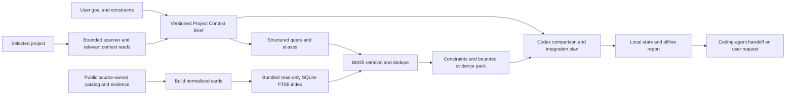

# CP-02: Local Plugin Architecture

Decision date: 2026-08-30; amended by owner decision 2026-08-31. Owner: Catalog Architect; product scope selected by the user. Status: local design selected; implementation and runtime verification pending. Read with [permissions](plugin-v1-permissions.md) and [verification](plugin-v1-verification.md).

## Decision And Scope

Owner revision: 2026-08-31. SQLite FTS5/BM25 is selected for local catalog retrieval. The product optimizes time to a useful open-source integration or modernization plan. Relevant project reads are allowed within existing permissions; the former host-wide source-isolation requirement is superseded, not technically proven. Repository activity and evidence observation are separate; the former 30-day snapshot rejection is withdrawn. CP-01/02 remain completed documentation records; CP-03-CP-16 remain planned, with CP-12-CP-14 deferred. This revision changes plans and contracts, not runtime or permissions.

The selected package is a Codex skill, trusted local Python scripts, catalog cards, a read-only SQLite FTS5 index, and project-local artifacts. No Cloudflare, server database, remote MCP, embedding API/model download, vector extension, Docker, daemon, OAuth or scheduler is required. Codex supplies the conversational model under its own account/data policy; local scripts do not imply local model inference or zero Codex cost.

Source mode is `catalog_only`; retrieval engine is `sqlite_fts5`. These are separate fields, not synonyms or fallback indicators. The plugin's packaged path adds no network calls. Public research in an explicitly requested host workflow remains distinct from plugin runtime. The scanner is a useful overview, not an exclusive gateway preventing relevant host-authorized project reads. The permissions ADR defines minimization and exclusions.

CP-03 owns the complete local contract slice C1-C6 plus C9. Remote C4 discovery/ledger and C7 tool contracts move to the separately scoped CP-12/13 extension; their absence cannot keep local CP-03 or CP-15/16 permanently incomplete.

## Runtime And Package

- Implementation target: Windows local disk, CPython 3.14.x, standard-library runtime only. Current development interpreter reports 3.14.6; that is availability evidence, not plugin compatibility evidence. Other Python versions, macOS/Linux/WSL, UNC/network and synchronized filesystems remain unsupported until their own checks. Never install a runtime or dependencies automatically.
- Codex is the entrypoint. Internal script commands are implementation interfaces, not a separately supported standalone CLI product. No Node.js, Docker, web server or backend framework is needed for this slice.
- Resolve the trusted plugin root independently of the target project and current directory. Installed plugins may be cached elsewhere. Never import project Python modules, use project virtualenv executables, evaluate project config, or invoke project scripts/tests/builds to collect context.
- Use an already available, explicitly resolved trusted interpreter, isolated execution (`-I -B`) and strict UTF-8 I/O. Internal module loading must use only the trusted bundle; do not re-add the project or current directory to import paths. Python's isolated flag excludes the script directory/user site and ignores `PYTHON*` settings; it is not a filesystem or network sandbox. [Python command-line reference](https://docs.python.org/3/using/cmdline.html#cmdoption-I).
- Unknown or unsupported runtime, including missing SQLite FTS5 support, returns an actionable prerequisite error without installing, downloading, changing host permissions or dumping the catalog into the model. Probe the actual Python sqlite3 build; the Python version alone is insufficient.

The official package contract requires `.codex-plugin/plugin.json`; skills and MCP wiring are separate optional components. Keep scripts/assets outside `.codex-plugin`. The local manifest will identify `myai-stackguide`, version it, and point `skills` at `./skills/`. Omit `apps`, `mcpServers` and hooks; do not create `.app.json`, `.mcp.json` or a placeholder remote connection. [OpenAI plugin packaging, checked 2026-08-30](https://developers.openai.com/plugins/build/plugins).

Local marketplace installation and fresh-session testing are CP-16 work, not implied by files existing. The documented repo marketplace is `.agents/plugins/marketplace.json`; changing it or global plugin state requires the applicable permission boundary. Neither is changed in CP-02. The host can cache a package separately from the project, so a source-folder edit does not prove that an installed copy changed. [OpenAI local distribution workflow](https://developers.openai.com/plugins/build/plugins#marketplaces).

## Exact Future File Ownership

All paths below are future files relative to this implementation repository. Builders own implementation; the Quality Evaluator owns named tests/fixtures; the Curator owns research evidence. Sequential handoffs preserve these boundaries. No file in this registry is created merely by this ADR.

| Task | Implementation / source outputs | Evaluator-owned checks |
| --- | --- | --- |
| CP-03 | Local C1-C6 and C9 registry in the detailed plan | `tests/test_plugin_contracts.py`, `tests/fixtures/plugin_contracts.json` |
| CP-06 | `scripts/build_plugin_catalog.py`, `scripts/build_plugin_search_index.py`; `data/plugin_advisory_seed.json`, `data/plugin_catalog_metadata.json`; Curator: `research/plugin-v1-advisory-evidence.json`; bundle assets `catalog.snapshot.json`, `catalog.search.sqlite`, `catalog.search-manifest.json`, `retrieval-policy.json` | `tests/test_plugin_catalog.py`, `tests/test_plugin_search_index.py` |
| CP-07 | `plugins/myai-stackguide/.codex-plugin/plugin.json`; `skills/myai-stackguide/SKILL.md`; `scripts/intake.py`, `state_store.py`, `sanitize.py`; `assets/question-bank.json` under that plugin root | `tests/test_plugin_intake.py`, `tests/test_plugin_state.py` |
| CP-08 | Plugin `scripts/scanner.py`, `context.py` | `tests/test_plugin_scanner.py`, synthetic `tests/fixtures/plugin_scanner/` |
| CP-09 | Plugin `scripts/retrieval.py`, `context_pack.py`, `matcher.py` | `tests/test_plugin_retrieval.py`, `tests/test_plugin_matching.py` |
| CP-10 | Plugin `scripts/render_report.py`, `assets/status-template.html` | `tests/test_plugin_artifact.py` |

CP-07 state helpers are shared; no parallel state implementation. CP-06 derives public cards/index from source-owned inputs, preserving v5 and existing generated outputs unless a separately assigned source change requires regeneration. Browser-local enrichment must not be mistaken for persisted source metadata. Research facts need per-field provenance and observation dates in source-owned evidence before normalization into `data/plugin_catalog_metadata.json`.

## Scan Budgets And Classification

These are selected conservative engineering limits, not measured speed or quality promises. CP-03 encodes them in the policy; CP-08 supplies boundary evidence. Depth selection and repository classification are separate fields. Raising limits requires an explicit policy change, not an automatic retry or a model decision.

| Control | Selected value |
| --- | --- |
| `quick` reads | 50 files; 2 MiB text; 10 seconds total |
| `standard` reads | 200 files; 10 MiB text; 30 seconds total |
| `deep` reads | Up to 500 files; 30 MiB text; 90 seconds total, including standard work; no repeated reset of counters |
| Topology, all depths | At most 10,000 visited directory entries, depth 12 below project root, 5 seconds; also charged to total time |
| Individual file | At most 512 KiB bytes; no truncated source passed off as a complete file |
| Sanitized scanner response | At most 256 KiB UTF-8 JSON; retain aggregate gaps if detailed observations do not fit |

Use monotonic deadlines and check cancellation/budgets before enumeration, opening, reading and parsing, and between bounded chunks. File/byte counters include unsuccessful attempted reads and bytes consumed before a rejection; file attempts never exceed the cap. A single blocking OS operation may overrun a cooperative deadline; no hard realtime guarantee is claimed. Do not walk excluded subtrees. Count every visited entry before exclusions, but expose only safe aggregate exclusion counts. Do not enumerate or sort an unbounded directory before applying the entry cap.

An eligible file is a regular, contained file admitted by the CP-03 policy after mandatory path/type/size exclusions; excluded/generated/binary files are not eligible. Manifest count is the number of eligible recognized manifest files, not the count of dependencies. A service root is a distinct directory containing at least one recognized application/package manifest; multiple manifests in one directory count once. Recognized formats and exclusions are source-owned by CP-03, not inferred from arbitrary filenames.

Classification precedence: (1) any coverage cap, incomplete enumeration/access, or detected monorepo => `large_or_monorepo`, with a separate reason so a cap does not claim an actual monorepo; (2) complete traversal with zero eligible files => `idea_or_empty`; (3) at most 500 eligible files and five manifests => `compact`; (4) at most 5,000 eligible files, twenty manifests and twenty service roots => `standard`; otherwise `large_or_monorepo`. Monorepo detection precedes compact: a safely parsed workspace declaration or at least two distinct service roots suffices. This is a conservative heuristic, not architectural certainty; user corrections remain separate from observed facts. Unread/unparseable declarations stay unknown.

At any cap, cancellation, denied path or invalid encoding, show `coverage_partial` and reason codes, missing areas and reduced confidence; never label an incompletely enumerated project empty. Deep is only an explicitly selected expansion and does not authorize broader file types or sensitive-source exceptions.

## Local State, Recovery And Retention

In the user's selected project, the only output root is `docs/myai-stackguide/`. `state.json` is current truth; `status.html` is a deterministic projection; `runs/{run_id}.json` is immutable finalized history. Small internal recovery/lock files also stay under this root. UUID run IDs, revisions and schema versions are local technical identifiers, not public telemetry.

Use one persistent `.state.lock` with an OS-backed exclusive lock for cooperating plugin writers. Wait at most two seconds, then return `state_busy`; never delete a supposedly stale lock to steal ownership. CP-07 must verify lock release after process exit on the selected Windows filesystem. A mutation checks expected run ID and state revision under lock. A competing start cannot replace an unfinished run: resume it or explicitly finalize it incomplete before starting another. A stale answer/result gets `state_conflict`, not last-writer-wins. Do not hold the lock while awaiting a user/model response or scanning.

Validate sanitized new state, write a same-directory temporary file, flush/sync, preserve one validated `state.previous.json`, and replace `state.json`. Temporary/recovery files are never alternative current truth. The intended replace primitive is `os.replace`; it is not a transaction across all files or a guarantee against power loss. Validate interruption and Windows sharing-failure behavior; preserve the previous file on failure. [Python filesystem operations](https://docs.python.org/3/library/os.html#os.replace).

Render only from a committed revision and record that revision in HTML. Recheck it under the lock before publishing; discard an obsolete render result. If rendering fails after state commits, mark/report HTML stale and regenerate from state; do not roll back a saved answer. Readers reject malformed/schema-incompatible state instead of guessing or overwriting it. Recovery from the validated prior file is explicit and records the recovered revision; a damaged file is retained for local review without echoing its contents.

Finalization first commits final state, then creates the run snapshot without overwriting any existing run ID. A crash before history publication is repaired idempotently from the final current state before allowing a new run. Identical existing final content is success; conflicting content or a partial run file is an integrity error, never an overwrite. The next task must test each interruption boundary. Completed runs are not mutated by resume/correction; a new run records its predecessor. Within a run, answer corrections increment the Brief version and invalidate dependent recommendations.

No automatic retention period, cleanup, deletion, hidden backups outside the output root, upload or telemetry. Local artifacts remain until the user removes them; they can contain sanitized confidential context, so local does not mean public-safe. Warn that normal repository sync/backups can copy them; do not silently modify `.gitignore`. Cap each current/final state at 2 MiB, rendered HTML at 5 MiB, and stored finalized runs at 100. Before a new run would exceed the history cap, stop with a storage-limit message; never auto-prune. Failed persistence does not display an answer as saved. CP-03 defines bounded version history within these limits.

The entire output root, including recovery/partial/temporary files, is capped at 256 MiB and 128 file entries; account for prospective peak bytes before a write, not just committed history. Use at most four named pending slots (each JSON slot at most 2 MiB, each HTML slot at most 5 MiB) and one `state.damaged.json` slot at most 2 MiB. Reuse only positively identified plugin-owned pending slots; never append randomly named retry debris. Existing damaged content is not overwritten to make room for another failure: stop with an integrity/storage conflict. Oversized, unrecognized or unbounded existing output is not loaded or auto-cleaned; retain it and ask for a separate owner recovery decision. CP-07 must test repeated interrupted writes exhausting these limits without growth, data loss or automatic pruning. Exact slot names/ownership markers are CP-03 contracts.

## SQLite FTS5 Retrieval And Context Budget

The retrieval unit is a repository solution card, with one canonical repository ID and explicit aliases. Index name, description, topics, short category labels, task/use-case signals, adoption/integration surfaces and advisory facts that actually exist. Keep structured dates, license, deployment, status and provenance in ordinary SQLite columns/tables. Do not index repeated long category descriptions as if they were repository evidence, and do not chunk arbitrary JSON or ingest all upstream source code.

FTS5 uses `unicode61` and weighted BM25 as the initial lexical baseline. Smaller BM25 values rank earlier; stable canonical ID is the tie-breaker. SQL values must be parameterized, but that alone does not escape FTS MATCH syntax: compile an allowlisted structured query into quoted terms/operators. Bound term count/length and reject malformed queries. The model never supplies SQL. Preserve technology aliases such as `C++`, `.NET` and `Next.js` through the versioned policy. RU/EN intent normalization and maintained aliases address vocabulary gaps; no claim of automatic semantic or Russian morphology understanding. CP-03 specifies deterministic rank fusion across query variants; raw BM25 scores from different queries are not treated as comparable fit scores. CP-04 measures where lexical recall remains weak. [SQLite FTS5 reference](https://www.sqlite.org/fts5.html).

Selected initial engineering caps: at most 60 retrieved candidates across all query variants, at most 12 detailed cards, and at most 48 KiB UTF-8 for the complete serialized evidence pack including provenance and exclusion summaries. These are uncalibrated ceilings, not token counts or quality targets. CP-03 fixes per-query/field limits and total model-input allocation; CP-04 calibrates them against held-out cases without silently lifting the ceilings. The Brief and host context are additional model input and must receive their own bounded allocation. Apply hard metadata constraints before retrieval where feasible, dedupe before spending detailed-card budget, and use only bounded query broadening within the same total cap. Never fall back to reading the whole catalog into context.

Separate stages: structured intent/constraints -> lexical candidates -> canonical dedupe and mandatory-evidence checks -> diversified evidence pack -> Codex comparison, roles and integration handoff. A lexical score orders candidates; it is not fit, confidence, or a probability. Return source references, matched fields, score/rank, exclusion reasons, missing facts, activity observations and truncation flags. Broad/no-hit queries can yield a clarification or an honest limited/no-match report. No-match is distinct from retrieval failure.

The packaged `catalog.search.sqlite` is derived public data, not the user's state database. Open it read-only from the trusted bundle. It never contains project files, user queries, answers or embeddings. Do not build/update the index on plugin startup; CP-06 builds the immutable package assets. A manifest pins source/card digest, catalog snapshot ID, schema/index format, builder version, SQLite build information, retrieval policy/aliases and index byte hash. Validate compatibility, hashes and read-only SQLite integrity checks before use. FTS internal consistency checks that use special write commands belong to the build gate, never the runtime read-only connection. Missing FTS5/index or mismatch returns typed `retrieval_unavailable`/`index_incompatible`; report construction may preserve saved context and explain the failure, but must not fabricate an empty successful search or silently substitute a different engine.

Rebuilding on the same input/policy must reproduce logical rows and deterministic candidate ordering. Physical SQLite bytes need not be identical across SQLite builds; freeze and hash the actual tested package bytes for release. Version changes use a new bundled index, keep the prior compatible bundle for rollback, and never overwrite an index in use. Future remote overlays must define an atomic version-compatible index update before activation.

## Catalog Replay And Eligibility

Persist `catalog_snapshot_id`, source/index digests, card schema, index format, retrieval-policy version, source mode and engine with each run. Replay guarantees the deterministic retrieval inputs and candidate ordering, not identical future LLM wording. A correction invalidates the evidence pack and recommendation as well as the Brief. Local runs have no fake overlay version, GitHub-live badge or upload-success state.

Store `createdAt`, `pushedAt`, verified `lastCommitAt` with commit SHA/branch, optional `lastReleaseAt`, and field/source `observedAt` separately. Missing fields are explicit unknowns. `pushedAt` is a last-push signal, not a verified last-commit timestamp; `updatedAt`, snapshot/index build dates and observation dates must not be substituted for commit activity. Do not stamp an entire corpus current after partial browser fetches. CP-06 reports actual field coverage and provenance instead of manufacturing values. Field semantics were rechecked on 2026-08-31 against [GitHub Repository fields](https://docs.github.com/en/graphql/reference/repos#repository) and [Commit fields](https://docs.github.com/en/graphql/reference/commits#commit).

There is no maximum snapshot age that automatically rejects a candidate. Old observation dates lower confidence in volatile facts and can justify a targeted verification step; repository activity is evaluated in project context. A mature stable library can remain useful without recent commits; recent commits do not prove operability, compatibility, security or fit. Archived/unavailable entries remain visible as references/avoid-for-now when useful; unknown mandatory license/deployment/compatibility facts prevent an unconditional primary adoption claim, not all retrieval. Provide a concrete verification or integration experiment when evidence is incomplete. Catalog status, evidence stage, eligibility and request-specific role remain independent; no machine-to-curator acceptance transition.

## Consequences And Rollback

FTS5 limits catalog context growth without adding a service or embedding dependency. It will miss vocabulary and cross-language matches unless query policy/data coverage helps; measure this before adding optional vectors. `sqlite-vec`, LanceDB, Qdrant, GraphRAG and embedding/reranker models are not V1 prerequisites. Any future alternative must outperform this versioned baseline on the same representative cases with acceptable installation, latency, memory and maintenance costs.

This revision is documentation only. Preserve the pre-existing CP-01/02 work and historical source bodies. Later runtime rollback uses the previous compatible package/index and valid user state; incompatible state is not rewritten by an older plugin. No automatic deletion, catalog-wide context fallback, global permission change or remote activation is part of recovery.
